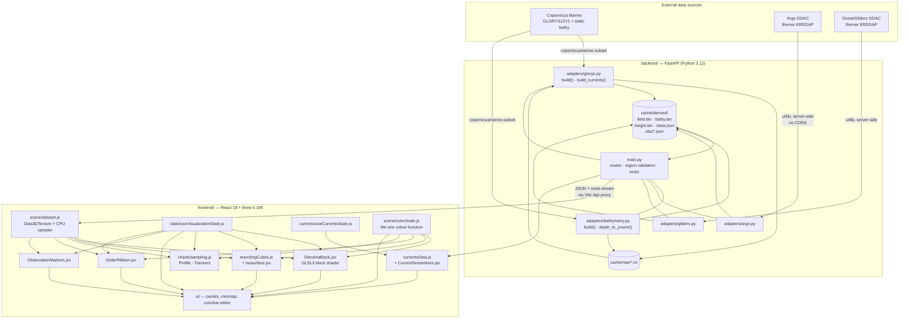
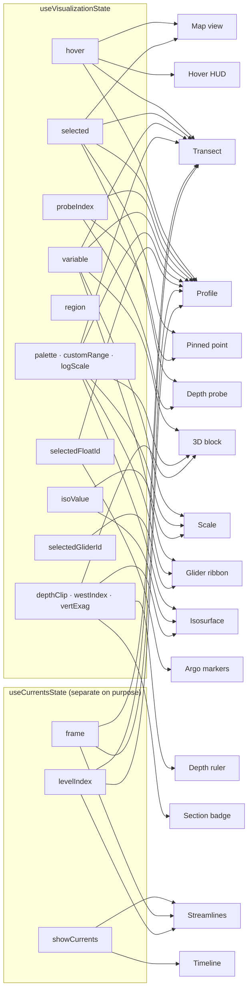
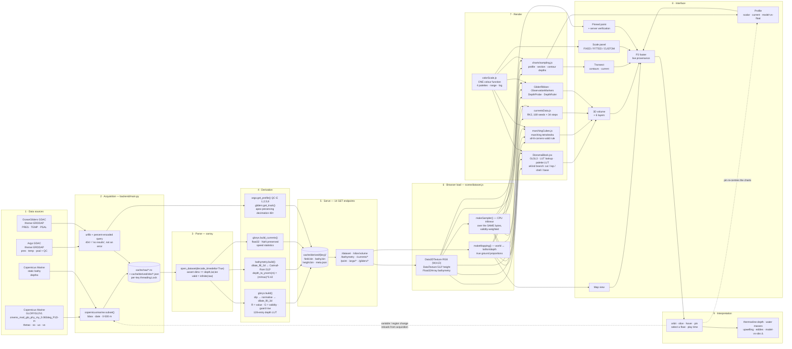

# Ocean-Viz — Project Documentation

> Generated by reading the codebase itself: `backend/` (FastAPI + Copernicus adapters),
> `frontend/` (React + WebGL2), the live API responses of the running server, and the
> installed dependency versions. Every number, name, endpoint and formula below was
> taken from source or from a live response, not from the README.
>
> Where something could not be determined from the implementation, this document says
> **"Not found in the current implementation"** rather than guessing.
>
> **Note on the README:** `README.md` is out of date in several places and the
> implementation wins. The discrepancies are listed in [§27 Documentation Audit](#27-documentation-audit).

---

## Table of contents

| § | Section |
|---|---|
| 1 | [Project Overview](#1-project-overview) |
| 2 | [Beginner Background](#2-beginner-background) |
| 3 | [Datasets Used by This Project](#3-datasets-used-by-this-project) |
| 4 | [Exact Data Variables](#4-exact-data-variables) |
| 5 | [Complete End-to-End Workflow](#5-complete-end-to-end-workflow) |
| 6 | [Codebase Architecture](#6-codebase-architecture) |
| 7 | [Data Processing Pipeline](#7-data-processing-pipeline) |
| 8 | [The Visualization Components](#8-the-visualization-components) |
| 9 | [How to Read the Visualizations as a Beginner](#9-how-to-read-the-visualizations-as-a-beginner) |
| 10 | [User Interface](#10-user-interface) |
| 11 | [Complete User Guide](#11-complete-user-guide) |
| 12 | [Example Walkthrough](#12-example-walkthrough) |
| 13 | [Technical Implementation](#13-technical-implementation) |
| 14 | [Important Functions and Classes](#14-important-functions-and-classes) |
| 15 | [API / External Data Flow](#15-api--external-data-flow) |
| 16 | [NetCDF Technical Explanation](#16-netcdf-technical-explanation) |
| 17 | [Scientific Interpretation](#17-scientific-interpretation) |
| 18 | [Validation and Accuracy](#18-validation-and-accuracy) |
| 19 | [Error Handling and Common Problems](#19-error-handling-and-common-problems) |
| 20 | [Installation and Setup](#20-installation-and-setup) |
| 21 | [Configuration](#21-configuration) |
| 22 | [Performance](#22-performance) |
| 23 | [Limitations](#23-limitations) |
| 24 | [Glossary](#24-glossary) |
| 25 | [Quick Reference](#25-quick-reference) |
| 26 | [Final Workflow Diagram](#26-final-workflow-diagram) |
| 27 | [Documentation Audit](#27-documentation-audit) |

---

# 1. Project Overview

## In one sentence

> **Ocean-Viz is a browser application that turns a day of Copernicus Marine GLORYS12V1
> ocean-model output into a solid three-dimensional block you can rotate, slice open and
> click into, with real Argo float and underwater-glider measurements drawn in the same
> space so a model prediction and an instrument reading can be compared side by side.**

## What this software is

Ocean-Viz is a **web-based 3-D ocean data explorer**. It has two halves:

- a **Python backend** (`backend/`) that downloads ocean-model files from Copernicus
  Marine, converts them into compact binary products a browser can render, and proxies
  live queries to two public instrument archives;
- a **JavaScript frontend** (`frontend/`) that renders those products with WebGL2 as a
  block of ocean sitting in space, plus 2-D charts alongside it.

It was built for **Smart India Hackathon problem statement 26067**, issued by
**INCOIS** (Indian National Centre for Ocean Information Services) under India's
**Ministry of Earth Sciences** — stated in `README.md` and `PRODUCT.md`.

## What problem it solves

`INTERACTION_LAYER_SPEC.md` records the problem as stated by the PS:

> MoES/INCOIS produces large 3D ocean model fields (temperature, salinity, currents,
> chlorophyll) across depth and time, plus in-situ observations from Argo floats,
> gliders, CTDs. Today oceanographers must switch between separate, mostly-2D, desktop
> tools to inspect model fields and observations, and cannot easily correlate model
> predictions with observational evidence in one place.

In plain terms, the ocean is a **volume**: every point has a latitude, a longitude, a
depth and a time. Conventional tools flatten that. They show you one horizontal map at
one depth, or one vertical slice along one line, and you must stack those pictures in
your head. Two things are lost:

1. **Vertical structure.** The boundary between warm surface water and cold deep water
   (the *thermocline*) is a curved surface. Paging through flat depth slices makes it
   very hard to see its shape.
2. **Model-versus-instrument comparison.** A model is a computed guess. A float is a
   real measurement. Judging one against the other normally means opening two different
   applications.

Ocean-Viz addresses both: the field is drawn as one continuous solid whose cut faces are
real cross-sections, and real instrument data is drawn in the same coordinate system.

## Why Argo data is used

Argo is the world's main source of **measured** subsurface temperature and salinity. If
you want to know whether a model is telling the truth about the water 200 m down, an Argo
float is the cheapest available check. In this project (`backend/adapters/argo.py`,
`frontend/src/observations/argoSource.js`) an Argo profile is fetched live and drawn on
the same chart axes as the model column at the same position, with the difference between
them computed and shown.

## Why Copernicus data is used

Copernicus Marine Service is the European Union's free, open ocean data programme. It
publishes **GLORYS12V1**, a global ocean *reanalysis* that provides a physically
consistent estimate of temperature, salinity and currents at every point of a 1/12°
grid, at 50 depth levels, for every day from 1993 onward. That is the "model field" half
of the PS. It is used because it is free, global, gridded (so it can be rendered as a
volume), and covers the Indian Ocean at a useful resolution.

## What NetCDF means

**NetCDF** (*Network Common Data Form*) is the standard file format for scientific
gridded data. One NetCDF file is a small self-describing database: it holds *dimensions*
(how big each axis is), *coordinate variables* (the actual latitude, longitude, depth and
time values), *data variables* (temperature, salinity, …) laid out on those axes, and
*attributes* (units, missing-value codes, provenance text). Every dataset this project
downloads from Copernicus arrives as NetCDF. Full treatment in [§16](#16-netcdf-technical-explanation).

## What the software allows a user to do

Everything in this list is implemented and was verified against the running application:

| Capability | Where |
|---|---|
| Load a 6° × 6° tile of the ocean as a 3-D block | `Minimap`, `loadDataset` |
| Rotate and zoom around it | `OrbitControls` in `OceanScene.jsx` |
| Switch the scalar field between **temperature** and **salinity** | `DataLayersPanel` |
| Slice the block downward, snapping to real model depth levels | `SectionControls` "Slice from top" |
| Slice the block inward from the west, snapping to real longitude columns | `SectionControls` "Slice from west" |
| Exaggerate the vertical axis 3×–30× | `SectionControls` |
| Draw contour lines (isotherms / isohalines) on the cut faces | `SectionControls` |
| Extract and display a 3-D **isosurface** at any chosen value | `Isosurface.jsx` |
| Hover any cut face and read the value under the cursor | `PointSelection` + `HUDLabel` |
| Click to **pin** a point, then walk a depth cursor down that column | `InfoPanel` |
| Verify the pinned value against the source NetCDF server-side | `GET /point` |
| See a **vertical profile** chart at the pinned point | `ProfileChart` |
| See a **west→east transect** with contour depths and bathymetry | `TransectChart` |
| Show **real Argo floats** in the scene and compare a real profile to the model | `ObservationMarkers`, `ComparisonChart` |
| Show a **real glider track** as a coloured ribbon through the volume | `GliderRibbon.jsx` |
| Animate **real current streamlines** over 8 consecutive days | `CurrentStreamlines`, `TimelineControls` |
| Edit the colour scale: palette, min/max range, log/linear | `Colorbar.jsx` |
| Draw a new region on the map and load it | `Minimap` drag |

**Not implemented:** exporting or saving anything (no image download, no CSV, no
report). Searched for across `frontend/src/` — no `download`, `toBlob`, `toDataURL`, or
export path exists. See [§23](#23-limitations).

## What the final visualization components represent

The application does **not** have a fixed set of three figures. It has **five primary
surfaces**, one of which (the 3-D view) hosts **six independently toggleable layers**,
and two of which (Profile, Transect) each have **three or two alternate modes**. All are
documented individually in [§8](#8-the-visualization-components). In summary:

```
Map view          -> where on Earth you are; also the region selector
3D volume         -> the ocean field itself, as a solid object
  ├─ cut faces        real vertical cross-sections
  ├─ top face         stylized sea surface, OR a real horizontal section when sliced
  ├─ isosurface       the 3-D shape of one chosen value
  ├─ streamlines      measured current flow, animated over 8 days
  ├─ glider ribbon    a real glider's sawtooth path, coloured by what it measured
  └─ Argo markers     real float positions, clickable
Profile panel     -> the vertical column under one point (3 modes)
Transect panel    -> a west→east vertical slice (2 modes)
Scale panel       -> what the colours mean, and the controls that change them
Pinned point      -> the exact numbers, plus server-side verification
```

## Who the intended users are

From `PRODUCT.md`, verbatim in substance:

- **Primary — ocean scientists and analysts at INCOIS and equivalent institutions.**
  They need to read an actual value at an actual lat/lon/depth, see where the thermocline
  sits, and know where data ends and seafloor begins. "Precision and provenance are
  non-negotiable for them."
- **Secondary, and a hard constraint on the primary — non-specialist evaluators.** The
  same build has to be legible inside a ~10-minute hackathon demo to judges who have
  never seen the dataset. There is no separate "presentation mode."
- **Explicitly not a designed-for audience:** classroom/public outreach.

## What a complete user workflow looks like

```
open http://localhost:5173
      │
      ├─ default tile loads: Bay of Bengal, 2026-06-11, temperature
      │
      ├─ (optional) drag a box on the Map view -> a different tile loads
      │
      ├─ orbit the block; the cut faces are the temperature cross-section
      │
      ├─ drag "Slice from top" -> the block's lid becomes a real horizontal
      │   section at model level N, and the badge on the canvas says which
      │
      ├─ turn on Isosurface, set the isovalue to 20 °C -> the thermocline
      │   surface appears; drag the top slice past it to lift it into open air
      │
      ├─ hover a cut face -> a leader-line label shows lat/lon/depth/value
      │
      ├─ click -> the point is pinned; Profile and Transect both re-centre on it;
      │   the Pinned point panel queries the server for the authoritative value
      │
      ├─ click an Argo float marker -> the Profile panel becomes
      │   "Model vs float", with mean |Δ| and the worst-disagreement depth
      │
      ├─ turn on Current flow lines -> streamlines appear; press play to run
      │   eight GLORYS days
      │
      └─ open the Scale panel -> change palette, narrow the range, toggle log
```

---

# 2. Beginner Background

## Argo

### What Argo is

**Argo** is an international ocean-observation programme. Since the early 2000s it has
kept roughly 4,000 robotic instruments — *floats* — drifting in the world's oceans,
measuring the water and reporting by satellite. All the data is free and public. It is
the reason we have any systematic picture of the ocean's interior at all.

### What an Argo float is

A cylindrical robot about the size of a person, with no propulsion. It controls its
**buoyancy** — it can make itself slightly heavier or lighter than seawater — and
therefore its depth. A typical *cycle* is:

```
 surface ── sink to ~1000 m ── drift with the current for ~9 days
                                        │
                                  sink to ~2000 m
                                        │
                        rise to the surface, measuring all the way up
                                        │
                        transmit by satellite, then repeat
```

One cycle takes about **10 days**. This 10-day rhythm has a direct consequence in this
codebase: a query for floats "on 2026-06-11" returns nothing, because no float happens to
surface on that exact day. `backend/main.py` therefore searches a **window**:

```python
OBS_DAYS = 10
def _obs_window(date, days=OBS_DAYS):
    d = datetime.date.fromisoformat(date)
    return ((d - datetime.timedelta(days=days)).isoformat(),
            (d + datetime.timedelta(days=days)).isoformat())
```

and `backend/adapters/argo.py` documents the measured fact: *"the demo tile has 5 floats
within ±10 days of 2026-06-11 and ZERO on 2026-06-11 itself."*

### What measurements it collects

The core Argo sensors are **CTD**: Conductivity, Temperature, Depth. From those come the
three variables this project uses:

| Argo variable | Meaning |
|---|---|
| `PRES` | Pressure in **decibars** — the standard Argo vertical coordinate |
| `TEMP` | Seawater temperature in **°C** |
| `PSAL` | Practical salinity (dimensionless; conventionally written **PSU**) |

### How floats collect vertical profiles

The float measures continuously while rising. The resulting series — one triple
(pressure, temperature, salinity) at each of many depths, all at effectively one
place and one moment — is a **profile**. The live example this project fetched:

```
GET /argo/profile?wmo=2902772&cycle=231
  → 102 levels, 0 dropped, delayed-mode
    shallowest  {depthM: 0.3,    thetao: 29.401 °C, so: 33.985 PSU}
    deepest     {depthM: 1981.8, thetao:  2.611 °C, so: 34.778 PSU}
```

That single profile is the whole story of the water column at that spot: 29.4 °C at the
surface, 2.6 °C two kilometres down.

### The four coordinates, explained

| Term | Plain meaning | In this project |
|---|---|---|
| **Latitude** | How far north or south, −90° to +90°. Positive = north. | `latitude` in NetCDF, ascending; the demo tile spans 12°N–18°N |
| **Longitude** | How far east or west, −180° to +180°. Positive = east. | `longitude`, ascending; demo tile spans 79.5°E–85.5°E |
| **Pressure / Depth** | How far down. Pressure is what an instrument actually measures; depth is what a model grid uses. | Model uses **depth in metres**; Argo and gliders report **pressure in decibars** |
| **Time** | Which day. | One day per GLORYS file; 8 consecutive days for currents |

**Why pressure and depth are treated as interchangeable here, and where that is
disclosed.** One decibar of pressure corresponds to almost exactly one metre of depth in
seawater. `backend/adapters/argo.py` states the reasoning in the code:

> *"Pressure in decibars is within 1% of depth in metres over this range; the model's own
> axis is depth, so the two are compared directly and the approximation is disclosed
> rather than hidden."*

`GliderRibbon.jsx` repeats it: *"pressure in decibars ~= depth in metres to well under 1%
here."* No latitude/density conversion is performed — this is a deliberate, stated
approximation, not an oversight.

### Profile vs trajectory

- A **profile** is *vertical*: many depths, one place, one time. Argo floats give profiles.
- A **trajectory** is *horizontal through time*: a path. Both floats and gliders have
  trajectories, but a glider's is the interesting one.

This distinction is architectural in this codebase. `frontend/src/observations/gliderSource.js`:

> *"A glider is not a station and deliberately does NOT go through `listFloats()`: it flies
> a sawtooth, diving and climbing while it drifts, so its data is a PATH through the
> volume rather than a column at a point. Folding it into the float list would force it
> into a marker-and-profile shape that throws away the only thing that makes it a glider."*

A **glider** is a float with wings and a steerable buoyancy engine. It glides forward
while it sinks and again while it rises, tracing a sawtooth. The real deployment this
project loads, `Bellatrix_368`, flew **176 dives over 14 days**, producing **193,458 raw
measurement rows**.

### Why Argo data is scientifically useful

It is the only large-scale, continuous, freely available record of what the ocean is
actually doing *below the surface*. Satellites see only the skin. Ships are sparse and
expensive. Argo is how the subsurface ocean is known at all — and therefore how any
ocean model gets checked.

## Copernicus Marine Data

### What Copernicus Marine is

The **Copernicus Marine Environment Monitoring Service (CMEMS)** is the EU's operational
oceanography programme. It publishes global ocean datasets — model output, satellite
observations, and reanalyses — free to anyone with a registered account. Access in this
project is through the official Python client, `copernicusmarine`, version **2.4.1**.

### Product types, and which this project uses

| Type | What it is | Used here? |
|---|---|---|
| **Observation** | Direct measurement (satellite, in-situ) | No — observations come from Argo/OceanGliders GDAC instead |
| **Forecast / analysis** | A model run predicting the near future | No |
| **Reanalysis** | A model rerun over the *past*, with all historical observations fed in to keep it on track — the best available reconstruction of what the ocean *was* doing | **Yes** — GLORYS12V1 |

A reanalysis is the right choice for this tool: it is physically consistent (so it looks
like an ocean, not noise), it is gridded everywhere (so it can be rendered as a volume),
and it covers a long historical span (so a 2016 glider deployment can be shown against
the model tile for its own date, which the app actually does).

### The exact Copernicus datasets this software uses

Two, both hard-coded, both verified from the live API:

| | Dataset ID | Declared in |
|---|---|---|
| **1. The field** | `cmems_mod_glo_phy_my_0.083deg_P1D-m` | `backend/adapters/glorys.py:30` |
| **2. The seafloor** | `cmems_mod_glo_phy_my_0.083deg_static` (part `bathy`) | `backend/adapters/bathymetry.py:33-34` |

Decoding the first ID: `mod` = model, `glo` = global, `phy` = physics, `my` = multi-year
(reanalysis), `0.083deg` = 1/12° ≈ 9 km, `P1D-m` = one-day means. Its human name is
**GLORYS12V1**, carried through the whole stack as `SOURCE_NAME = "GLORYS12V1"` and shown
in the app bar.

### Variables extracted from it

`thetao` (temperature), `so` (salinity), `uo` and `vo` (eastward and northward current
components) from the physics dataset; `deptho`, `mask`, `deptho_lev` requested from the
static bathymetry dataset (of which only `deptho` is actually consumed — see
[§4](#4-exact-data-variables)).

### Why it is used alongside Argo

This is the PS's headline requirement — gap #2, *"No unified display of Argo/Glider/CTD
profiles ALONGSIDE model fields."* GLORYS is a computation; Argo is a measurement. Putting
them on one axis, at one position, and printing the difference is the point of the tool.
`useComparison()` in `useObservations.js` computes exactly that, and the UI reports
`mean |Δ|` and the depth of worst disagreement.

---

# 3. Datasets Used by This Project

Four distinct data sources. Nothing else is fetched; there is no stock basemap, no tile
server, no bundled sample data.

## 3.1 GLORYS12V1 — the scalar and vector ocean field

| Property | Details |
|---|---|
| **Dataset name** | GLORYS12V1 global ocean physics reanalysis, daily means |
| **Dataset ID** | `cmems_mod_glo_phy_my_0.083deg_P1D-m` |
| **Source** | Copernicus Marine Service (EU) |
| **Access** | `copernicusmarine.subset(...)` — Python client, authenticated |
| **File format** | NetCDF-4 (`.nc`) |
| **Naming convention** | `cache/raw/vol_<regionslug>_<date>_<variable>.nc` for scalars; `cache/raw/cur_<regionslug>_<from>_<to>.nc` for currents |
| **Spatial coverage** | Global. This project subsets to the requested bbox only |
| **Temporal coverage** | 1993-01-01 → 2026-06-23 (`backend/main.py:83-86` notes this was *"verified against the store's own time axis, not the catalogue"*) |
| **Variables requested** | `thetao`, `so`, `uo`, `vo` |
| **Dimensions** | `(time, depth, latitude, longitude)` — asserted in code, not assumed |
| **Coordinate variables** | `time`, `depth` (metres, ascending, `positive: down`, **non-uniform**), `latitude` (ascending, uniform 1/12°), `longitude` (ascending, uniform 1/12°) |
| **Units** | `thetao` °C · `so` CF attribute `1e-3` (displayed as PSU) · `uo`/`vo` m s⁻¹ · `depth` m |
| **Missing values** | Packed `int16` with a fill value; **xarray decodes fill to `NaN`**. NaN means *land* **and** *below-seafloor*, undifferentiated |
| **Resolution** | 1/12° ≈ 9 km horizontally; 1 day temporally; non-uniform vertically |
| **Depth subsetting** | `minimum_depth=0, maximum_depth=500.0` — see note below |
| **How accessed** | `glorys.fetch_subset()` (one date, one variable) and `glorys.fetch_subset_range()` (a date range, several variables in one call) |
| **Local/remote** | Remote once, then **local forever**: `backend/cache/raw/`. A warm cache serves fully offline |

**Verified live values for the demo tile** (`region=bengal`, `date=2026-06-11`):

```
W (longitude cells) = 73     lonMin 79.5   lonMax 85.5
D (latitude cells)  = 73     latMin 12.0   latMax 18.0
levelsReal          = 31     maxDepthM = 453.9377136230469
depthLevels[0..5]   = 0.494, 1.541, 2.646, 3.819, 5.078, 6.441
depthLevels[-3:]    = 318.13, 380.21, 453.94
nanFraction         = 0.2797  (28% of cells are land or below the seafloor)
```

**Two important consequences of `maximum_depth=500`:**

1. The subset asks for 0–500 m but GLORYS's level *below* 453.94 m exceeds 500 m, so the
   tile actually contains **31 levels ending at 453.94 m**. The whole UI is built around
   this: "no data below 454 m" is a legend entry, a footer disclosure, and a reference
   line on the transect chart.
2. The **depth axis is wildly non-uniform** — 0.494 m at the top, 74 m steps at the
   bottom (a ~70× ratio). Rendering these as evenly spaced slabs would be a physical
   error, which is why the depth LUT exists ([§7.4](#74-the-depth-lut)).

**Per-variable range policy.** `glorys.py` sets a `rangeMode` per variable, and the
comment block explaining it is a measurement, not an opinion:

| Variable | `rangeMode` | Clamp | Why |
|---|---|---|---|
| `thetao` | `fixed` | `[8.0, 33.0]` for every tile | Temperature's within-tile span is set by the vertical thermocline, which every tile has: measured 19.9–23.1 °C within-tile against ~24 °C between-tile. `[8, 33]` covers three test tiles using 79.5–92.2% of the ramp |
| `so` | `tile` | the tile's own min/max, snapped outward to ¼ PSU | Salinity's range is set by *geography*: within-tile span 1.4–3.8 against a between-tile spread of **27.3** (9.40 PSU in the Ganges-Brahmaputra plume, 36.69 in the Arabian Sea). No fixed clamp survives that — one covering the domain renders the Bay tile in 13.5% of the ramp |

Live confirmation: `thetao` → `valueMin 8.0, valueMax 33.0, rangeMode fixed`;
`so` → `valueMin 31.25, valueMax 35.25, rangeMode tile`. **The cost is disclosed in the
UI** by the `FITTED TO TILE` badge in the Scale panel.

## 3.2 GLORYS static bathymetry — the seafloor

| Property | Details |
|---|---|
| **Dataset name** | GLORYS global physics static fields, bathymetry part |
| **Dataset ID** | `cmems_mod_glo_phy_my_0.083deg_static`, `dataset_part="bathy"` |
| **Source** | Copernicus Marine Service |
| **File format** | NetCDF-4 |
| **Naming convention** | `cache/raw/bathy_<regionslug>.nc` |
| **Temporal coverage** | None — it is static, so it is cached **per region only**, never per date |
| **Variables requested** | `deptho`, `mask`, `deptho_lev` |
| **Variables actually used** | **`deptho` only** — `bathymetry.build()` reads `deptho`, `latitude`, `longitude` and nothing else. `mask` and `deptho_lev` are downloaded but never opened |
| **Dimensions** | `(latitude, longitude)` |
| **Units** | metres, positive down |
| **Missing values** | `NaN` = **land**. This is the app's only land mask |
| **Resolution** | 1/12°, matching the field |
| **How accessed** | `bathymetry.fetch_static()` |

**Verified live values (`bengal`):**

```
bathyW 73   bathyD 73   heightN 512
bathyMaxM 3591.0        bathyMinM 7.0        landCells 1280
boxSpan 240.0           boxDepth 6.0         depthCurve 0.42
```

`bathyMaxM = 3591 m` against the field's `maxDepthM = 453.94 m` is the single most
consequential number in the app: **the block is 3591 m deep and only the top 454 m of it
has any field data.** Everything below is drawn as an explicitly non-data colour.

There is also a wide **context tile**, `region=context`, spanning 68°E–98°E, 0°N–26°N
(`CONTEXT_REGION` in `main.py`). Bathymetry only, no volume is ever built for it — it is
the Map view's basemap, so the coastline on the minimap is the same `deptho` NaN mask as
the block's.

## 3.3 Argo GDAC — real float profiles

| Property | Details |
|---|---|
| **Dataset name** | Argo Global Data Assembly Centre, served via Ifremer ERDDAP |
| **ERDDAP datasets** | `ArgoFloats-index` (one row per profile: path, date, position, DAC) and `ArgoFloats` (the measurements + QC flags) |
| **Base URL** | `https://erddap.ifremer.fr/erddap/tabledap` |
| **Cited source URL** | `https://data-argo.ifremer.fr` |
| **File format** | JSON (`.json` ERDDAP tabledap response), parsed with the stdlib |
| **Naming convention** | The index `file` column is `<dac>/<wmo>/profiles/<R\|D><wmo>_<cycle>.nc`, so WMO id, cycle number and data mode are all readable from the path without opening anything |
| **Spatial/temporal coverage** | Global, ~2000 → present |
| **Variables** | `pres`, `temp`, `psal` plus `pres_qc`, `temp_qc`, `psal_qc`, `platform_number`, `cycle_number`, `time`, `latitude`, `longitude`, `data_mode` |
| **Missing values** | JSON `null` |
| **How accessed** | `urllib.request` from `backend/adapters/argo.py`, **server-side** |
| **Local/remote** | Remote, then cached as JSON under `cache/derived/obs/` |

**Three verified behaviours the code depends on** (`argo.py` docstring, marked
"verified 2026-08-31 … do not re-guess"):

1. `institution` in the index is the **DAC code**, not the float's owner. The `DACS` map
   translates: `IN` → INCOIS, India; `AO` → AOML, USA; `HZ` → CSIO, China; and eight more.
2. **A query matching nothing returns HTTP 404**, not an empty table. `_get()` returns
   `None` on 404 and the caller renders "no floats here" — an empty layer, not an error.
3. **ERDDAP sends no CORS headers**, which is why this must be proxied server-side and
   cannot be fetched from the browser.

**QC filtering.** Argo reference table 2 quality flags; `QC_KEEP = {"1", "2", "5", "8"}`
(good, probably good, adjusted, interpolated). Flags 3, 4 (bad) and 9 (missing) are
dropped and **counted**, reported as `levelsDropped`.

**Live response for the demo tile:**

```
GET /argo/floats?region=bengal&date=2026-06-11
  count 5, window 2026-06-01 → 2026-06-21
    2902772  cyc 231  2026-06-19  13.29°N 81.56°E  HZ  CSIO, China    mode D
    2903434  cyc  79  2026-06-18  13.15°N 85.22°E  AO  AOML, USA      mode D
    2903892  cyc 101  2026-06-19  14.92°N 85.48°E  IN  INCOIS, India  mode R
    5907171  cyc  49  2026-06-19  13.66°N 85.11°E  IN  INCOIS, India  mode R
    7902249  cyc  53  2026-06-12  12.58°N 82.88°E  IN  INCOIS, India  mode R
```

Three of the five are INCOIS floats. `mode D` = delayed-mode (a scientist has adjusted
it); `mode R` = real-time (automatic QC only). The UI prints which.

## 3.4 OceanGliders GDAC — real glider tracks

| Property | Details |
|---|---|
| **Dataset name** | OceanGliders Global Data Assembly Centre, via Ifremer ERDDAP |
| **ERDDAP dataset** | `OceanGlidersGDACTrajectories` |
| **Base URL** | `https://erddap.ifremer.fr/erddap/tabledap` |
| **File format** | JSON for the deployment list, **CSV** for the track — *"CSV because it is half the size of JSON for the same numbers and this is the heavy request"* |
| **Variables** | `platform_deployment`, `time`, `latitude`, `longitude`, `PRES`, `TEMP`, `PSAL` |
| **Missing values** | The literal string `NaN` in CSV. Handled explicitly: `return None if f != f else f` |
| **Coverage** | Global; the docstring records that coverage ends 2026-06-23 |
| **How accessed** | `urllib.request` from `backend/adapters/gliders.py`, server-side, cached |

**The finding that shaped the UI**, recorded in the adapter docstring:

> *"The five deployments in this basin are July 2016 at ~8 N, 85-89 E. There is NO glider
> anywhere near the 2026-06 demo tile, which is why the layer has a real empty state and
> a preset that travels to where the data is."*

Confirmed live: `GET /gliders/tracks?region=bengal&date=2026-06-11` → `{"count": 0}`.
Rather than fabricate one, `main.py` publishes a **preset**:

```python
PRESETS = [{
  "id": "gliders-bob-2016",
  "label": "Glider deployment · Bay of Bengal",
  "region": "bbox:85.0,90.0,5.0,10.0",
  "date": "2016-07-08",
  "why": "Real OceanGliders GDAC tracks. No glider has operated near the 2026-06 demo
          tile, so this jumps to real historical data — both the model tile and the
          glider tracks are measured, at their own date.",
}]
```

**QC caveat, disclosed:** *"The QC columns (TEMP_QC, PSAL_QC, ...) are present but NULL
throughout the Bay of Bengal deployments. There is no QC to filter on, and the UI must say
so rather than implying the data has been screened."* The API returns
`"qcAvailable": false` and the footer prints "no QC flags in source".

**Live track (`Bellatrix_368`):**

```
rowsRaw 193458  →  rowsKept 4002
dives 176, apexesKept 177, method "dive-segmented, apices preserved (prominence 25 dbar)"
dateFrom 2016-07-02  dateTo 2016-07-16
maxPresDbar 1016.53  minPresDbar 0.20
deeperThanModel 0.4557   modelMaxDepthM 453.94
thetaoRange [6.757, 29.621]   soRange [19.242, 36.224]
qcAvailable false
```

**45.6% of this glider's track is deeper than the model's entire 454 m extent** — and the
footer says so, in those words.

## 3.5 NetCDF structure, and what this project uses

The generic shape of any NetCDF file:

```text
Dataset
 ├── dimensions        how long each axis is        e.g. depth = 31
 ├── coordinates       the actual axis values       e.g. depth = [0.494, 1.541, …]
 ├── variables         data on those axes           e.g. thetao(time, depth, lat, lon)
 └── attributes        metadata                     e.g. units = "degrees_C"
```

The GLORYS physics file as this project actually opens it:

```text
vol_bengal_2026-06-11_thetao.nc
 ├── dimensions
 │     time      = 1
 │     depth     = 31        (0.494 m … 453.94 m, NON-uniform)
 │     latitude  = 73        (12.0 … 18.0, uniform 1/12°)
 │     longitude = 73        (79.5 … 85.5, uniform 1/12°)
 ├── coordinates
 │     time, depth, latitude, longitude       all ascending
 ├── variables
 │     thetao(time, depth, latitude, longitude)   int16 packed, NaN after decode
 └── attributes
       units, positive="down" on depth, standard CF metadata
```

The static bathymetry file:

```text
bathy_bengal.nc
 ├── dimensions   latitude = 73, longitude = 73
 ├── variables    deptho(latitude, longitude)  float, metres, NaN = land
 │                mask, deptho_lev             downloaded, NOT read
 └── attributes   CF metadata
```

The dimension order is **asserted, not assumed** — `glorys.build()` line 159:

```python
assert list(da.dims) == ["depth", "latitude", "longitude"], da.dims
```

If Copernicus ever reorders its axes, this crashes loudly instead of rendering a
silently transposed ocean.

---

# 4. Exact Data Variables

Every variable name below was read from source. None is assumed.

## 4.1 Model field variables (Copernicus GLORYS12V1)

| Variable | Meaning | Units | Source | Dimension | Used where | Processing |
|---|---|---|---|---|---|---|
| `thetao` | Sea water **potential temperature** | °C | `cmems_mod_glo_phy_my_0.083deg_P1D-m` | `(time, depth, lat, lon)` | The default 3-D block, cut faces, isosurface, profile, transect, probe, Argo comparison | Clip to `[8, 33]` → normalise → dilate-fill → RG8 R channel |
| `so` | Sea water **salinity** | displayed **PSU**; CF attribute is `1e-3` | same | `(time, depth, lat, lon)` | Second selectable 3-D field, same machinery | Clip to the **tile's own** min/max snapped to ¼ → normalise → dilate-fill → RG8 R |
| `uo` | **Eastward** sea water velocity | m s⁻¹ | same | `(time, depth, lat, lon)` | Streamline tracer, current profile/transect | **Not** RG8. Kept as raw `float32` with NaN preserved |
| `vo` | **Northward** sea water velocity | m s⁻¹ | same | `(time, depth, lat, lon)` | same | same |
| `depth` | Depth of each model level | m, `positive: down` | same | coordinate, length 31 | Depth LUT, slice stops, isosurface placement, all chart Y axes | Used verbatim; never resampled |
| `latitude` | Grid latitude | degrees north | same | coordinate, length 73 | World-space mapping | Only min/max are carried in the manifest |
| `longitude` | Grid longitude | degrees east | same | coordinate, length 73 | World-space mapping | same |
| `time` | The day | ISO date | same | coordinate | Cache key; currents frame index | `np.datetime_as_string(..., unit="D")` |

**Why `uo`/`vo` deliberately avoid the RG8 path** — `glorys.py:288-296`:

> *"That encoding exists so a scalar can be a GPU texture with a validity channel;
> currents are integrated on the CPU by the streamline tracer, with no shader in the path,
> so 8-bit quantisation would buy nothing and RK2 compounds per-step error over ~34 steps.
> Measured on the Bengal tile, ±1.5 m/s gives only ~21 codes across the median speed."*

And why NaN is preserved rather than filled:

> *"an invented velocity at a coastline would bend a streamline into the land rather than
> stop it, so the tracer must be able to SEE the boundary. NaN is that signal."*

## 4.2 Bathymetry variables

| Variable | Meaning | Units | Source | Dimension | Used where | Processing |
|---|---|---|---|---|---|---|
| `deptho` | Seafloor depth (ocean bottom) | m, positive down | `..._static`, part `bathy` | `(lat, lon)` | Block floor, seafloor mask texture, Map view raster, coastline, transect bathymetry curve, "below seafloor" test | `dilate_fill_2d` → Catmull-Rom upsample to 512² → `depth_to_ynorm` → both a float32 world-Y grid and a uint8 height texture |
| `mask` | Land/sea mask | — | same | `(lat, lon)` | **Downloaded but never read.** Land comes from `isnan(deptho)` | none |
| `deptho_lev` | Index of the deepest wet level | — | same | `(lat, lon)` | **Downloaded but never read** | none |

## 4.3 Argo variables

| Variable | Meaning | Units | Source | Dimension | Used where | Processing |
|---|---|---|---|---|---|---|
| `pres` | Pressure | decibar | `ArgoFloats` | per level | Becomes `depthM` on the comparison chart | 1 dbar ≈ 1 m, **stated** approximation |
| `temp` | Temperature | °C | same | per level | Observed curve when the block shows `thetao` | QC-filtered |
| `psal` | Practical salinity | PSU | same | per level | Observed curve when the block shows `so` | QC-filtered |
| `pres_qc` / `temp_qc` / `psal_qc` | Argo QC flags | code | same | per level | Filter | Keep `{1, 2, 5, 8}`; count the rest as `levelsDropped` |
| `platform_number` | WMO float id | — | same | scalar | Label, provenance | — |
| `cycle_number` | Which dive | — | same | scalar | Profile id (`<wmo>-<cycle>`) | — |
| `data_mode` | `R` or `D` | — | same | scalar | Prints "real-time (automatic QC)" or "delayed-mode (adjusted)" | — |
| `institution` | DAC code | — | `ArgoFloats-index` | per row | Provenance line | Mapped through `DACS` |
| `file` | Profile file path | — | `ArgoFloats-index` | per row | **Parsed** for WMO, cycle and data mode | `<dac>/<wmo>/profiles/<R\|D><wmo>_<cycle>.nc` |
| `latitude`, `longitude`, `date` | Where and when it surfaced | — | same | per row | Marker position, disclosed profile date | — |

## 4.4 Glider variables

| Variable | Meaning | Units | Source | Dimension | Used where | Processing |
|---|---|---|---|---|---|---|
| `PRES` | Pressure | decibar | `OceanGlidersGDACTrajectories` | per row | Ribbon depth; apex detection | `_apexes()` with 25 dbar prominence |
| `TEMP` | Temperature | °C | same | per row | Ribbon colour when the block shows `thetao` | `NaN` string guarded |
| `PSAL` | Salinity | PSU | same | per row | Ribbon colour when the block shows `so` | same |
| `latitude`, `longitude` | Position | degrees | same | per row | Ribbon path in world space | — |
| `time` | Timestamp | ISO | same | per row | Sort key, date range | — |
| `platform_deployment` | Deployment name | — | same | grouping key | Deployment picker, id | e.g. `Bellatrix_368` |
| `TEMP_QC`, `PSAL_QC` | QC flags | — | same | per row | **Null throughout — not usable, and the UI says so** | none |

## 4.5 Derived quantities computed by this project

These do not exist in any source file — the application computes them.

| Derived variable | Meaning | Computed in | Formula / method |
|---|---|---|---|
| `ynorm` | Normalised box depth, 0 at surface, 1 at box floor | `bathymetry.depth_to_ynorm` | $(m / \text{bathyMax})^{0.42}$ |
| `depthLUT` | 128 entries mapping box-depth fraction → field-texture row | `glorys.build` | See [§7.4](#74-the-depth-lut) |
| `field_rg8` | The volume texture: R = normalised value, G = validity | `glorys.build` | See [§7.2](#72-the-rg8-volume-encoding) |
| `height_u8` | 512² seafloor mask texture | `bathymetry.build` | Normalised floor world-Y → uint8 |
| `surfaceMedian` | Median of the **top level only** | `glorys.build` | Drives the stylized top face's contrast expansion |
| `contourStep` | Contour interval in the variable's own units | `glorys.build` | 2.0 fixed for `thetao`; `_nice_step(span)` off a ladder for `so` (0.5 PSU on the demo tile) |
| `speed` | Current speed | `currentsSampling.js`, `glorys.build_currents` | $\sqrt{u^2 + v^2}$ |
| `dir` | Current heading, oceanographic convention (flowing **toward**) | `currentsSampling.headingDeg` | $\mathrm{atan2}(u, v)$ in degrees, wrapped to 0–360 |
| Isotherm/isohaline depth | Depth at which the column crosses a value | `sampling.isothermDepths` | Linear interpolation between bracketing levels |
| `meanAbsDiff`, `worst` | Model-vs-float agreement | `useObservations.useComparison` | Mean of \|obs − model\|, and the level of maximum \|Δ\| |
| `deeperThanModel` | Fraction of a glider track below the model's extent | `gliders.get_track` | count(pres > maxDepthM) / count |

---

# 5. Complete End-to-End Workflow

The generic flow in the brief has been rewritten to match the implementation. Note two
real deviations: **there is no "data cleaning" stage in the usual sense** (NaN is
*preserved* as meaning, not removed), and the pipeline **forks into four independent
product paths** rather than being linear.

```text
Copernicus Marine  ·  Argo GDAC  ·  OceanGliders GDAC
        │
   [1] Acquisition — authenticated subset / HTTP proxy
        │
   [2] Raw cache   — backend/cache/raw/*.nc, JSON under cache/derived/obs/
        │
   [3] NetCDF parse — xarray, dimension order ASSERTED
        │
   ┌────┴───────────────┬────────────────┬──────────────────┐
   │                    │                │                  │
 [4a] scalar          [4b] bathymetry  [4c] currents      [4d] instruments
  clip → normalise      dilate-fill      keep float32       QC filter (Argo)
  dilate-fill R         bicubic 512²     NaN = mask         apex-preserving
  validity G            depth curve      speed stats        decimation (glider)
  guard row             two products
  depth LUT
   │                    │                │                  │
   └────┬───────────────┴────────────────┴──────────────────┘
        │
   [5] Derived cache — cache/derived/<key>/{field.bin, meta.json, bathy.bin,
                       height.bin, <date>.bin}
        │
   [6] HTTP — JSON manifests + application/octet-stream binaries
        │
   [7] Browser load — Data3DTexture + DataTexture + CPU sampler closure
        │
   ┌────┴──────────┬──────────────┬──────────────┬─────────────┐
   │               │              │              │             │
 [8a] GLSL       [8b] marching  [8c] RK2       [8d] chart    [8e] ribbon
  block shader     tetrahedra     streamlines    samplers      tube
   │               │              │              │             │
   └────┬──────────┴──────────────┴──────────────┴─────────────┘
        │
   [9] Panels — 3D view, Map, Profile, Transect, Scale, Pinned point
        │
  [10] User interaction — orbit, slice, hover, pin, select float, play time
        │
  [11] Feedback loop — a pin re-centres the charts; a variable switch reloads
       from [1]; a region drag reloads from [1]
```

## Stage 1 — Data acquisition

**What happens.** A browser request arrives at a FastAPI route. The route resolves the
region spec, then checks whether a derived product already exists. Only if it does not
does anything reach the network.

**Which module.** `backend/main.py` → `_volume_dir()`, `_bathy_dir()`, `_currents_dir()`;
`backend/adapters/glorys.fetch_subset()` / `fetch_subset_range()`;
`backend/adapters/bathymetry.fetch_static()`.

**In.** `region` (a name like `bengal`, or `bbox:lonMin,lonMax,latMin,latMax`), `date`,
`variable`.

**Out.** A `.nc` file in `backend/cache/raw/`.

**Why necessary.** Copernicus subsetting is slow (~1–2 minutes, disclosed in the loading
card) and rate-limited. Everything downstream is deterministic, so downloading once is
correct.

Region resolution is guarded (`_region()`):

```python
MIN_SPAN_DEG = 1.5    # below this a 1/12° tile has too few cells to interpolate
MAX_SPAN_DEG = 10.0   # above this the derive step and the browser 3-D texture blow up
```

and a bbox is canonicalised to 2 dp (`_canon()`) so the same drawn rectangle always hits
the same cache entry.

**Concurrency.** Each cache key gets a `threading.Lock` from `_lock()`, so two
simultaneous requests for an uncached tile do not both trigger a Copernicus download.

## Stage 2 — File / API loading

**What happens.** `xarray.open_dataset()` opens the NetCDF; for a multi-file currents
window, `xarray.open_mfdataset(..., combine="by_coords")` merges them and `sortby("time")`
orders them.

**Which module.** `glorys.build()`, `glorys.build_currents()`, `bathymetry.build()`.

**In.** Path(s) to `.nc`. **Out.** In-memory `xarray.Dataset`.

A notable optimisation lives here. `_nc_covers()` reads the **date range out of the
filename** rather than opening candidate files:

> *"the bare `cur_<region>_*.nc` glob merged every window ever fetched for the region —
> with a January 2020 and a June 2026 file on disk that is one `open_mfdataset` across a
> six-year gap, to read eight days out of it."*

## Stage 3 — NetCDF parsing

**What happens.** Coordinate arrays are pulled to `float64`; the data variable is taken at
`time=0`; the dimension order is asserted; the NaN mask is computed.

```python
da    = ds[variable].isel(time=0)
assert list(da.dims) == ["depth", "latitude", "longitude"], da.dims
raw   = da.values.astype("float64")     # NaN = land / below seafloor
valid = np.isfinite(raw)
if not valid.any():
    raise ValueError(f"{variable}: tile has no valid cells")
```

**Why necessary.** This is the P7 discipline the codebase states repeatedly — never guess
dataset structure. The all-land guard is a real defence: a bbox drawn entirely over land
would otherwise divide by an empty range.

## Stage 4 — "Cleaning": NaN is preserved, not removed

This is where the implementation diverges most from the generic template. **There is no
step that discards or imputes bad data in the scalar path.** Instead:

- `valid = np.isfinite(raw)` becomes the **G channel of the texture** — a per-voxel
  truth flag carried all the way to the fragment shader, the CPU sampler and the
  isosurface mesher.
- `dilate_fill_3d()` fills the *value* channel near coastlines, but **only so trilinear
  filtering has something plausible to blend toward**. The docstring is explicit:
  *"`valid` (the true mask) is never modified — it becomes the G channel."*

So the fill is a rendering aid, never a data claim. Any consumer that asks "is this real?"
reads G, and G was never touched. Full detail in [§7](#7-data-processing-pipeline).

Real filtering does happen in the **instrument** paths: Argo QC flags
(`QC_KEEP = {1,2,5,8}`) and glider rows lacking position or pressure.

## Stage 5 — Spatial and temporal selection

| Selection | Where | How |
|---|---|---|
| Spatial | Copernicus server-side | `minimum_longitude` … `maximum_latitude` in `subset()` |
| Depth | Copernicus server-side | `minimum_depth=0, maximum_depth=500.0` |
| Temporal (scalar) | Copernicus server-side | `start_datetime == end_datetime` — one day |
| Temporal (currents) | Copernicus server-side | `fetch_subset_range()`, 8 days in one call — *"Measured on the Bengal tile: 8 dates x uo,vo = 40 s, 4.7 MB"* versus 16 separate calls |
| Temporal (instruments) | Client-side, in the query | `±OBS_DAYS` (10) around the model date |
| Depth (currents, again) | Python | `keep = depth <= max_depth_m + 1e-6` |

## Stage 6 — Scientific calculations and transformations

Four independent derivations, all covered in [§7](#7-data-processing-pipeline):

| Path | Function | Output |
|---|---|---|
| Scalar field | `glorys.build()` | `field.bin` (RG8) + `meta.json` (LUT, ranges, levels) |
| Bathymetry | `bathymetry.build()` | `bathy.bin` (f32 world-Y) + `height.bin` (u8 512²) + `meta.json` |
| Currents | `glorys.build_currents()` | one `<date>.bin` per frame (f32, NaN kept) + `meta.json` with speed statistics |
| Instruments | `argo.get_profile()`, `gliders.get_track()` | JSON, cached |

## Stage 7 — Transport

`_bin()` in `main.py` returns raw bytes as `application/octet-stream` with
`Cache-Control: public, max-age=86400`. Manifests are ordinary JSON. Nothing is
base64-encoded and nothing is compressed at the application layer.

## Stage 8 — Browser-side loading

`frontend/src/scene/dataset.js` → `loadDataset({region, date, variable})`:

1. `GET /dataset` for the manifest.
2. Three binaries in parallel via `Promise.all`: the volume, the height texture, the
   bathymetry grid.
3. Build a `THREE.Data3DTexture(rg8, W, H, D)` with `RGFormat`, `UnsignedByteType`,
   `LinearFilter`, `ClampToEdgeWrapping`, `unpackAlignment = 1`.
4. Build a `THREE.DataTexture` for the 512² height map.
5. Build `map` — the world↔geographic mapping (`makeMapping`).
6. Build `sampler` — a **CPU trilinear sampler over the same `rg8` bytes**.

Point 6 is the architectural keystone. The comment at the top of the file:

> *"The sampler is what the hover HUD reads — it walks the SAME RG8 buffer the shader
> samples, honouring the depth LUT and the validity channel, so the number on screen is
> the number being rendered (not a stub and not a second, differently-interpolated
> source)."*

## Stage 9 — Visualization

Five renderers read that one dataset object:

| Renderer | File | Reads |
|---|---|---|
| Block shader | `DioramaBlock.jsx` (GLSL3 `RawShaderMaterial`) | `dataset.field` (3-D texture), `dataset.lut`, `dataset.height` |
| Isosurface | `marchingCubes.js` | `dataset.rg8` **directly** — no resampling |
| Streamlines | `currentsData.js` | the currents `Float32Array` |
| Charts | `charts/sampling.js` | `dataset.sampler` |
| Glider ribbon | `GliderRibbon.jsx` | the track JSON + `dataset.map` + the shared colour scale |

## Stage 10 — User interaction

`PointSelection.jsx` raycasts against the block mesh at ~30 Hz. A hit's **face kind**
(0 shell, 1 cut face, 2 top, 3 base) comes from a per-triangle attribute, *not* from the
normal — because the torn shell's normals point everywhere and the shell is rock that
carries no value. Kinds 0 and 3 return `null`: they report nothing rather than a wrong
number.

## Stage 11 — The feedback loop

| Gesture | Effect |
|---|---|
| Click a cut face | `setSelected(readout, nearestLevel(...))` → Profile, Transect, Pinned point all re-centre; `GET /point` fires for server verification |
| Click an Argo marker | `setSelectedFloat(id)` → clears the field pin, Profile becomes the comparison chart |
| Change variable | `setVariable()` → clears `customRange`, refires `loadDataset` from Stage 1 |
| Drag a box on the map | `setRegion()` → clears pin, hover, both slices, float and glider selections; refires from Stage 1 |
| Apply the glider preset | `applyPreset()` → region **and** date change together in one commit, so only one tile load fires |

---

# 6. Codebase Architecture

## 6.1 Project structure

```text
project-ocean/
├── README.md                       (partly stale — see §27)
├── PRODUCT.md                      users, purpose, positioning
├── INTERACTION_LAYER_SPEC.md       the PS's five gaps + the interaction plan
├── .gitignore                      excludes .env, caches, *.nc, node_modules
│
├── backend/                        FastAPI service
│   ├── main.py                     ALL routes, cache orchestration, region logic
│   ├── requirements.txt
│   ├── .env.example                CMEMS_USERNAME / CMEMS_PASSWORD placeholders
│   ├── adapters/
│   │   ├── __init__.py             imports bathymetry, glorys
│   │   ├── glorys.py               GLORYS subset + RG8 derivation + currents
│   │   ├── bathymetry.py           static bathy + THE vertical mapping
│   │   ├── argo.py                 Argo GDAC via Ifremer ERDDAP
│   │   └── gliders.py              OceanGliders GDAC + apex-preserving decimation
│   ├── cache/                      gitignored, regenerated on demand
│   │   ├── raw/<key>.nc
│   │   └── derived/<key>/{field.bin, meta.json, …} and derived/obs/*.json
│   └── (one-off analysis scripts: fetch_june, gate_june, analyze_currents,
│         probe_currents, range_currents, verify_frames)
│
├── frontend/                       React + WebGL2 client
│   ├── index.html                  loads IBM Plex Mono + Inter, mounts #root
│   ├── vite.config.js              dev server :5173, proxies /api → :8000
│   ├── package.json
│   └── src/
│       ├── main.jsx                ReactDOM.createRoot → <App/>
│       ├── App.jsx                 layout grid + SourceNote (the P3 footer)
│       ├── styles.css              the entire design system, one file
│       │
│       ├── state/
│       │   ├── useVisualizationState.js   the main zustand store
│       │   └── useColorScale.js           the one colour-scale hook
│       │
│       ├── scene/
│       │   ├── dataset.js          loadDataset / loadBasemap / makeMapping / sampler
│       │   ├── OceanScene.jsx      the R3F <Canvas> and its layer list
│       │   ├── DioramaBlock.jsx    the GLSL3 block shader (the main renderer)
│       │   ├── chunkGeometry.js    the torn-chunk mesh + cut outlines
│       │   ├── blockLayout.js      ONE definition of the block in world space
│       │   ├── sliceStops.js       legal depth stops and longitude stops
│       │   ├── isoRange.js         the isovalue slider's range
│       │   ├── marchingCubes.js    marching TETRAHEDRA isosurface extraction
│       │   ├── Isosurface.jsx      the isosurface layer (two-pass draw)
│       │   ├── GliderRibbon.jsx    the glider tube
│       │   ├── ObservationMarkers.jsx  Argo float markers
│       │   ├── colorScale.js       THE colour definition (4 palettes, LUT, scale)
│       │   ├── BathymetryTerrain.jsx   ** DEAD CODE — not imported anywhere **
│       │   ├── VolumeRaymarch.jsx      ** DEAD CODE — superseded by DioramaBlock **
│       │   ├── FreeFlyCamera.jsx       ** DEAD CODE — kept deliberately **
│       │   └── seafloorDetail.js       used only by dead BathymetryTerrain
│       │
│       ├── currents/
│       │   ├── currentsData.js     fetch + RK2 streamline tracer
│       │   ├── useCurrentsState.js SEPARATE zustand store (isolation guarantee)
│       │   └── CurrentStreamlines.jsx  lines + travelling arrowheads
│       │
│       ├── observations/
│       │   ├── ObservationSource.js  the interface + mockArgoSource (** unused **)
│       │   ├── argoSource.js         real Argo through that interface
│       │   ├── gliderSource.js       real gliders (listTracks/getTrack)
│       │   └── useObservations.js    hooks: floats, argo state, tracks, comparison
│       │
│       ├── interaction/
│       │   ├── PointSelection.jsx  raycast hover + click
│       │   ├── useProbe.js         the depth cursor, derived once
│       │   ├── DepthProbe.jsx      the pinned column drawn in 3-D
│       │   └── HUDLabel.jsx        the leader-line hover card
│       │
│       ├── charts/
│       │   ├── sampling.js         profile / section / isotherm samplers
│       │   ├── currentsSampling.js speed & heading samplers
│       │   ├── ProfileChart.jsx    3 modes incl. ComparisonChart
│       │   ├── TransectChart.jsx   2 modes
│       │   └── SubjectSwitch.jsx   which field the panels describe
│       │
│       └── ui/
│           ├── AppBar.jsx, Panel.jsx, icons.jsx
│           ├── DataLayersPanel.jsx  variables, layers, observations, preset
│           ├── Minimap.jsx          basemap raster + coastline + region drag
│           ├── ScenePanel.jsx       hosts the 3-D canvas and its overlays
│           ├── SectionControls.jsx  slices, exaggeration, contours, isosurface
│           ├── RenderControls.jsx   wraps SectionControls + View panel
│           ├── Colorbar.jsx         the Scale panel AND the colorbar editor
│           ├── InfoPanel.jsx        pinned readout + depth cursor + verification
│           ├── DepthRuler.jsx       SVG depth ruler overlay
│           ├── SectionBadge.jsx     on-canvas "horizontal section, level N"
│           ├── TimelineControls.jsx currents transport + scrubber
│           ├── usePresets.js        fetches /regions presets
│           └── variableTerms.js     "Isotherm" vs "Isohaline", decimals
│
├── spike/            throwaway shader validation      (superseded, kept)
└── spike-real-data/  throwaway real-data validation   (superseded, kept)
```

## 6.2 Backend files in detail

### `backend/main.py`

| | |
|---|---|
| **Purpose** | The entire HTTP surface, the cache orchestration, region validation, and the observation proxies |
| **Key constants** | `REGIONS` (3 named tiles), `CONTEXT_REGION`, `PRESETS`, `DEFAULT_DATE = "2026-06-11"`, `MIN_SPAN_DEG = 1.5`, `MAX_SPAN_DEG = 10.0`, `CURRENT_DAYS = 8`, `OBS_DAYS = 10` |
| **Key functions** | `_load_env`, `_canon`, `_region`, `_slug`, `_bin`, `_lock`, `_bathy_dir`, `_volume_dir`, `_currents_dir`, `_current_dates`, `_nc_covers`, `_obs_window`, `_obs_cached` |
| **Routes** | `/health`, `/regions`, `/dataset`, `/slice/volume`, `/currents/meta`, `/currents/field`, `/bathymetry/meta`, `/bathymetry`, `/bathymetry/height`, `/point`, `/argo/floats`, `/argo/profile`, `/gliders/tracks`, `/gliders/track` |
| **Inputs** | Query strings only. No request bodies; every route is `GET` |
| **Outputs** | JSON, or `application/octet-stream` |
| **Dependencies** | `fastapi`, `numpy`, and the four adapters |
| **Connects to** | Every frontend fetch goes here through the Vite `/api` proxy |

### `backend/adapters/glorys.py`

| | |
|---|---|
| **Purpose** | Copernicus subsetting for the physics dataset, plus the two derivations (scalar RG8, vector float32) |
| **Constants** | `DATASET_ID`, `SOURCE_NAME`, `VARIABLES` (the per-variable spec table), `NICE_STEPS`, `LUT_N = 128`, `CURRENT_VARS = ("uo", "vo")` |
| **Functions** | `_nice_step`, `dilate_fill_3d`, `fetch_subset`, `fetch_subset_range`, `build`, `sample_point`, `build_currents` |
| **Inputs** | bbox dict, date(s), variable name, a `.nc` path, `bathy_max_m` |
| **Outputs** | `{"field_rg8": ndarray, "meta": {...}}`; `{"fields": {date: ndarray}, "meta": {...}}` |
| **Dependencies** | `numpy`, `xarray`, `copernicusmarine` (imported lazily inside the fetch functions), and `bathymetry` for `BOX_DEPTH` / `ynorm_to_depth` |

### `backend/adapters/bathymetry.py`

| | |
|---|---|
| **Purpose** | Static bathymetry fetch **and the single vertical mapping the entire project shares** |
| **Constants** | `BOX_SPAN = 240.0`, `BOX_DEPTH = 6.0`, `DEPTH_CURVE = 0.42`, `HEIGHT_N = 512`, `STATIC_DATASET`, `STATIC_PART` |
| **Functions** | `depth_to_ynorm`, `ynorm_to_depth`, `catmull_rom_upsample`, `dilate_fill_2d`, `fetch_static`, `build` |
| **Why it matters** | Its docstring: *"The vertical mapping lives here because it is bathymetry-derived and EVERYTHING else (terrain mesh, seafloor mask, the temperature depth-LUT) must go through this one function or they de-register."* `glorys.build()` imports `ynorm_to_depth` from here to build its LUT |

### `backend/adapters/argo.py` and `gliders.py`

Covered in [§3.3](#33-argo-gdac--real-float-profiles) and
[§3.4](#34-oceangliders-gdac--real-glider-tracks). Both are pure `urllib` + stdlib parsing
with no third-party HTTP dependency, both return `None` on a 404 (meaning "nothing here",
not "failed"), and both percent-encode their queries with `safe="&=,/"` because ERDDAP
rejects a literal `>`, `<` or `"` with a 400.

### One-off analysis scripts

`fetch_june.py`, `gate_june.py`, `analyze_currents.py`, `probe_currents.py`,
`range_currents.py`, `verify_frames.py`. These are **not part of the running service** —
they are the gates that were run before the currents feature shipped. `probe_currents.py`
says so: *"Touches no application code — the /dataset endpoint still refuses `uo`
(available: False) and that stays true until the magnitude gate passes."*

## 6.3 Frontend files in detail

### `frontend/src/scene/dataset.js`

| | |
|---|---|
| **Purpose** | The only place the app talks to the dataset endpoints, and the only place GPU textures and the CPU sampler are constructed |
| **Exports** | `makeMapping(meta)`, `loadBasemap()`, `loadDataset({region, date, variable})` |
| **Internal** | `makeSampler(meta, rg8, map)` — trilinear over R weighted by G |
| **Returns** | `{meta, field, rg8, height, bathy, lut, map, sampler}` |
| **Consumed by** | `App.jsx`, and then essentially everything |

A subtle detail in `makeMapping`: the block's **footprint is not square**. A degree of
longitude is shorter than a degree of latitude away from the equator, so:

$$\text{spanX} = \text{boxSpan}\cdot\frac{\text{km}_{lon}}{\max(\text{km}_{lon},\text{km}_{lat})},\qquad
\text{spanZ} = \text{boxSpan}\cdot\frac{\text{km}_{lat}}{\max(\text{km}_{lon},\text{km}_{lat})}$$

with $\text{km}_{lon} = \Delta\text{lon}\cdot 111.32\cdot\cos(\bar\varphi)$ and
$\text{km}_{lat} = \Delta\text{lat}\cdot 111.32$. The block therefore has the tile's true
ground proportions.

### `frontend/src/scene/DioramaBlock.jsx`

| | |
|---|---|
| **Purpose** | The main renderer — a GLSL3 `RawShaderMaterial` on a torn-chunk mesh |
| **Uniforms** | `uField` (sampler3D), `uLUT[128]`, `uHeightMap`, `uRamp` (256×1 palette LUT), `uRange`, `uValue`, `uLog`, `uBoxMin/Max`, `uFloorRange`, `uSliced`, `uClipNorm`, `uWallTop`, `uSat`, `uContour`, `uContourStep`, `uSurfMid`, `uSurfGain`, `uStylizedTop`, `uSpan` |
| **Fragment branches** | On a per-face `aKind` attribute: 0 torn shell (rock), 1 cut face (real section), 2 top (stylized **or** real horizontal section), 3 base (abyss rock) |
| **Key functions in GLSL** | `fieldRow()` (LUT lookup), `sectionColor()`, `transfer()` (samples `uRamp`), `scalePos()` (display-range remap, linear or log), `grade()`, `topSurface()`, `shellRock()`, `fbm()` |

The `aKind` branch is the honesty mechanism: the torn shell and the base are drawn as rock
because they carry no data, and `PointSelection` refuses to report a value from them.

### `frontend/src/scene/colorScale.js` — the single colour definition

| | |
|---|---|
| **Purpose** | One colour function for the entire application |
| **Exports** | `PALETTES` (4), `palette()`, `paletteRGB()`, `paletteCSS()`, `paletteLUT()`, `LUT_SIZE = 256`, `rangeStep()`, `makeScale()`, `DEFAULT_PALETTE` |
| **Consumers** | The block shader (as a `DataTexture` uniform), `Isosurface`, `GliderRibbon`, `TransectChart` contour strokes, `ProfileChart` knots, `SectionControls` isovalue swatch, and the `Colorbar` gradient — all via `useColorScale()` |

The module docstring records why it exists:

> *"It used to live in two places: a hardcoded `transfer()` in DioramaBlock's GLSL and a
> STOPS array in charts/sampling.js, kept in agreement by a comment … That held while
> there was one palette. It would not survive four, so the shader now samples a 256-entry
> LUT TEXTURE built by this module from the same stops the charts read."*

Stops are stored as **bytes**, not floats, so the CSS gradient, the chart strokes and the
GPU texture all round identically.

### `frontend/src/state/useVisualizationState.js`

The main zustand store. Roughly 40 fields; the ones that drive rendering:

| Group | Fields |
|---|---|
| Dataset selection | `region`, `date`, `variable`, `setRegion`, `setVariable`, `applyPreset` |
| Loaded data | `dataset`, `loading`, `loadError` |
| Colour scale | `palette`, `logScale`, `customRange` + setters and `resetCustomRange` |
| Slices | `depthClip`, `clipIndex`, `sliceExtended`, `westIndex` |
| Render | `vertExag` (default 8), `showContours`, `showDetail`, `density` |
| Isosurface | `showIso`, `isoValue`, `isoStats` |
| Observations | `showArgo`, `selectedFloatId`, `showGliders`, `selectedGliderId`, `gliderStats` |
| Interaction | `hover`, `selected`, `probeIndex`, `panelLayer` |
| Camera | `homeOrbit {az:118, el:25, dist:430}`, `homeNonce`, `goHome` |

Two invariants are enforced *in the setters*, which is why the UI cannot drift:

- `setSelectedFloat` clears `selected`, and `setSelected` clears `selectedFloatId` — the
  Profile panel shows exactly one subject.
- `setVariable` and `setRegion` both clear `customRange`, because a colour range in °C is
  meaningless once the field is PSU.

### `frontend/src/currents/useCurrentsState.js` — a deliberately separate store

> *"Currents live in their OWN store, separate from useVisualizationState. That was the
> isolation guarantee during the spike and it still holds: no component in §5.1-§5.5
> subscribes here, so stepping frames cannot re-render the block, rebuild the isosurface,
> or refire the /point query."*

Playback is `setInterval` at `FPS = 3`, chosen because *"At 6 fps eight days went by in
1.3 s, too fast to read a day."*

## 6.4 Architecture diagram



## 6.5 Dead code, explicitly

Verified by grep across all `.js`/`.jsx` in `frontend/src`:

| File | Status | Note |
|---|---|---|
| `scene/BathymetryTerrain.jsx` | **Not imported anywhere** | Superseded by `DioramaBlock`, which draws the seafloor as part of the block |
| `scene/seafloorDetail.js` | Imported **only** by the above | Therefore also dead |
| `scene/VolumeRaymarch.jsx` | Referenced only in a comment | The original raymarcher, superseded by the diorama block |
| `scene/FreeFlyCamera.jsx` | Referenced only in comments | Kept deliberately: *"lives on … for the future fullscreen deep-dive"* |
| `observations/ObservationSource.js` (`mockArgoSource`) | Referenced only in comments | Kept deliberately: *"ObservationSource.js keeps the mock for offline work, unreferenced"* |

None of these affect the running application. They are listed so a developer does not
assume `VolumeRaymarch.jsx` is the renderer — **`DioramaBlock.jsx` is.**

---

# 7. Data Processing Pipeline

Every operation below is in the source. Formulas are transcribed from the code.

## 7.1 Land / NaN handling — the validity channel

```text
Input   raw(depth, lat, lon), NaN = land OR below seafloor (undifferentiated)
   ↓
Operation   valid = np.isfinite(raw)          → becomes texture channel G, never modified
            dilate_fill_3d(norm, valid)       → fills the VALUE channel only
   ↓
Output  R = plausible everywhere · G = the truth, 0 or 255
   ↓
Reason  Trilinear filtering blends 8 neighbours. Near a coastline some are land.
        Without a fill, the interpolator blends real water toward zero and paints
        a false cold fringe. With a fill but no mask, land would render as water.
        Two channels solve both: fill R so the blend is plausible, keep G so
        every consumer can ask "is this real?" and get the untouched answer.
```

`dilate_fill_3d` — 8 iterations, 6-neighbour averaging, implemented with `np.roll`:

```python
for _ in range(iters):                       # iters = 8
    if known.all(): break
    acc = np.zeros_like(out); cnt = np.zeros_like(out)
    for ax in range(3):
        for sh in (-1, 1):
            acc += np.where(np.roll(known, sh, axis=ax), np.roll(out, sh, axis=ax), 0.0)
            cnt += np.roll(known, sh, axis=ax)
    newly = (~known) & (cnt > 0)
    out[newly] = acc[newly] / cnt[newly]
    known = known | newly
out[~known] = 0.0
```

Formally, for each unknown cell $c$ with known 6-neighbourhood $N(c)$:

$$v_c \leftarrow \frac{1}{|N(c)|}\sum_{n \in N(c)} v_n$$

The **all-or-nothing rule** is applied consistently by every downstream consumer:

| Consumer | Rule |
|---|---|
| Fragment shader | `if (s.g < 0.5) return <off-ramp deep-water colour>` |
| CPU sampler | a corner with `g < 128` contributes zero weight; if total weight < 1e-4 → `null` |
| Isosurface mesher | a cell is meshed only if **all eight** corners have `g >= 128` |
| Current sampler | **any** NaN corner → `null`, no partial interpolation |

## 7.2 The RG8 volume encoding

```text
Input   raw float64, plus vmin/vmax from the variable's range policy
   ↓
Operation   norm = clip((raw - vmin)/(vmax - vmin), 0, 1)
            R    = round(255 * dilate_fill(norm))
            G    = 255 where valid else 0
            + one extra all-invalid "guard row"
   ↓
Output  uint8 array of shape (D, H+1, W, 2), C-order
   ↓
Reason  Two bytes per voxel. The demo tile is 73 × 32 × 73 × 2 = 341 KB —
        small enough to ship uncompressed and upload as one GPU texture.
```

$$R = \left\lfloor 255 \cdot \mathrm{clip}\!\left(\frac{v - v_{\min}}{v_{\max} - v_{\min}},\, 0,\, 1\right) + 0.5 \right\rfloor$$

**Quantisation error.** One 8-bit code spans $(v_{\max}-v_{\min})/255$. For `thetao` on
`[8, 33]` that is **0.098 °C**; for `so` on `[31.25, 35.25]` it is **0.0157 PSU**.

**The clipping is irreversible and has a UI consequence.** Because the browser only ever
receives values already clipped into the baked range, the colorbar editor can *narrow* the
display range exactly but **cannot widen it past the baked window**. `colorScale.js` states
this and clamps accordingly, and the Scale panel prints it:

> *"Limits are this tile's baked 8–33 °C window — the volume was clipped to it before
> download, so the scale narrows but cannot widen."*

**The guard row.** One extra all-invalid level is appended:

```python
H_TEX = H + 1
rg[:, :H, :, 0] = R;  rg[:, :H, :, 1] = G
rg[:, H,  :, 0] = R[:, H - 1, :]     # value copied so the blend has something
rg[:, H,  :, 1] = 0                  # but validity is 0
```

Reason: the world box runs to 3591 m while the field stops at 454 m. The LUT saturates
into the guard row below that, and the shader's *existing* `g < 0.5` test masks it — no
extra shader code, no special case.

## 7.3 The vertical mapping (the "0.42 depth curve")

The single most-shared function in the project.

$$\text{ynorm}(m) = \left(\frac{m}{\text{bathyMax}}\right)^{0.42}, \qquad
\text{world}_y = -\text{BOX\_DEPTH}\cdot\text{ynorm}$$

with the exact inverse

$$m(\text{ynorm}) = \text{bathyMax}\cdot \text{ynorm}^{1/0.42}$$

```text
Input   depth in metres
   ↓
Operation   power-law compression with exponent 0.42
   ↓
Output  normalised box depth 0..1  →  world Y
   ↓
Reason  A 6 km-deep, 600 km-wide tile drawn linearly is a pancake in which the
        top 450 m — where all the field data is — occupies 12% of the height.
        The curve stretches the shelf and compresses the abyss so both are
        legible in one view. It is MONOTONIC and INVERTIBLE, so every real
        sounding keeps its exact relative position; nothing is reordered or
        invented. Set DEPTH_CURVE = 1.0 for a strictly linear axis.
```

Worked example on the demo tile (`bathyMax = 3591 m`, `boxDepth = 6`):

| Depth | ynorm | world Y |
|---|---|---|
| 0 m | 0.000 | 0.00 |
| 100 m | 0.226 | −1.36 |
| 454 m (field extent) | 0.428 | −2.57 |
| 1000 m | 0.596 | −3.58 |
| 3591 m (deepest) | 1.000 | −6.00 |

So the 0–454 m band with all the data gets **43%** of the block's height instead of 13%.

This is disclosed in the UI in three places: the footer ("Depth axis non-linearly
exaggerated (curve 0.42)"), the Section panel subtitle ("curve 0.42"), and the depth
ruler, whose tick spacing is visibly non-uniform. The ruler comment: *"Ticks are REAL
metres … that compression is what lets the shelf and the abyss share one block."*

The `vertExag` slider (3×–30×, default 8) multiplies on top of this:
`yOfDepthM(m) = boxMaxY + depthToY(m) * vertExag`.

## 7.4 The depth LUT

GLORYS depth levels run 0.494 m … 453.94 m with 0.5 m spacing at the top and ~74 m at the
bottom — a **~70× ratio**. The shader must convert a linear box height into the right
texture row. A 128-entry lookup table does it:

```python
guard = (H + 0.5) / H_TEX
for e in range(LUT_N):                        # LUT_N = 128
    ynorm = e / (LUT_N - 1)
    d = ynorm_to_depth(ynorm, bathy_max_m)    # box fraction -> real metres
    if d > max_depth_m:
        lut.append(guard); continue           # past the field: the guard row
    lo   = clip(searchsorted(depth, d, "right") - 1, 0, H - 2)
    frac = clip((d - depth[lo]) / (depth[lo+1] - depth[lo]), 0, 1)
    lut.append((lo + frac + 0.5) / H_TEX)     # +0.5 = texel centre
```

```text
Input   box depth fraction 0..1
   ↓
Operation   invert the 0.42 curve → real metres → bracketing model levels →
            fractional level → texel-centre texture coordinate
   ↓
Output  128 floats, uploaded as `uniform float uLUT[128]`
   ↓
Reason  README: a per-step float-texture fetch measured ~35% of frame time on
        the target integrated GPU. A uniform array is free by comparison.
```

The CPU sampler in `dataset.js` **mirrors this exactly**, including the `rowCoord * H - 0.5`
texel-centre correction, which is why a hovered number equals a rendered colour.

## 7.5 Bathymetry processing

```text
Input   deptho(lat, lon), NaN = land
   ↓
[1] is_land = isnan(deptho);  bathy_max_m = nanmax(deptho)
[2] dilate_fill_2d(deptho, ~is_land)      — 8 iters, 4-neighbour
[3] catmull_rom_upsample(filled, 512)     — bicubic, C1, passes through every sample
[4] catmull_rom_upsample(is_land, 512) > 0.5
[5] floor_y = -BOX_DEPTH * depth_to_ynorm(dep_up, bathy_max_m)
    floor_y[land] = 0.0                   — land clips the whole column
[6] height_u8 = round(255 * clip((floor_y + BOX_DEPTH)/BOX_DEPTH, 0, 1))
[7] bathy_y   = (-BOX_DEPTH * depth_to_ynorm(filled, bathy_max_m)).float32
    bathy_y[is_land] = NaN                — mesh/minimap need land to stay NaN
   ↓
Output  height.bin (512² uint8 shader mask) + bathy.bin (73×73 float32, NaN = land)
   ↓
Reason  Two products because two consumers need different things: the shader
        wants a smooth normalised texture, the minimap and the seafloor test
        want native-resolution values with land still marked.
```

Catmull–Rom is used specifically because it **interpolates** rather than approximates:

> *"C1-continuous and passes exactly through every real sample, so authoritative soundings
> are preserved and only the space between them is interpolated."*

A recorded past bug, kept as a warning in the docstring: *"an earlier version scaled by the
temperature data's 454 m extent, which clamped 65% of the seafloor to a flat plane. Do not
reintroduce that."*

## 7.6 Currents processing

```text
Input   uo, vo over 8 dates
   ↓
[1] keep = depth <= 500 + 1e-6
[2] per date: arr[..., 0] = u, arr[..., 1] = v   float32, C-order (levels, lat, lon, 2)
[3] NaN preserved — NO dilate-fill
[4] speed = sqrt(u² + v²) over finite cells; mean / median / p99 / max recorded
   ↓
Output  one <date>.bin per frame + meta.json with the speed statistics
   ↓
Reason  See §4.1 — CPU integration, so quantisation buys nothing and the tracer
        must be able to see the coastline.
```

Live statistics for the demo tile:

```
validFraction 0.7203   speedMean 0.2437 m/s   speedMedian 0.2162
speedP99 0.6587        speedMax 1.1773 m/s
```

A **missing-date guard** runs before any of this:

```python
missing = [d for d in dates if d not in have]
if missing:
    raise ValueError(f"dates absent from the fetched tiles: {missing}")
```

## 7.7 Streamline integration (RK2 midpoint)

`currentsData.streamlines()`, on the CPU, per frame:

$$\mathbf{x}_{i+1} = \mathbf{x}_i + h\,\mathbf{u}\!\left(\mathbf{x}_i + \tfrac{h}{2}\,\mathbf{u}(\mathbf{x}_i)\right)$$

with $h = 7400$ s and 34 steps. Positions are normalised tile fractions; velocity in m/s
is converted per axis by $m_x = 1/(\text{km}_{lon}\cdot 1000)$, $m_z = 1/(\text{km}_{lat}\cdot 1000)$.

```text
Input   one frame's float32 field, one depth level, tile dimensions in km
   ↓
Operation   169 seeds on a deterministically jittered 13×13 grid
            RK2 midpoint, 34 steps of 7400 s
            any null sample (land / off-tile) → the line STOPS and holds position
   ↓
Output  Float32Array(169 × 34 × 2) + Uint8Array(169) "live" flags
   ↓
Reason  Step size: "Arc length scales with the speed of the field, so a fixed
        step gives shorter lines in a slower season: 6000 s drew ~46 km medians
        on the January tile but only ~37 km on the June one. 7400 s restores
        ~46 km there."
        Seed count: "420 was far too many: at 21 × 21 the spacing between seeds
        (~19 world units) was SHORTER than the lines themselves (~28 units for a
        46 km arc), so every line overlapped its neighbours and the layer read as
        stipple rather than flow."
```

Seeds are jittered by a deterministic hash, *"so a line only moves between frames because
the FIELD moved — never because the seed did."*

## 7.8 Isosurface extraction — marching tetrahedra

```text
Input   dataset.rg8 (the same bytes the shader uploads), an isovalue in real units
   ↓
[1] iso = (isoValue - valueMin) / (valueMax - valueMin);  reject if not in (0,1)
[2] for each cube: require ALL 8 corners G >= 128, else skip (cellsMasked++)
[3] split each cube into 6 tetrahedra sharing the 0–6 diagonal (Kuhn)
[4] per tet: 3 topological cases only — empty, one corner cut off (1 triangle),
    or 2-vs-2 (a quad = 2 triangles)
[5] one vertex per grid EDGE, cached by edge key → exact welding, no epsilon
[6] a crossing gives a FRACTIONAL LEVEL, lerped through depthLevels[] into
    metres, then placed with the block's own yOfDepthM()
[7] normals from the FIELD GRADIENT (central differences, one-sided at a mask
    boundary), not from triangle winding
[8] each triangle wound to agree with those normals
[9] clipped to the torn shell's silhouette (point-in-polygon in XZ)
   ↓
Output  THREE.BufferGeometry + {triangles, vertices, cellsActive, cellsMasked, ms}
   ↓
Reason  Tetrahedra over the 256-case cube table: "Every tet has only three
        topological cases … so the algorithm is correct by construction rather
        than by the fidelity of a 4096-entry transcribed table, where a single
        wrong row is a hole or a spike that no screenshot reliably catches."
```

**Why it marches in index space, not world space** — because the levels are non-uniform:

> *"A crossing between levels j and j+1 therefore yields a FRACTIONAL LEVEL, which is
> lerped through depthLevels[] into real metres and only then placed with the block's own
> yOfDepthM(). Marching in world space would misplace the surface everywhere the levels
> are unevenly spaced, which is everywhere."*

Measured on the demo tile at 20 °C: **28,064 triangles, 14,961 vertices, ~58–144 ms**.

The open edges are deliberate: *"The surface is left with a ragged open edge at the shelf
and at the 454 m floor. That edge is the honest answer, not a hole to be patched."*

## 7.9 CPU trilinear sampling

`makeSampler()` in `dataset.js`. Validity-weighted trilinear:

$$v = v_{\min} + (v_{\max}-v_{\min})\cdot\frac{\sum_{c\,\in\,\text{valid}} w_c\,R_c/255}{\sum_{c\,\in\,\text{valid}} w_c}$$

where $w_c$ are the usual eight trilinear weights and invalid corners are excluded from
**both** sums. If $\sum w_c < 10^{-4}$ the sampler returns `{value: null, valid: false}`.

## 7.10 Argo QC filtering

```text
Input   ERDDAP rows: pres, temp, psal + their QC flags
   ↓
[1] drop rows with pres == null
[2] drop rows whose pres_qc ∉ {1,2,5,8}                      → dropped++
[3] t_ok = temp != null and temp_qc ∈ KEEP;  s_ok likewise
[4] if neither is ok, drop the level                          → dropped++
[5] emit {depthM: pres, thetao: temp or null, so: psal or null}
[6] sort by depth
   ↓
Output  levels[] + levelsDropped count
   ↓
Reason  Argo reference table 2: 1/2 usable as-is, 5 adjusted, 8 interpolated;
        3/4 bad, 9 missing. The count is reported rather than hidden.
```

Live check: WMO 2902772 cycle 231 → **102 levels, 0 dropped**.

## 7.11 Glider apex-preserving decimation

The most specialised algorithm in the project, and the reason a glider looks like a
glider.

```text
Input   193,458 rows of (time, lat, lon, pres, temp, psal)
   ↓
[1] _apexes(pres, prom=25 dbar) — a ZIGZAG WALK:
      hold the running extreme in the direction of travel and commit a turn
      only once pressure has retraced by 25 dbar
[2] every apex index is kept EXACTLY as measured
[3] the remaining budget (target 4000 − #apexes) is spread across the
      inter-apex segments in proportion to their length
   ↓
Output  4,002 points; 176 dives; 177 apexes kept
   ↓
Reason  "A glider's shape is its dive apices; a plain every-k-th-row stride
        clips them and flattens the sawtooth into a smear."
        The prominence threshold exists so "a wobble on a slow limb cannot
        manufacture a dive, while every real apex is reported at the exact
        sample where it occurred — no smoothing, no shifting."
```

Compression ratio: **48.3×**, with zero apices lost.

## 7.12 Contour / isotherm depth extraction (charts)

For each station column, find the shallowest crossing of `value` and interpolate linearly:

$$d = z_k + \frac{c_k - v}{c_k - c_{k+1}}\,(z_{k+1} - z_k)
\quad\text{where}\quad (c_k - v)(c_{k+1} - v) \le 0$$

Returns `null` where the column never crosses that value — drawn as a gap, never bridged.

Contour *values* come from `isothermValues()`, which walks
`ceil(lo/interval)*interval … hi` over the range the section actually contains.

## 7.13 Colour mapping

```text
Input   a value in the variable's units, or a baked-normalised t from the texture
   ↓
[1] position p = (v - lo)/(hi - lo)                          linear
       or      p = (ln v - ln lo)/(ln hi - ln lo)            log (requires lo > 0)
[2] clamp p to [0,1]
[3] colour = palette LUT at p
   ↓
Output  RGB bytes — identical in CSS, in SVG strokes, in vertex colours, and on the GPU
   ↓
Reason  One colour function. The shader samples the SAME 256-entry table the
        charts read, at texel centres ((0.5 + p·255)/256), so a voxel and a
        chart stroke for one value are the same three bytes.
```

**Log-scale caveat, measured and shown in the panel:** for `thetao` on `[8, 33]` the
midpoint 20.5 maps to position 0.664 under log versus 0.500 linear — a shift of 0.164 of
the bar. For `so` on `[31.25, 35.25]` the same midpoint maps to 0.515 versus 0.500 — a
shift of 0.015, which is not visible. Neither variable is a log quantity; the toggle exists
because the PS asks for it, and the UI says exactly that.
---

# 8. The Visualization Components

This application has **five primary visualization surfaces**. One of them, the 3-D volume,
hosts **six independently toggleable layers**. Two of them (Profile, Transect) have
**alternate modes** that replace their content entirely. There is no fixed set of three
figures, and this section documents every real component found in the implementation.

```text
Component 1  Map view            geographic context + region selector      (2-D canvas)
Component 2  3D volume           the ocean field as a solid object         (WebGL2)
   2a  cut faces / top face        real cross-sections through the field
   2b  isosurface                  the 3-D shape of one chosen value
   2c  current streamlines         measured flow, animated over 8 days
   2d  glider ribbon               a real glider's path, coloured by its data
   2e  Argo float markers          real instrument positions, clickable
   2f  depth probe + ruler         the pinned column and a true-metres scale
Component 3  Profile panel       the vertical column under one point       (3 modes)
   3a  scalar profile              temperature or salinity vs depth
   3b  current profile             speed and direction vs depth
   3c  model vs float              the PS's headline comparison
Component 4  Transect panel      a W→E vertical slice                      (2 modes)
   4a  contour section             isotherm/isohaline depths + bathymetry
   4b  current transect            speed along the same line
Component 5  Scale panel         what the colours mean + the editor
Component 6  Pinned point panel  the exact numbers + server verification
```

---

## Component 1 — Map view (minimap and region selector)

**File:** `frontend/src/ui/Minimap.jsx`

**What it shows.** A wide bathymetric map of the North Indian Ocean (68°E–98°E, 0°N–26°N),
with the currently loaded tile outlined in cyan and everything outside it dimmed. It is
also the **region selector**: drag a rectangle and the app loads that tile.

| Axis / channel | Meaning |
|---|---|
| **X** | Longitude, 68°E (left) → 98°E (right) |
| **Y** | Latitude, 26°N (top) → 0°N (bottom). North is up; not mirrored |
| **Colour** | Seafloor depth, on a **logarithmic** ramp over the tile's own range: dark navy `rgb(9,24,48)` at the deepest, lighter blue `rgb(61,112,170)` at the shallowest. Land is flat grey `rgb(57,64,74)` |
| **White outline** | The coastline |
| **Units** | Degrees for position, metres for the depth ramp |

**Data source.** `GET /bathymetry/meta?region=context` and `GET /bathymetry?region=context`
— the same GLORYS static `deptho` field the block uses, at 1/12°.

**How the data is calculated.** The `bathy.bin` float32 grid holds world-Y with NaN for
land. Per pixel the minimap inverts the depth curve back to metres and applies
$t = 1 - \frac{\ln(1 + m/6) - \ln(1 + m_{\min}/6)}{\ln(1 + m_{\max}/6) - \ln(1 + m_{\min}/6)}$,
because *"log ramp over the tile's own depth range, or shelf and abyss collapse."*

**How the plot is generated.** Two canvases. A static one is rendered once per size change:
an `ImageData` raster at native 1/12° resolution, upscaled with high-quality smoothing, then
a coastline stroked over it. The coastline is extracted by **marching squares** at threshold
0.5 over a 3×3-smoothed land field — 16 cases, with saddles (5 and 10) drawing two segments.
A second canvas redraws every animation frame with the live overlays: the loaded-tile
rectangle, a dimming mask outside it (even-odd fill), the hover dot, the camera heading
arrow (from `camera.getWorldDirection`), the pinned-point ring, and the rectangle being
dragged.

**What to look for.** The blue-white coastline tells you where India and Sri Lanka are. The
cyan rectangle is your tile. During a drag, the rectangle turns **red** if the selection is
outside 1.5°–10° per side, and the readout says so.

**Beginner reading.** *"This is where in the world the 3-D block comes from."* Darker blue
is deeper water.

**Scientific meaning.** The coastline is not decorative — it is the same `deptho` NaN mask
the block's cut faces use, at the same resolution. `Minimap.jsx` says so: *"Nothing here is
a stock basemap or a traced outline; at 1/12° (~9 km) it is as coarse as the rest of the
data, which is honest."* So the visibly blocky ~9 km coastline is a truthful statement about
the resolution of everything you are looking at.

---

## Component 2 — The 3-D volume (the diorama block)

**Files:** `scene/OceanScene.jsx` (canvas), `scene/DioramaBlock.jsx` (shader),
`scene/chunkGeometry.js` (mesh), `scene/blockLayout.js` (world-space definition).

**What it shows.** One tile of ocean as a **solid, bounded object** — a torn chunk of
seafloor sliced clean through by up to two knife planes. It is deliberately *not* a fog
volume: `OceanScene.jsx` notes *"the background is flat and there is NO fog — an
exponential falloff would dissolve the far edges and undo the whole point of a bounded
block."*

### 2a — Cut faces and top face

| Axis / channel | Meaning |
|---|---|
| **X (world)** | Longitude, west → east. `spanX` world units for the tile's true east-west ground extent |
| **Z (world)** | Latitude, south → north |
| **Y (world)** | Depth, through the 0.42 curve × the vertical-exaggeration slider. 0 = sea surface at the top of the cut |
| **Colour** | The active scalar field (temperature or salinity), through the shared palette and display range |
| **Units** | °C or PSU for colour; metres for depth (the ruler reads true metres) |

**Four face kinds, four different meanings** — branched on a per-triangle `aKind` attribute:

| `aKind` | Face | What it is | Carries data? |
|---|---|---|---|
| 1 | **Cut face** | A real vertical cross-section through the GLORYS field | **Yes** |
| 2 | **Top face** | Stylized sea surface **when unsliced**; a real horizontal section at the clip depth **when sliced** | Only when sliced |
| 0 | **Torn shell** | Broken rock — deliberately drab and desaturated *"so it can never be confused with the temperature ramp two faces away"* | **No** — reports nothing when hovered |
| 3 | **Base** | Abyss rock below the block | **No** |

Two more non-data colours are used *inside* a cut face:

- **Below the seafloor** — mottled grey-brown rock with FBM strata, off the ramp entirely.
- **Below the field's 454 m extent** — a very dark blue-black gradient,
  `mix(vec3(0.063,0.098,0.176), vec3(0.024,0.039,0.078), t)`, chosen because it is
  *"Deliberately OFF the temperature ramp so it can never read as a value, and deliberately
  untextured so nothing there implies structure."* Both appear in the on-canvas legend.

**How the data is calculated.** Per fragment: convert world position to a box depth
fraction → look up the 128-entry depth LUT to get the field-texture row → sample the
`sampler3D` → if `G < 0.5`, return the off-ramp colour → otherwise take the normalised
value `R`, remap it through the display range (linear or log), and sample the 256-entry
palette LUT.

**Contours.** When enabled, bright thin lines with a soft dark halo are drawn on every
`uContourStep` of the field:

```glsl
float vv   = s.r / max(uContourStep, 1e-5);
float dist = abs(fract(vv - 0.5) - 0.5) / max(fwidth(vv), 1e-5);
float line = 1.0 - smoothstep(0.0, 1.5, dist);
```

The `fwidth` term makes the line one pixel wide regardless of zoom. **Contours are computed
in *baked-normalised* units**, i.e. at fixed value intervals, so changing the display range
never moves them. Interval is 2.0 °C for temperature on every tile; 0.5 PSU on the demo
salinity tile (picked from a ladder of round numbers).

**The stylized top face is decorative, and disclosed.** When unsliced, `topSurface()` draws
FBM waves with specular highlights, a beach line, shelf lightening and land relief. It is
**not imagery and not data**; the footer says *"Block top face is STYLIZED shading, not
imagery — cut faces are real data"*, and the layer is toggleable ("Stylized top surface",
badged `STYLIZED`). Its one data-derived input is `uSurfMid`, the tile's own surface median,
used to expand contrast — because *"surface temperature varies by well under a degree
across an open-ocean tile, so the full 8–31 °C ramp renders it as one flat colour."*

**What patterns to look for.**

- A **horizontal colour boundary** on a cut face, usually 50–150 m down, is the
  **thermocline** — warm surface water above, cold deep water below.
- **Contour lines bunching together** means a strong vertical gradient.
- **Contours tilting** across the face means the thermocline is deeper on one side —
  often a current or an eddy.
- Where the coloured band **ends against grey rock**, that is the real seafloor.
- Where it ends against **flat dark blue**, that is the 454 m limit of the model subset,
  not the seafloor.

**Beginner reading.** Look at the block like a slice of cake. The frosting on top is
decorative. The two cut sides show what the cake is made of — red/yellow warm water near
the surface, green/blue cold water below.

**Scientific meaning.** A vertical cross-section through a 4-D reanalysis field, at 1/12°
horizontally and on the model's own 31 non-uniform levels vertically, with land and
below-seafloor cells masked rather than interpolated.

### 2b — Isosurface (badged `DERIVED`)

**Files:** `scene/marchingCubes.js`, `scene/Isosurface.jsx`

**What it shows.** The three-dimensional surface where the field equals one chosen value —
*"the shape a 2D map cannot hold."* At 20 °C in the Bay of Bengal this is essentially the
**D20 thermocline proxy**, which `isoRange.js` names explicitly as the reason temperature's
isovalue slider opens at 20.

| Channel | Meaning |
|---|---|
| **Geometry** | Every point in the tile where the field crosses the isovalue |
| **Colour** | **Flat**, at the isovalue's own position on the colour scale. *"The whole surface is one value; a depth gradient would imply variation that is not there. Lighting carries the shape."* |
| **Open edges** | Where the field meets land, or its 454 m extent — not holes to be patched |

**How it is generated.** Marching tetrahedra over `dataset.rg8` — see
[§7.8](#78-isosurface-extraction--marching-tetrahedra). Drawn in **two passes**: an
ordinary depth-tested pass for the part standing in open air, and a `depthFunc:
THREE.GreaterDepth` "ghost" pass (opacity 0.3) that draws *only* where something is already
in front. The comment explains why not `depthTest: false`: that *"would paint the surface
over the block and read as a UI layer pasted on top — the exact failure the Argo markers
had."*

**What to look for.** Drag "Slice from top" down past the isosurface and it **emerges into
open air**, correctly lit and occluded. Its doming and dipping is the thermocline's
topography — a dome is often a cold-core eddy, a depression a warm-core one.

**Isovalue range.** `isoRange()` restricts the slider to values the tile actually contains,
rounded **inward** to a nice step, *"because rounding out put both ends of the slider
outside the data: 32.5 on a tile topping out at 32.39 crosses nothing, so the last stop
always drew an empty surface."*

### 2c — Current streamlines (badged `REAL`)

**Files:** `currents/currentsData.js`, `currents/CurrentStreamlines.jsx`

**What it shows.** 169 streamlines traced through the measured GLORYS `uo`/`vo` field at one
depth level, with a travelling arrowhead on each, animated over 8 consecutive days.

| Channel | Meaning |
|---|---|
| **Line path** | Where a particle would travel in ~34 × 7400 s ≈ 2.9 days of that day's frozen field |
| **Line length** | Proportional to speed — a long line is fast water |
| **Arrowhead** | Direction of flow. Advances with the frame so it travels downstream as the days play |
| **Colour** | Violet `#a98cf0` — deliberately outside the scalar ramp: *"the ramp runs blue-green-yellow-red, cyan is the cursor, amber the pinned point, steel/ink the Argo floats"* |
| **Depth** | One of three selectable real model levels (surface, ≥90 m, ≥300 m) |

**How it is generated.** RK2 midpoint integration on the CPU
([§7.7](#77-streamline-integration-rk2-midpoint)); geometry buffers are allocated once and
rewritten in place. Also drawn in two passes (ghost at 0.26/0.34 opacity, exposed at
0.75/0.92). Arrowheads are flat triangles lying in the level's own horizontal plane, which
is correct *"because a streamline at one depth IS horizontal — it needs no lighting to read,
and it never presents itself edge-on from above."*

**What to look for.** Lines **stop at the coast** rather than crossing it — the field is
masked there, not filled. Tight spirals are eddies. Long parallel lines are a jet.

### 2d — Glider ribbon (badged `REAL`)

**File:** `scene/GliderRibbon.jsx`

**What it shows.** One real glider deployment's whole path drawn as a tube through the
volume, coloured by what the instrument actually measured.

| Channel | Meaning |
|---|---|
| **Path** | (lon, lat, pressure→depth) of 4,002 measured points, through the *same* mapping and depth curve the block uses |
| **Colour** | The measured `TEMP` or `PSAL`, through the **same colour scale as the block** |
| **Grey `[0.42,0.45,0.5]`** | A point where the instrument reported no value for the active variable — unmeasured, not zero |
| **Shape** | A pleated curtain: each fold is one dive |

**How it is generated.** A `CatmullRomCurve3` with `'centripetal'` parameterisation —
chosen deliberately because *"a uniform spline overshoots badly at the dive apices, where
the path reverses within a couple of samples, and would draw loops the glider never flew."*
Then a `TubeGeometry` (radius 1.5, 6 radial segments) with per-vertex colour. Two passes,
same ghost technique.

**What to look for.** The ribbon runs far below the coloured block band — 45.6% of
`Bellatrix_368` is deeper than the model's 454 m extent, and the footer prints that
percentage. Where the ribbon is warm and the block beside it is cool (or vice versa), model
and instrument disagree.

### 2e — Argo float markers (badged `REAL`)

**File:** `scene/ObservationMarkers.jsx`

**What it shows.** One marker per real Argo float in the tile and window: a lit sphere at
the waterline, a thin flat ring around it, and a hairline stem running 450 m down the
column it profiled, with a cross tick at the bottom.

| Channel | Meaning |
|---|---|
| **Position** | The float's real latitude and longitude at its last profile in the window |
| **Steel blue `#84a9c0`** | Idle |
| **Ink white `#e4ecf7`** | Selected — matching its own curve in the comparison chart |
| **Stem** | The column it profiled |

Built *"in the depth probe's language, not a map-pin language … No halos and no billboards
— a glow reads as decoration, and this marker is carrying information."* Markers scale with
camera distance so they stay clickable, and each has a generous invisible hit sphere
(radius 5.5) because the visible body is only a couple of pixels at normal zoom.

### 2f — Depth probe, depth ruler, section badge, hover HUD

| Overlay | File | What it shows |
|---|---|---|
| **Depth probe** | `interaction/DepthProbe.jsx` | The pinned water column drawn *inside* the block with additive blending and `depthTest: false`, with a cross tick at every real model level. The stretch below the field's extent is dimmer and dashed — *"the geometry continues, the data does not."* |
| **Depth ruler** | `ui/DepthRuler.jsx` | An SVG overlay along the block's nearest right-hand vertical edge. Ticks are chosen from `[250, 500, 1000, 2000, 3000, 4000]` m with a 13 px minimum label gap. **Spacing is visibly non-uniform because the depth axis is** — that is the disclosure |
| **Section badge** | `ui/SectionBadge.jsx` | Appears on the canvas the moment the block is sliced: "HORIZONTAL SECTION · 6.4 m · model level 6 of 31 · real GLORYS12V1 thetao". If the slice is below the field's extent it says so instead. Reason given in the file: *"the most quotable image the tool produces"* must carry its own provenance |
| **Hover HUD** | `interaction/HUDLabel.jsx` | A leader line from the projected hit point to an offset card with lat/lon/depth/value. Flips side near the panel edge. **Re-reads the value from the current volume** rather than trusting the one captured at pick time, so a pin surviving a variable switch cannot show a temperature under a PSU label |

---

## Component 3 — Profile panel

**File:** `frontend/src/charts/ProfileChart.jsx`. Three mutually exclusive modes.

### 3a — Scalar profile (default)

| | |
|---|---|
| **What it shows** | Temperature or salinity against depth, in one vertical column |
| **X axis** | The variable's value. Domain padded and snapped to **half the variable's contour step** — 1 °C for temperature, 0.25 PSU for salinity |
| **Y axis** | Depth in metres, 0 at the **top**, increasing downward, to `max(60, ceil(deepest×1.06/25)×25)` |
| **Line colour** | Cyan `#4fc3f7` — the "model / cursor" colour throughout the app |
| **Dots ("knots")** | One per **real GLORYS level**, coloured by the shared colour scale |
| **Reference lines** | Grey dashed = the seafloor depth here; amber = the depth cursor's current level, labelled `L14 · 92 m` |
| **Data source** | `sampleProfile()` → `dataset.sampler` at every real level, stopping at the first null |

**Why the dot spacing is itself information:** the knots sit on the model's own levels, so
their crowding near the surface and spreading at depth *shows you the model's vertical
resolution*. The chart stops rather than extrapolating: `if (s.value == null) break`.

**What to look for.** A near-vertical line at the top is the **mixed layer** — wind-stirred,
uniform. The sharp bend where it turns and drops fast is the **thermocline**. Below that the
line straightens again in the cold deep water.

### 3b — Current profile

| | |
|---|---|
| **X axis** | Speed in m/s, 0 → `ceil(max×20)/20` |
| **Y axis** | Depth in metres, downward |
| **Line colour** | Violet `#a98cf0` |
| **Dots** | `DirTick` — each dot is a **direction tick**, so the dot row doubles as a direction profile |
| **Tooltip** | Speed to 3 dp, plus heading in degrees and a 16-point compass name |
| **Footer** | Names the frame date, and turns amber if the scrubbed frame is **not** the tile's own date |

Direction convention, stated in `currentsSampling.js`: *"oceanographic, i.e. the direction
the water is flowing TOWARD (wind is quoted the other way round, which is exactly why this
says so)."*

### 3c — Model vs float — the PS's headline comparison

Replaces the panel whenever an Argo marker is selected.

| | |
|---|---|
| **What it shows** | Two curves on one axis: the float's **measured** profile and the **model** column at the same lat/lon |
| **X axis** | The active variable, padded/snapped to half a contour step |
| **Y axis** | Depth in metres, downward, over the observation's own range |
| **Cyan solid** | Model (GLORYS) |
| **Ink-white dashed with dots** | Float (measured) |
| **Footer metrics** | `mean \|Δ\|` over all matched levels, and `max ±X at N m` — the depth of worst disagreement |
| **Footer provenance** | DAC (e.g. "INCOIS, India"), cycle number, and `delayed-mode (adjusted)` or `real-time (automatic QC)` |
| **Footer warning (amber)** | `float profiled 2026-06-19 — NOT the 2026-06-11 model date`, whenever the dates differ |

**How the comparison is computed** (`useComparison`): the **model is interpolated onto the
observation's depths**, not the other way round —

> *"Both are resampled onto the observation's own depths, because that is the series with
> real levels; interpolating the model onto them is the honest direction."*

$$\overline{|\Delta|} = \frac{1}{n}\sum_i |o_i - m(d_i)|, \qquad
\text{worst} = \arg\max_i |o_i - m(d_i)|$$

A live example measured from the running app: WMO 2902772 → `mean |Δ| 0.53 °C, max −1.05 at
15 m`.

**Beginner reading.** Two lines that lie on top of each other mean the model got it right
there. Where they separate, it did not. The number in the corner is the average
disagreement in the variable's own units.

---

## Component 4 — Transect panel

**File:** `frontend/src/charts/TransectChart.jsx`. Two modes.

### 4a — Contour section (default)

| | |
|---|---|
| **What it shows** | A west→east vertical slice across the whole tile at one latitude, drawn as the **depth of each isotherm/isohaline** plus the seafloor |
| **X axis** | Distance in km from the tile's west edge, 0 → tile width (645 km on the demo tile) |
| **Y axis** | Depth in metres, **reversed** so 0 is at the top; selectable 0–500 m (data) or 0–3591 m (seafloor) |
| **Coloured lines** | One per contour value, each stroked with **that value's colour on the shared scale** — so a line's colour matches the block face beside it |
| **Grey filled area** | Bathymetry — the seafloor, `connectNulls={false}` so land is a gap |
| **Amber dashed reference** | `no temperature data below 454 m` |
| **Latitude followed** | The pinned point → else the cursor → else the tile centre, snapped to ~½ cell (`Math.round(lat*24)/24`) |
| **Contour interval control** | A **multiplier** of the variable's own step (0.5×, 1×, 2×), so switching variables needs no reset |

**How it is generated.** `sampleTransect()` walks 68 stations along the latitude line,
sampling the full column at each, then `isothermDepths()` finds the shallowest crossing of
each value ([§7.12](#712-contour--isotherm-depth-extraction-charts)).

A real implementation detail worth knowing: recharts treats a string `dataKey` as an
**object path**, so a decimal in the key (a 33.25 PSU isohaline) would be read as nesting.
Hence `isoKey = (v) => \`t${String(v).replace(/[.-]/g, '_')}\``.

**What to look for.** Lines that **dip together** on one side mean the thermocline is deeper
there — typically a warm-core eddy or a downwelling region. Lines **rising toward the coast**
mean upwelling: cold water pushed up onto the shelf, which is what drives coastal fisheries.
Lines converging is a front.

### 4b — Current transect

Same X axis (distance in km) and the same latitude line, but Y is **speed in m/s** at the
depth level the currents layer is set to. Gaps are land or below-seafloor. Iso-speed contours
were deliberately not used: *"speed does not stratify the way temperature does and a contour
set of it reads as noise."*

---

## Component 5 — Scale panel (colorbar + editor)

**File:** `frontend/src/ui/Colorbar.jsx`

**What it shows.** The colour scale, what it means, and the controls that change it.

| Element | Meaning |
|---|---|
| **The bar** | The active palette, low at the bottom, high at the top |
| **Tick labels** | Values at 0%, 25%, 50%, 75%, 100% of the bar. Under a log scale the **labels move**, not the gradient |
| **`in tile`** | The tile's actual data min–max, e.g. `9–32 °C` — distinct from the scale's endpoints |
| **Policy badge** | `FIXED SCALE` (temperature) · `FITTED TO TILE` (salinity) · `CUSTOM RANGE` (user override) · plus a `LOG` chip when log is active |
| **Palette row** | Four gradient swatches: Ocean (default), Viridis, Red–Blue, Mono |
| **Range min / Range max** | Two sliders, limited to the baked window |
| **Mapping** | `LINEAR` / `LOG` segmented control; LOG is disabled with a stated reason when the range minimum is ≤ 0 |
| **Reset** | Appears only when a custom range is set; restores the variable's default exactly |

**The badge is the point.** Because temperature uses one fixed clamp for every tile and
salinity uses each tile's own, *the same colour on two salinity tiles is not the same
salinity.* The panel states this rather than burying it:

> `FITTED TO TILE` — "Scale is this tile's own 31.3–35.1 range — salinity is set by
> geography, so colours are NOT comparable with another tile."

**One colour function.** Everything in the app reads `useColorScale()`: the block shader
(via a 256×1 `DataTexture`), the isosurface, the glider ribbon, the transect contour
strokes, the profile knots, the isovalue swatch, and this bar. Changing the palette moves
all of them together, and it is not possible to change one without the others.

---

## Component 6 — Pinned point panel

**File:** `frontend/src/ui/InfoPanel.jsx`

| Element | Meaning |
|---|---|
| **Headline value** | The value at the clicked point, to 2 dp, with units, plus lat/lon/depth |
| **Depth cursor** | A slider over the **31 real model levels**. `↑`/`↓` step one level |
| **Cursor readout** | The value at that level, or an explicit reason: "below the seafloor here" / "no value — past the 454 m extent" |
| **Clamp disclosure** | If the seafloor is deeper than the field's extent: "Seafloor is 2140 m — deeper than the 454 m the field reaches. Sampled at 454 m, the deepest level with data." |
| **Server verification** | An independent `GET /point` query straight from the source NetCDF: value, the exact GLORYS **grid cell** it came from, and the nearest model level |
| **Provenance block** | dataset id, date, grid (`1/12° (~9 km)`), region label |

The server-verification block exists specifically to make client/server drift *visible*:
*"useful for spotting client/server drift rather than hiding it."* The client value comes
from the 8-bit RG8 texture; the server value comes from the full-precision NetCDF. They
should agree to within the quantisation step (0.098 °C for temperature).

---

## How the components stay synchronized

All cross-panel coordination runs through the two zustand stores. Nothing is passed by prop
drilling between panels, and nothing polls.



Four synchronisation rules are worth calling out because they are enforced in the store
setters, not in components:

1. **One subject at a time.** `setSelectedFloat` clears `selected`; `setSelected` clears
   `selectedFloatId`. The Profile panel can never show a pin and a float comparison at once.
2. **A pin survives a variable switch.** Same grid, same location — so the pin stays and only
   the value is re-read. That is why `HUDLabel` re-samples live rather than caching.
3. **A region change clears everything positional** — pin, hover, both slices, float and
   glider selection, and the custom colour range, because world coordinates mean something
   different in a new tile.
4. **Currents are isolated.** No §5.1–§5.5 component subscribes to `useCurrentsState`, so
   stepping a frame cannot re-render the block or rebuild the isosurface.

The `SubjectSwitch` control resolves which field the Profile and Transect panels describe
(`field` vs `currents`) *once*, in `usePanelSubject()`, "so Profile and Transect can never
disagree."

---

# 9. How to Read the Visualizations as a Beginner

> **If you are seeing this application for the first time, look at these things in this
> order.**

## Step 1 — Start with the app bar

Read the four cells across the top before looking at anything else:

```
MODEL  GLORYS12V1 · 1/12°     ← which model, at what resolution
DATE   2026-06-11             ← which day
REGION 12.0°N–18.0°N 79.5°E–85.5°E   ← where
FIELD  Temperature °C · 0–454 m      ← what variable, and how deep it goes
```

That last cell matters most: **0–454 m** tells you the field only exists in the top 454
metres, even though the block is 3591 m deep.

## Step 2 — The Map view: where am I?

Cyan rectangle = the tile you are looking at. White outline = coastline. Darker blue =
deeper water. If the coastline looks blocky, that is correct — it is a 9 km grid, not a
smoothed cartographic outline.

## Step 3 — The 3-D block: understand the four surfaces

Before reading any colour, work out which face you are looking at:

| If it looks like… | It is… | Does it mean anything? |
|---|---|---|
| A smooth flat wall with colour bands | A **cut face** | **Yes** — a real cross-section |
| Rough brown-grey rock | The **torn shell** | No — it is the outside of the chunk |
| Blue water with waves and a beach | The **stylized top** | No — decorative, and labelled so |
| A flat coloured lid with a badge on the canvas | A **horizontal section** (you sliced it) | **Yes** — real data at the named level |

## Step 4 — Understand the colours before trusting them

Go to the **Scale** panel. Read the badge:

- **`FIXED SCALE`** — the same 8–33 °C scale on every tile. You may compare colours between
  two tiles.
- **`FITTED TO TILE`** — this tile's own range. **You may not compare colours between
  tiles.** The same green is a different salinity somewhere else.
- **`CUSTOM RANGE`** — someone has changed it by hand; the panel says to what.

Then read the tick numbers, and read the `in tile` line: the scale's endpoints and the data's
actual endpoints are different things.

**Two colours are deliberately off the ramp and mean "no data":**

| Colour | Meaning |
|---|---|
| Flat very dark blue-black | Below the field's 454 m extent — the model subset just stops |
| Mottled grey-brown rock | Below the seafloor |

Both are in the on-canvas legend, bottom right of the 3-D view.

## Step 5 — Identify the location, depth and time you are looking at

- **Location:** hover a cut face — the leader-line card gives latitude, longitude, depth and
  the value. Click to pin it.
- **Depth:** the ruler along the block's right edge is in **true metres**, and its tick
  spacing is intentionally uneven because the vertical axis is compressed by the 0.42 curve.
  Do not read distances off the block by eye; read the ruler.
- **Time:** the app bar's DATE is the model tile's date. If the currents timeline has been
  scrubbed, the chart footers will say so **in amber** when the frame is not the tile's date.

## Step 6 — Read the Profile chart

1. **Axes first.** X = the variable (°C or PSU). Y = depth in metres, zero at the top,
   increasing downward.
2. **Units.** From the axis label and the app bar.
3. **The dots.** Each is one real model level. Their crowding near the surface is the model's
   own vertical resolution, not a styling choice.
4. **The shape.** Near-vertical at the top = the **mixed layer**. The sharp bend = the
   **thermocline**. Straight again below = deep water.
5. **The amber line.** That is the depth cursor's current level — the same level the ring in
   the 3-D scene is on.
6. **Where the line stops.** It stops at the first level with no data. That is either the
   seafloor or the 454 m limit. It never guesses past it.

## Step 7 — Read the Transect chart

1. **Axes.** X = distance in km from the tile's west edge. Y = depth, zero at the top.
2. **The coloured lines are not values — they are *depths of a value*.** The line labelled
   28 °C shows *how deep the 28 °C level is* at each point along the section.
3. **The grey area at the bottom** is the seafloor. Gaps in it are land.
4. **Lines rising toward the coast** = upwelling (cold water brought up). **Lines dipping in
   the middle** = a warm eddy pressing the thermocline down.

## Step 8 — Read the model-vs-float comparison

Click an Argo marker. Then:

1. **Cyan = model. Dashed white = the float's real measurement.**
2. **Read the footer date warning first.** If it says *"float profiled 2026-06-19 — NOT the
   2026-06-11 model date"*, you are comparing two different days. Argo floats surface about
   every 10 days, so this is normal, not a bug.
3. **`mean |Δ|`** is the average disagreement in the variable's units.
4. **`max −1.05 at 15 m`** tells you *where* they disagree most — usually at the thermocline,
   where a small vertical offset produces a large value difference.
5. **`delayed-mode (adjusted)` vs `real-time (automatic QC)`** tells you how much the float
   data has been quality-controlled. Delayed-mode has had a scientist look at it.

## Step 9 — Read the current streamlines

1. **Arrowheads show direction.** Without them a streamline is ambiguous — it looks the same
   forwards and backwards.
2. **Longer lines = faster water**, because every line is the same number of time steps.
3. **Lines stopping at the coast** is correct behaviour, not clipping.
4. Press play. Eight GLORYS days run at 3 frames per second. What moves between frames is the
   *field*, never the seeding.

## Step 10 — Know what you cannot conclude

- **A colour is not a measurement.** Everything on the block is model output.
- **Between-tile colour comparison is only valid for temperature** (`FIXED SCALE`). For
  salinity it is invalid unless you set the same custom range on both.
- **There is nothing below 454 m** in the field. Empty is not "zero" and not "cold".
- **A single day is not a trend.** The scalar field is one day; only currents have 8.

## Terminology, in plain language

| Term | Plain meaning |
|---|---|
| **Thermocline** | The depth band where temperature drops fast with depth — the boundary between warm surface water and cold deep water |
| **Halocline** | The same idea for salinity |
| **Mixed layer** | The top layer stirred uniform by wind and waves |
| **Isotherm** | A line or surface of constant temperature |
| **Isohaline** | A line or surface of constant salinity |
| **D20** | The depth of the 20 °C isotherm — a standard proxy for thermocline depth in the tropics |
| **Upwelling** | Deep, cold, nutrient-rich water rising toward the surface |
| **Eddy** | A rotating body of water, tens to hundreds of km across |
| **Transect / section** | A vertical slice through the ocean along a line |
| **Profile** | A vertical column of measurements at one point |
| **Reanalysis** | A model rerun over the past with observations fed in, giving the best reconstruction of what happened |

---

# 10. User Interface

Every control below exists in the running application and was verified. Panels are listed in
screen order. The layout is a CSS grid: `[left rail] [centre] [right rail]` with an app bar
row on top and a wrapping footer row at the bottom.

## 10.1 App bar (`ui/AppBar.jsx`)

| Component | Purpose | Input | Values | Effect | Backend |
|---|---|---|---|---|---|
| Brand mark | Identity | — | — | — | — |
| `MODEL` cell | Which model and resolution | read-only | from `meta.volume.source` | — | — |
| `DATE` cell | The tile's date | read-only | ISO date | — | — |
| `REGION` cell | The tile's bounds | read-only | formatted lat/lon | — | — |
| `FIELD` cell | Variable, units, depth extent | read-only | e.g. `Temperature °C · 0–454 m` | — | — |
| **Home button** (`H`) | Reset the camera | click / `H` key | — | Re-frames to `{az:118°, el:25°, dist:430}` | none |
| **Help button** | Controls reference | hover | — | Tooltip only | none |

## 10.2 Left rail — Data & layers (`ui/DataLayersPanel.jsx`)

### Ocean variables

| Control | Purpose | Values | Effect | Backend triggered |
|---|---|---|---|---|
| **Temperature** (badged `3D`) | Select `thetao` | on/off (radio-like) | Reloads the whole dataset for `thetao`; clears `customRange`; re-derives the isovalue if out of range | `GET /dataset`, `GET /slice/volume` |
| **Salinity** (badged `3D`) | Select `so` | on/off | Same, for `so` | same |

`uo` is filtered out of this list in code (`.filter(([key]) => key !== 'uo')`) because
currents are a vector pair, not a scalar field: *"a colour-ramped velocity volume is a
different (and worse) way to show circulation than streamlines."*

### Bathymetry

| Control | Purpose | Values | Effect |
|---|---|---|---|
| **Seafloor topography** (badged `REQUIRED`, disabled) | Disclosure only | always on | Cannot be hidden — *"The seafloor bounds the block and terminates the cut faces"* |
| **Stylized top surface** (badged `STYLIZED`) | Toggle the decorative lid | on/off | Sets `uStylizedTop`; the footer text changes to "Stylized top face OFF — every rendered face is data" |

### Observations

| Control | Purpose | Values | Effect | Backend |
|---|---|---|---|---|
| **Argo floats** (badged `REAL`) | Show float markers | on/off | Markers appear; the note below reports count and window | `GET /argo/floats` |
| **Gliders** (badged `REAL`) | Show the glider layer | on/off | Reveals the deployment picker, or the empty state | `GET /gliders/tracks` |
| **Deployment picker** | Choose which track to draw | one of N deployment buttons | Loads and draws that ribbon | `GET /gliders/track` |
| **CTD stations** (badged `SOON`, disabled) | Not implemented | — | — | — |
| **Drifters** (badged `SOON`, disabled) | Not implemented | — | — | — |

**The four observation states**, each rendered differently by `ObsNote`:

| Status | What the user sees |
|---|---|
| `loading` | "Searching Argo floats…" |
| `ready` | "5 floats profiled 2026-06-01 to 2026-06-21 — ±10 days of the model date, because an Argo cycle is ~10 days and none profiles daily. Click one in the 3D view." |
| `empty` | "**No glider deployment here.** Nothing in this tile between 2026-06-01 and 2026-06-21 (±10 days of the model date)." |
| `error` | "Source unavailable — <the actual error, truncated to 110 chars>" |

The rationale is in the file: *"a silently empty layer is indistinguishable from a broken
one, and neither may be quietly replaced by a mock."*

### The preset button

Appears **only** when the glider layer is on and its status is `empty`:

```
GO TO REAL DATA
Glider deployment · Bay of Bengal
5 real glider tracks · July 2016 · 2016-07-08
Real OceanGliders GDAC tracks. No glider has operated near the 2026-06 demo
tile, so this jumps to real historical data — both the model tile and the
glider tracks are measured, at their own date.
```

Clicking it calls `applyPreset()`, which sets region **and** date in one commit so only one
tile load fires. Fetched from `GET /regions` (`presets` key) so the coordinates live in one
place.

### Circulation panel

| Control | Purpose | Effect | Backend |
|---|---|---|---|
| **Current flow lines** (badged `REAL`) | Toggle streamlines | Loads 8 frames (~10.6 MB), shows the timeline under the 3-D view, sets the chart subject to `currents` | `GET /currents/meta`, then `GET /currents/field` × 8 |

### Tools panel

| Control | State |
|---|---|
| **Select region** (badged `MAP`, disabled button) | **Works** — it is the map's drag behaviour. Deliberately *not* badged `SOON`: *"that would be a claim the user can disprove in one click"* |
| **Draw transect** (badged `SOON`) | Not implemented |
| **Measure distance** (badged `SOON`) | Not implemented |

## 10.3 Centre — Map view (`ui/Minimap.jsx`)

| Control | Purpose | Input | Valid values | Effect | Backend |
|---|---|---|---|---|---|
| **Drag a box** | Load a new region | pointer drag | **1.5°–10° per side**, inside −180…180 lon / −80…90 lat | On release, `setRegion('bbox:...')` → full reload | `GET /dataset` etc. for the new bbox; may trigger a Copernicus download |
| Live readout | Feedback while dragging | — | shows `4.2° × 3.8° — release to load`, or red `— needs 1.5–10° per side` | — | — |
| Legend | Orientation | — | loaded tile / pinned / current bounds | — | — |

## 10.4 Centre — 3D volume (`ui/ScenePanel.jsx`)

| Control | Purpose | Input | Effect |
|---|---|---|---|
| **Drag** | Orbit | pointer | Rotates the camera. Polar angle capped at 0.495π so you cannot go under the block; panning disabled |
| **Scroll** | Zoom | wheel | Distance clamped to 0.42×–3.2× the tile's reach |
| **Hover** | Read a value | pointer | ~30 Hz raycast; leader-line HUD |
| **Click** | Pin a point | pointer up within 4 px of pointer down | Pins; a longer move is treated as an orbit drag, not a click |
| **Click a float marker** | Select the float | pointer | Markers win over the block behind them; selecting a float does **not** also drop a field pin |
| **Home icon** / `H` | Reset the view | click / key | Re-frames |
| **Expand icon** / `Esc` | Fullscreen the 3-D view | click / key | Covers the right rail and **mounts its own copy of the Section controls and the currents toggle**, so the deep-dive is never less capable than the docked view |
| **Timeline** (currents only) | Step and play time | see below | — |

### The currents timeline (`ui/TimelineControls.jsx`)

| Control | Values | Effect |
|---|---|---|
| `GLORYS12V1` tag | — | Provenance chip |
| **Prev / Play / Next** | — | Steps or plays the 8 frames at 3 fps |
| **Scrubber** | 0–7 | Jumps to a frame |
| **Clock** | e.g. `2026-06-14` | The **real GLORYS date** of the current frame |
| **Counter** | `4/8` | Position in the window |
| **Depth tabs** | three real model levels: surface, first ≥90 m, first ≥300 m | Re-traces the streamlines at that level |

Touching any of these also sets `panelLayer = 'currents'`, because *"Touching the scrubber,
transport or depth tabs is an explicit statement about which field you are reading, so the
panels follow."*

## 10.5 Centre — Profile and Transect panels

| Control | Panel | Values | Effect |
|---|---|---|---|
| **Subject switch** (`Temp`/`Salinity` vs `Flow`) | both | 2 options | Only appears when currents are on. Chooses which field the panels describe |
| **Collapse / back** | Profile (comparison mode) | — | Clears the float selection, returning to the ordinary profile |
| **Isotherms/Isohalines** checkbox | Transect | on/off | Shows or hides the contour lines |
| **Bathymetry** checkbox | Transect | on/off | Shows or hides the seafloor area |
| **Interval** select | Transect | 0.5×, 1×, 2× the variable's contour step | Changes contour density. Labels show the real value, e.g. `1 °C` / `2 °C` / `4 °C` |
| **Depth** select | Transect | `0–500 m (data)` or `0–3591 m (seafloor)` | Changes the Y-axis range |

## 10.6 Right rail — Section controls (`ui/SectionControls.jsx`)

| Control | Purpose | Range | Effect | Notes |
|---|---|---|---|---|
| **Slice from top** | Cut the block down | 0 … 31 (or 49 extended) | Rebuilds the chunk; the new lid is a real horizontal section | Snaps to the 31 **real model levels**. `←`/`→` step one level |
| **Extend below data extent** | Allow slicing past 454 m | on/off | Adds 18 evenly-curve-spaced stops down to the seafloor | Those stops show "no value at this depth" |
| **Slice from west** | Cut in from the west edge | 0 … ~64 | Exposes a N–S section | Snaps to real **longitude columns**; stops short so 12% of the tile always survives |
| **Vertical exaggeration** | Stretch the depth axis | 3.0 – 30.0, step 0.5 | Scales the block and the floor together | Default **8×**. Ruler still reads true metres |
| **Isotherm/Isohaline contours** | Contour lines on cut faces | on/off | Sets `uContour` | Badge shows the interval, e.g. `2 °C` |
| **Isosurface** (badged `DERIVED`) | Extract the 3-D surface | on/off | Runs marching tetrahedra | Swatch shows the isovalue's colour |
| **Isovalue** | Which value to extract | tile-dependent, e.g. 9.5 – 32 °C, step 0.25 | Rebuilds the surface | Hint reports triangle count and build time, or explains an empty result |

## 10.7 Right rail — Scale panel

Fully documented as [Component 5](#component-5--scale-panel-colorbar--editor). Controls:
four palette swatches, Range min slider, Range max slider, `LINEAR`/`LOG` segmented control,
and a `RESET` button that appears only when a custom range is active.

## 10.8 Right rail — View panel and Pinned point panel

| Control | Purpose | Effect |
|---|---|---|
| **Reset view** (`H`) | Camera home | Same as the app-bar home |
| **Depth cursor** slider | Walk the pinned column | 0 … 30, one per real model level. `↑`/`↓` step |
| **Clear pin** (`Esc`) | Remove the pin | Clears `selected`, `probeIndex`, `selectedFloatId` |

## 10.9 Status, loading and error surfaces

| Surface | When | What it says |
|---|---|---|
| **Boot screen** | First load, no dataset yet | "Loading GLORYS tile · volume · bathymetry · depth LUT" with a progress bar |
| **Fatal error screen** | No dataset **and** a load error | "Could not load the dataset", the error text, and the literal command to start the backend |
| **Scene busy veil** | A region is loading and a previous one is on screen | "Loading region · GLORYS subset · bathymetry · depth LUT · **Not cached yet? The Copernicus fetch takes ~1–2 min.**" |
| **Scene error veil** | A region failed but a previous one is on screen | "Could not load that region", the error, and "The previous region is still shown." |
| **Map status line** | While dragging or loading | Size feedback, validity, or "loading tile…" |
| **Minimap idle** | Basemap not yet loaded / failed | "loading basemap…" or "basemap unavailable" |
| **On-canvas legend** | Always | cursor · pinned · no data below 454 m · below seafloor |
| **Flow chip** | Currents ready | `REAL CURRENTS · GLORYS12V1 uo/vo · 92 m` |
| **Section badge** | Block sliced | "HORIZONTAL SECTION · 6.4 m · model level 6 of 31 · real GLORYS12V1 thetao" |
| **Footer (P3 disclosure)** | Always | See below |

### The footer — the provenance line

`SourceNote` in `App.jsx` builds a live sentence from what is actually on screen. Clauses
appear and disappear with the layers. A full example measured from the running app:

```
SOURCE  Temperature (thetao) and seafloor: real GLORYS12V1 / Copernicus Marine
      · Block top face is STYLIZED shading, not imagery — cut faces are real data
      · 1/12° ≈ 9 km grid
      · Argo: 5 REAL floats from Argo GDAC, profiled 2026-06-01–2026-06-21 (±10 d of the tile date)
      · Glider Bellatrix_368: REAL OceanGliders GDAC track, 2016-07-02–2016-07-16,
        176 dives, 4,002 of 193,458 samples drawn — no QC flags in source
      · 46% of that track is deeper than the 454 m model extent
      · Isosurface 20.00 °C — REAL structure derived from the same GLORYS12V1 thetao volume
      · Flow lines: REAL GLORYS12V1 uo/vo, 2026-06-14 — traced through the measured field
      · Palette: Viridis
      · Custom range 24.0–30.0 °C
      · Log colour scale
      · Depth axis non-linearly exaggerated (curve 0.42)                    WGS 84 · EPSG:4326
```

Three details worth noting:

1. It **wraps to extra lines rather than truncating** — the CSS comment says *"A disclosure
   that has scrolled off the edge is not a disclosure."*
2. The stylized-top clause **changes to a slice disclosure the moment the block is cut**,
   because the stylized face no longer exists: *"Disclosing something that isn't on screen is
   as wrong as failing to disclose something that is."*
3. The colour clauses appear **only when non-default**, and the log clause keys on the
   *effective* scale — a log request refused for a non-positive minimum leaves the colours
   linear, and the footer stays silent rather than claiming log.

## 10.10 Keyboard shortcuts

| Key | Action | Guard |
|---|---|---|
| `H` | Home view | Ignored while an input or select has focus |
| `Esc` | Clear pin; exits fullscreen first if expanded | Fullscreen handler runs in the capture phase |
| `←` / `→` | Step the depth slice one level | Ignored inside inputs/textareas |
| `↑` / `↓` | Step the depth cursor one level | Ignored inside inputs/textareas |

**Note:** the `README.md` also documents `W A S D`, `Q`/`E`, `Shift` and `F` for free-fly
navigation. **Those are not active** — `FreeFlyCamera.jsx` is not mounted and the scene is
orbit-only. The AppBar's help tooltip still carries the old text. See
[§27](#27-documentation-audit).

## 10.11 Screenshots in the repository

`frontend/screenshots/` contains ~150 PNGs produced by the verification and demo scripts
(`verify-*.mjs`, `shot*.mjs`, `demo.mjs`). Useful named examples:

| File | Shows |
|---|---|
| `dash-1-default.png` … `dash-5-sliced.png` | The dashboard in its main states |
| `sal-1-temperature.png` / `sal-2-salinity.png` | The variable switch |
| `iso-1-ghost.png` … `iso-5-full.png` | The isosurface emerging from the block |
| `obs-1-default.png` … `obs-7-ribbon-sliced.png` | Real Argo + glider states, incl. the empty state |
| `pal-block-{ocean,viridis,rdbu,mono}.png` | One per palette, same camera |
| `pal-scale-{default,custom,log}.png` | The Scale panel in its three badge states |
| `flow-surface.png` / `flow-deep.png` | Streamlines at two depths |
| `pick-1-default.png` … `pick-5-pinned.png` | The region-picker drag flow |

---

# 11. Complete User Guide

## Step 1 — Launch the application

Two processes. The backend must be running first, or the frontend shows the fatal error
screen with the command to start it.

**Terminal 1 — backend** (this machine's Python lives in WSL; see [§20](#20-installation-and-setup)):

```bash
cd backend
.venv/bin/uvicorn main:app --port 8000
```

**Terminal 2 — frontend:**

```bash
cd frontend
npm run dev
```

Then open **http://localhost:5173**.

**What you should see:** a brief "Loading GLORYS tile" screen, then the dashboard with the
Bay of Bengal block loaded for 2026-06-11, temperature. If the cache is warm this takes a
second or two; if not, the Copernicus fetch takes ~1–2 minutes and the scene veil says so.

## Step 2 — Select a dataset (variable)

In the left rail under **OCEAN VARIABLES**, click **Temperature** or **Salinity**. The whole
tile reloads for that variable.

- Watch the **Scale** panel badge change from `FIXED SCALE` to `FITTED TO TILE`. That is not
  cosmetic — it changes what a colour means.
- The contour label changes from "Isotherm contours" to "Isohaline contours", and the
  interval badge from `2 °C` to `0.5 PSU`.
- Any pin you had set **survives**, and its value is re-read in the new units.

## Step 3 — Select a location / region

**To stay in the default tile:** do nothing.

**To load a different one:** drag a rectangle on the **Map view**. While dragging you get
live size feedback. Release inside 1.5°–10° per side and the tile loads.

- The old tile stays on screen with a veil over it while the new one loads.
- Everything positional is cleared: pin, hover, both slices, float and glider selection.
- If you drew something the server rejects, the previous region stays and the error veil
  explains why.

## Step 4 — Select a date / time

**The scalar field's date is not selectable in the UI.** It is fixed to
`DEFAULT_DATE = "2026-06-11"` in the store, and the only way it changes is by applying a
**preset** (which moves region and date together). There is no date picker.

**Time *is* selectable for currents.** Turn on **Current flow lines** and the timeline
appears under the 3-D view: prev / play / next, a scrubber over 8 GLORYS days, and the real
date of the current frame.

## Step 5 — Choose what to render

In the left rail:

- **Stylized top surface** — turn it **off** to make every rendered face data.
- **Argo floats** — on by default.
- **Gliders** — off by default (loading one is a 4,000-point fetch, and no glider has
  operated near the default tile).
- **Current flow lines** — off by default.

In the right rail (**Section**):

- **Isotherm/Isohaline contours** — on by default.
- **Isosurface** — off by default, because *"it is a derived layer, and nothing about an
  existing view should change until the user asks for it."*

## Step 6 — Interrogate the volume

There is no "Run analysis" button — the analysis is the interaction.

1. **Orbit** the block by dragging. **Zoom** by scrolling.
2. **Slice from top**: drag the slider. The lid becomes a real horizontal section and the
   badge on the canvas names the level. Use `←`/`→` to step one level at a time.
3. **Slice from west**: drag the second slider to expose a north–south section. The two cuts
   are independent and work together.
4. **Vertical exaggeration**: raise it to make the thermocline more legible; lower it for a
   more truthful aspect. The ruler always reads true metres.
5. **Hover** a cut face to read a value. **Click** to pin it.

## Step 7 — Interpret the 3-D volumetric view

See [§9 steps 3–5](#9-how-to-read-the-visualizations-as-a-beginner). In short: identify the
face kind, read the Scale badge, find the horizontal colour boundary (the thermocline), and
check where the coloured band ends (seafloor vs the 454 m limit).

## Step 8 — Interpret the Profile and Transect panels

Both follow the pinned point automatically. See [§9 steps 6–7](#9-how-to-read-the-visualizations-as-a-beginner).

Optional adjustments: change the Transect **Interval** to 0.5× for finer contours, and switch
**Depth** from `0–500 m (data)` to `0–3591 m (seafloor)` to see the full water column with the
bathymetry.

## Step 9 — Compare against real instruments

**Argo:** click a float marker in the 3-D view (the small sphere at the waterline with a stem
below it). The Profile panel becomes **Model vs float**. Read the footer: mean |Δ|, the worst
depth, the DAC, the data mode, and the date warning.

**Gliders:** turn on **Gliders**. On the default tile you will get the honest empty state and
the **GO TO REAL DATA** preset. Click it — the app travels to the July 2016 Bay of Bengal
deployment, lists five real deployments, and drawing one renders its 4,002-point ribbon
through the volume.

**Currents:** turn on **Current flow lines**, wait for the 8 frames, then press play. Use the
depth tabs to compare surface flow against 92 m and 318 m.

## Step 10 — Extract and export results

> **Not found in the current implementation.**

There is no export, download, screenshot, copy-to-clipboard or report feature anywhere in
`frontend/src`. The available ways to get a number out are:

1. **Read it** from the Pinned point panel (including the server-verified value and the exact
   grid cell it came from).
2. **Query the API directly**, which returns clean JSON:

   ```bash
   curl "http://localhost:8000/point?region=bengal&date=2026-06-11&variable=thetao&lat=15&lon=82.5&depth=100"
   # {"lat":15.0,"lon":82.5,"depth":100.0,"variable":"thetao","date":"2026-06-11",
   #  "region":"bengal","source":"GLORYS12V1",
   #  "datasetId":"cmems_mod_glo_phy_my_0.083deg_P1D-m",
   #  "value":27.951628156006336,"units":"°C","nearestLevelM":92.3260726928711,
   #  "gridLat":15.0,"gridLon":82.5,"interpolated":true}
   ```

3. **Take a screenshot** — the on-canvas section badge, the flow chip and the footer are
   designed so that a screenshot carries its own provenance.

---

# 12. Example Walkthrough

> **This is an EXAMPLE.** Every value below was produced by the running application and the
> live API on the demo configuration. Your numbers will differ if you change the tile or date.

## The question

*"On 11 June 2026, how deep is the thermocline off the Andhra coast, and does the GLORYS
model agree with the Argo floats that were in the area?"*

## Step 1 — User input

| Input | Value | How it is entered |
|---|---|---|
| Region | `bengal` — Bay of Bengal, India east coast, 79.5°E–85.5°E, 12°N–18°N | The default; or drag it on the Map view |
| Date | `2026-06-11` | Fixed default (no date picker) |
| Variable | `thetao` (Temperature) | Default; left rail |
| Layers | Argo floats **on**, Isosurface **on** | Left rail, Section panel |

## Step 2 — Dataset selected and processing performed

The backend resolves the request and, because this tile is cached, serves it from disk:

```
GET /dataset?region=bengal&date=2026-06-11&variable=thetao
```

Manifest returned (verified live):

```
volume:   W 73 · H 32 (31 real + 1 guard) · D 73 · levelsReal 31
          valueMin 8.0   valueMax 33.0   rangeMode "fixed"   contourStep 2.0
          dataMin 9.328  dataMax 32.386  surfaceMedian 30.409
          maxDepthM 453.938   nanFraction 0.2797
          depthLevels 0.494 … 453.938 (31 non-uniform levels)
          depthLUT 128 entries
          source GLORYS12V1
          datasetId cmems_mod_glo_phy_my_0.083deg_P1D-m
bathymetry: bathyW 73 · bathyD 73 · heightN 512
          bathyMaxM 3591.0   bathyMinM 7.0   landCells 1280
          depthCurve 0.42   boxSpan 240.0   boxDepth 6.0
```

Reading that manifest before touching the UI already tells you a great deal:

- **28% of the tile is land or below the seafloor** (`nanFraction`).
- The field spans **9.33–32.39 °C** but is drawn on a **fixed 8–33 °C** scale, so this tile
  uses about 92% of the colour ramp and clips nothing.
- The deepest point is **3591 m**, but the field stops at **454 m**.
- The surface median is **30.4 °C** — a warm pre-monsoon Bay.

Binaries fetched in parallel: `field.bin` (73 × 32 × 73 × 2 = **341 KB**), `height.bin`
(512² = **262 KB**), `bathy.bin` (73 × 73 × 4 = **21 KB**).

## Step 3 — Read the vertical structure

Drag **Slice from top** to level 6. The badge reads:

```
HORIZONTAL SECTION
6.4 m
model level 6 of 31
real GLORYS12V1 thetao
```

The lid is now uniformly warm orange — the mixed layer is uniform at this depth. Drag the
slice deeper and the lid cools and develops structure.

## Step 4 — Extract the thermocline as a surface

Turn on **Isosurface**. The isovalue opens at **20.00 °C** (the D20 proxy). The hint reports:

```
28,064 triangles from the model's own 31 levels, rebuilt in 58 ms.
Drag the top slice down past it to lift it into open air.
Open edges are where the field meets land or its 454 m extent.
```

Drag the top slice down past it and the 20 °C surface lifts into open air. **This is the
thermocline's shape** — where it domes, the thermocline is shallow; where it sags, deep.

## Step 5 — Read an exact number

Hover a cut face at roughly 15°N, 82.5°E, 100 m. The HUD card gives lat/lon/depth/value.
Click to pin. The Pinned point panel shows the client value, then the **server verification**:

```
value       27.952 °C
grid cell   15.000°, 82.500°
level       92.3 m
```

(That is the live `GET /point` response quoted in [§11](#step-10--extract-and-export-results).)
The client reads the 8-bit texture; the server reads the full-precision NetCDF. Agreement
within the 0.098 °C quantisation step is the expected result.

Now drag the **Depth cursor** down the column: 0.5 m → 30.6 °C, 92 m → 28.0 °C, 454 m →
about 11 °C. The Profile chart's amber line tracks the cursor.

## Step 6 — Compare with a real instrument

The Argo layer reports:

```
5 floats profiled 2026-06-01 to 2026-06-21 — ±10 days of the model date,
because an Argo cycle is ~10 days and none profiles daily. Click one in the 3D view.
```

Click float **2902772** at 13.29°N 81.56°E. The Profile panel becomes:

```
MODEL VS FLOAT
WMO 2902772 · 13.29°N 81.56°E · 2026-06-19

model      cyan solid
float      ink-white dashed

mean |Δ| 0.53 °C        max -1.05 at 15 m
CSIO, China · cycle 231 · delayed-mode (adjusted)
float profiled 2026-06-19 — NOT the 2026-06-11 model date
```

## Step 7 — Interpret the result

| Observation | What it means |
|---|---|
| `mean |Δ| 0.53 °C` | Averaged over 102 levels, the model is within about half a degree of the measurement. For a 1/12° global reanalysis in a river-influenced basin, that is good agreement |
| `max -1.05 at 15 m` | The largest disagreement is **1.05 °C at 15 m**, and the sign is negative — the float is *cooler* than the model near the surface |
| Worst error is shallow, not deep | Typical: the near-surface layer responds fastest to weather the model cannot resolve, and a 15 m difference in mixed-layer depth produces a large temperature difference |
| `delayed-mode (adjusted)` | This float's data has been through scientist-reviewed QC, so the disagreement is much more likely to be the model's than the instrument's |
| `NOT the 2026-06-11 model date` | **The comparison spans 8 days.** Some of the 0.53 °C is genuine ocean change over that week, not model error. The tool refuses to let you forget this |

**Legitimate conclusion:** *On this date and in this tile, GLORYS12V1 reproduces the observed
temperature profile to about 0.5 °C on average, with the largest disagreement (~1 °C) in the
top 20 m, subject to an 8-day offset between the model date and the float's profile.*

**Not a legitimate conclusion:** *"GLORYS is accurate to 0.5 °C."* That is one float, one
cycle, one tile, one day. See [§17](#17-scientific-interpretation).

## Step 8 — Add circulation

Turn on **Current flow lines**. Eight frames load. The chip reads `REAL CURRENTS ·
GLORYS12V1 uo/vo · 0.5 m`. Press play: eight GLORYS days at 3 fps. Switch the depth tab to
92 m and note that the surface and subsurface flow differ in both speed and direction.

The tile's measured statistics, from `/currents/meta`:

```
speedMean 0.244 m/s   speedMedian 0.216   speedP99 0.659   speedMax 1.177 m/s
validFraction 0.720
```

## Step 9 — Adjust the colour scale for a specific question

The default 8–33 °C scale spends most of the ramp on water that is not interesting here.
In the **Scale** panel, drag **Range min** to 24 and **Range max** to 30. The badge flips to
`CUSTOM RANGE`, a `RESET` button appears, and the footer gains
`· Custom range 24.0–30.0 °C`.

The mixed layer now spans the whole ramp, and small horizontal temperature differences that
were invisible become obvious. **The contours do not move** — they are computed at fixed
value intervals, independent of the display range.

Press `RESET` to return to `FIXED SCALE`, exactly.

---

# 13. Technical Implementation

## 13.1 Languages, frameworks, libraries — exact versions

Versions below were read from the **installed** packages, not from the declared ranges.

### Backend (Python)

| Component | Declared (`requirements.txt`) | **Installed** |
|---|---|---|
| Python | — | **3.12.14** |
| FastAPI | `>=0.115` | **0.141.1** |
| Uvicorn (`[standard]`) | `>=0.32` | **0.52.4** |
| copernicusmarine | `>=2.4` | **2.4.1** |
| xarray | `>=2024.7` | **2026.7.0** |
| netCDF4 | `>=1.7` | **1.7.4** |
| numpy | `>=1.26` | **2.5.2** |
| python-dotenv | `>=1.0` | present (but see note) |

**Note on `python-dotenv`:** it is declared as a dependency but **is not imported anywhere**.
`main.py` implements its own `_load_env()` that parses `.env` files by hand. Documented here
because rule 9 of the brief says not to assume a library is used just because it is installed.

### Frontend (JavaScript)

| Component | Declared (`package.json`) | **Installed** |
|---|---|---|
| React | `^18.3.1` | **18.3.1** |
| react-dom | `^18.3.1` | **18.3.1** |
| three | `^0.169.0` | **0.169.0** |
| @react-three/fiber | `^8.17.10` | **8.18.0** |
| @react-three/drei | `^9.114.0` | **9.122.0** |
| zustand | `^4.5.5` | **4.5.7** |
| recharts | `^3.10.1` | **3.10.1** |
| simplex-noise | `^4.0.3` | **4.0.3** |
| vite | `^5.4.10` | **5.4.21** |
| @vitejs/plugin-react | `^4.3.3` | **4.7.0** |
| playwright (dev) | `^1.48.2` | **1.62.1** |

**Note on `simplex-noise`:** declared and installed, but the noise actually used is
hand-written value noise / FBM in GLSL (`DioramaBlock.jsx`) and in JS
(`chunkGeometry.js`, `seafloorDetail.js`). `simplex-noise` is imported only by
`scene/seafloorDetail.js`, which is itself reachable only from the dead
`BathymetryTerrain.jsx`. **Effectively unused in the running application.**

### Web platform requirements

- **WebGL2** is mandatory. The block uses `THREE.GLSL3`, a `sampler3D`, and a
  `RawShaderMaterial` — none of which exist in WebGL1. There is no fallback path.
- Google Fonts (`IBM Plex Mono`, `Inter`) are loaded from the network in `index.html`; the
  CSS declares fallbacks, so a font-blocked environment degrades rather than breaks.

## 13.2 Data formats in the stack

| Stage | Format | Why |
|---|---|---|
| Copernicus → disk | NetCDF-4 | The publisher's format |
| Derived volume | Raw `uint8` (`field.bin`) | Two bytes per voxel; uploads directly as a GPU texture |
| Derived bathymetry | Raw `float32` (`bathy.bin`) + raw `uint8` (`height.bin`) | One for CPU math with NaN, one for the shader |
| Derived currents | Raw `float32` per date | NaN must survive; CPU integration needs the precision |
| Manifests | JSON | Small, human-readable, cacheable |
| Argo / gliders | JSON in, JSON cached out | Small enough; ERDDAP CSV is used for the heavy glider request only |
| Transport | `application/octet-stream` with `Cache-Control: public, max-age=86400` | No base64 inflation |

## 13.3 Architecture and the frontend/backend split

The split is drawn along a very deliberate line:

| Backend does | Frontend does |
|---|---|
| Anything requiring credentials | Anything requiring interactivity |
| Anything requiring CORS-free access (ERDDAP) | All rendering |
| Anything expensive and cacheable (subsetting, dilate-fill, decimation) | All per-frame work |
| Anything that must be identical for every client (the depth curve, the range policy) | Display-only choices (palette, display range, exaggeration) |

Three things are computed **on the client on purpose**:

1. **The isosurface** — it depends on a value the user is dragging, so a round trip per tick
   would be unusable. It reads `dataset.rg8` directly, no resampling.
2. **Streamlines** — they depend on the depth level and frame the user is scrubbing.
3. **The CPU sampler** — so a hovered number comes from the *same bytes* being rendered.

## 13.4 State management

Two zustand stores, and the separation is a stated architectural guarantee.

| Store | Owns | Why separate |
|---|---|---|
| `useVisualizationState` | dataset, region/date/variable, slices, colour scale, isosurface, observations, hover/pin, camera home | The app's shared truth |
| `useCurrentsState` | `showCurrents`, `frame`, `playing`, `levelIndex`, and the loaded frames themselves | *"no component in §5.1-§5.5 subscribes here, so stepping frames cannot re-render the block, rebuild the isosurface, or refire the /point query"* |

**The loaded current frames live in the store, not in a hook's `useState`.** The comment
records why: four components read them, and per-component state meant four independent
loaders fetching 10.6 MB each — *"and worse, the effect that set `loading` re-ran itself and
its own cleanup cancelled the in-flight request, so the load never completed at all."*

Derived state is computed with `useMemo` in one place and shared, rather than recomputed per
consumer: `useProbe()` (the depth cursor), `useColorScale()` (the colour scale),
`usePanelSubject()` (which field the panels describe), `blockLayout()` (the block's world
geometry).

## 13.5 Error handling

### Backend

| Condition | Response |
|---|---|
| Unknown named region | `404` with the list of valid names |
| Malformed bbox | `400 malformed bbox '...'; want bbox:lonMin,lonMax,latMin,latMax` |
| Selection too small / too large | `400` naming the actual size and the limit |
| Selection outside the model domain | `400 selection outside the model domain` |
| Unknown variable | `404 unknown variable '...'` |
| Variable not wired up (`uo`) | `501 ... has no data wired up yet (coming soon)` |
| No CMEMS credentials **and** nothing cached | `503 CMEMS credentials missing and no cached tile` |
| Argo / glider service failure | `502 Argo GDAC unavailable: <error>` |
| Argo / glider **no results** | **Not an error** — 404 from ERDDAP becomes `[]`, and the client renders an empty state |
| Currents frame not in the window | `404 no current frame for <date>` |
| Tile with no valid cells | `ValueError` from `build()` → 500 |
| Missing dates in the fetched currents tiles | `ValueError: dates absent from the fetched tiles: [...]` |

### Frontend

| Condition | Behaviour |
|---|---|
| First dataset load fails | Full-screen error card with the exact backend start command |
| Subsequent region load fails | **The previous tile stays on screen**, with an overlay explaining why |
| Basemap fails | The map area says "basemap unavailable"; everything else still works |
| Observation source fails | The layer's note says "Source unavailable — <error>"; the rest of the app is unaffected |
| Observation source is empty | A distinct empty state, and (for gliders) a preset to real data |
| Sampler hits land / below seafloor / past the extent | Returns `null`; every consumer renders a stated reason, never a zero |
| Isovalue outside the new tile's range | Corrected in the same commit as the dataset, so the mesher never builds a throwaway empty surface |
| Empty isosurface | The hint explains: "the field never crosses that value here" |
| Race between two tile loads | Guarded by a `cancelled` flag in the effect and a `dataKey` check in the currents loader |

## 13.6 Caching

Four layers:

| Layer | Location | Key | Invalidation |
|---|---|---|---|
| Raw downloads | `backend/cache/raw/*.nc` | `vol_<region>_<date>_<var>`, `bathy_<region>`, `cur_<region>_<from>_<to>` | Manual (delete the file) |
| Derived products | `backend/cache/derived/<key>/` | same | Manual |
| Observation JSON | `backend/cache/derived/obs/*.json` | `argo_<region>_<date>_<days>d`, `gtrack_<deployment>`, … | Manual |
| HTTP | Browser | URL | `max-age=86400` on binaries |

Plus two in-memory caches on the client: `usePresets` (module-level, once per session) and
the per-source `listed ||= await json(...)` memo in `argoSource`/`gliderSource`.

**Manual invalidation is a real operational gotcha.** If an adapter changes what it puts in
`meta.json`, the derived cache must be deleted by hand or the server keeps serving the old
manifest. There is no version stamp in the cache key.

## 13.7 Concurrency and async

| Mechanism | Where | Purpose |
|---|---|---|
| `threading.Lock` per cache key | `_lock()` in `main.py` | Two simultaneous requests for an uncached tile do not both download |
| `async` route handlers | FastAPI | The routes themselves are synchronous `def`, so FastAPI runs them in a threadpool — appropriate, since the work is blocking I/O and NumPy |
| `Promise.all` | `loadDataset`, `loadCurrents` | Three binaries / eight frames in parallel |
| `useDeferredValue` | `Isosurface.jsx` | The 40–90 ms march does not block the isovalue slider; intermediate values are dropped rather than queued |
| `cancelled` / `dead` flags | Every data-loading effect | Prevents a stale response overwriting a newer one |
| `dataKey` race check | `useCurrentsState.load` | *"a newer tile won the race"* |
| `setInterval` at 3 fps | `usePlayLoop` | Currents playback |
| `requestAnimationFrame` | `Minimap`, `DepthRuler`, `HUDLabel` | Per-frame overlay redraw |

## 13.8 Performance considerations in the implementation

| Decision | Measured justification (from the source) |
|---|---|
| Depth LUT as a `uniform float[128]`, not a texture | *"a per-step float-texture fetch measured ~35% of frame time on the target iGPU"* |
| RG8, not float textures | 2 bytes/voxel; 341 KB for the demo tile |
| One `fetch_subset_range` call for currents | *"8 dates x uo,vo = 40 s, 4.7 MB"* versus 16 separate calls |
| Filename-based currents cache filtering | Avoids an `open_mfdataset` across a six-year gap |
| Isosurface built at a **fixed** exaggeration, group-scaled to the live one | The exaggeration slider stays at 60 fps; the mesh rebuilds only when the isovalue or a cut changes |
| `useDeferredValue` on the isovalue | Keeps the slider responsive during a 40–90 ms march |
| 169 seeds instead of 420 | At 21×21 the seed spacing (~19 units) was shorter than the lines (~28 units) — the layer read as stipple |
| Streamline buffers allocated once, rewritten in place | *"stepping 3 times a second should not be handing the GC a new buffer each frame"* |
| Glider decimation server-side to 4,000 points | 286,098 rows / 28 MB of CSV measured on one deployment — *"Too much to hand a browser, cheap enough to fetch once server-side and decimate exactly"* |
| `dpr={[1, 1.75]}` on the canvas | Caps the render resolution on high-DPI displays |
| Transect samples 68 stations (96 for the current transect), profile 31 levels | Bounded chart cost regardless of tile size |
| `MAX_SPAN_DEG = 10` | *"above ~10 deg the derive step and the browser-side 3-D texture both get unreasonable"* |

## 13.9 File I/O

- **Backend:** `numpy.ndarray.tofile()` / `numpy.fromfile()` for binaries, `pathlib` +
  `json` for manifests. No database, no object store.
- **Frontend:** `fetch()` → `ArrayBuffer` → typed arrays. No filesystem access, no
  IndexedDB, no `localStorage`.

## 13.10 API communication

- Dev: the browser calls `/api/*`; Vite proxies to `http://localhost:8000` with
  `changeOrigin` and strips the `/api` prefix.
- Backend CORS: `allow_origins=["*"]`, all methods, all headers — permissive, appropriate for
  a local demo, **not** appropriate for a public deployment.
- Every route is `GET`. No request bodies, no authentication on the API itself. Copernicus
  credentials never leave the server.

---

# 14. Important Functions and Classes

Trivial helpers are omitted. This table covers everything needed to follow the workflow.

## 14.1 Backend

| File | Function | Purpose | Input | Output |
|---|---|---|---|---|
| `main.py` | `_canon(spec)` | Canonical cache key for a region spec; rounds a bbox to 2 dp | region string | canonical region string |
| `main.py` | `_region(spec)` | Resolve + **validate** a region (span limits, domain bounds) | region string | `{label, lon_min, lon_max, lat_min, lat_max}` or raises `HTTPException` |
| `main.py` | `_slug(spec)` | Filesystem-safe key | region string | slug |
| `main.py` | `_lock(key)` | Per-key mutex so two requests don't both download | key | `threading.Lock` |
| `main.py` | `_bathy_dir(region)` | Ensure the bathymetry derived product exists | region | `Path` to the derived dir |
| `main.py` | `_volume_dir(region, date, variable)` | Ensure the scalar volume exists (fetch + derive if needed) | region, date, variable | `Path` |
| `main.py` | `_currents_dir(region, date, days)` | Ensure 8 days of uo/vo exist | region, date, days | `Path` |
| `main.py` | `_nc_covers(path, dates)` | Does this raw file's **filename** span any of these dates? | path, date list | bool |
| `main.py` | `_current_dates(date, days)` | The 8-day window | date | list of ISO dates |
| `main.py` | `_obs_window(date, days)` | The ±10-day observation window | date | (from, to) |
| `main.py` | `_obs_cached(key, build)` | Filesystem-cached JSON for third-party calls | key, thunk | parsed JSON |
| `main.py` | `_bin(data, filename)` | Binary HTTP response with cache headers | ndarray, name | `Response` |
| `glorys.py` | `fetch_subset(...)` | One date, one variable, from Copernicus | bbox, date, variable, path, creds | path |
| `glorys.py` | `fetch_subset_range(...)` | A date range and several variables in ONE call | bbox, from, to, vars, path, creds | path |
| `glorys.py` | **`build(nc, variable, bathy_max_m)`** | **The core derivation** — RG8 volume + depth LUT + all range metadata | NetCDF path, variable, deepest sounding | `{field_rg8, meta}` |
| `glorys.py` | `dilate_fill_3d(vals, valid, iters)` | Fill invalid cells from valid 6-neighbours; never touches `valid` | arrays | filled array |
| `glorys.py` | `_nice_step(span, target)` | Round contour interval off a ladder | span | step |
| `glorys.py` | `sample_point(nc, var, lat, lon, depth)` | Authoritative point query, NaN-aware bilinear from the source NetCDF | path, var, position | `{value, units, nearestLevelM, gridLat, gridLon, interpolated}` |
| `glorys.py` | `build_currents(paths, dates)` | Merge uo/vo into one float32 field per date + speed stats | paths, dates | `{fields, meta}` |
| `bathymetry.py` | **`depth_to_ynorm(m, max)`** | **THE vertical mapping** — every other module goes through it | metres | 0..1 |
| `bathymetry.py` | `ynorm_to_depth(y, max)` | Its exact inverse | 0..1 | metres |
| `bathymetry.py` | `catmull_rom_upsample(grid, n)` | Bicubic upsample that passes through every real sample | 2-D grid, size | n×n grid |
| `bathymetry.py` | `dilate_fill_2d(vals, valid, iters)` | 2-D version of the fill | arrays | filled |
| `bathymetry.py` | `fetch_static(bbox, path, creds)` | Download the static bathy tile | bbox, path, creds | path |
| `bathymetry.py` | `build(nc)` | Derive `bathy_f32`, `height_u8` and the metadata | NetCDF path | dict |
| `argo.py` | `_get(dataset, query, timeout)` | One ERDDAP request; **`None` on 404** | dataset, encoded query | `(rows, colindex)` or `None` |
| `argo.py` | `list_floats(bbox, from, to)` | Every profile in the box/window, grouped one entry per float | bbox, dates | list of float dicts |
| `argo.py` | `get_profile(wmo, cycle)` | One QC-filtered profile | wmo, cycle | `{levels, levelsDropped, dataMode, …}` |
| `gliders.py` | `list_tracks(bbox, from, to)` | Deployments crossing the box, with real extents, via `orderByMinMax` | bbox, dates | list of track dicts |
| `gliders.py` | **`_apexes(pres, prom)`** | **Zigzag walk to find dive turning points** | pressure list | apex indices |
| `gliders.py` | `_decimate(rows, target)` | Thin to ~4,000 points **without losing any apex** | rows | (kept rows, stats) |
| `gliders.py` | `get_track(deployment, max_depth_m)` | One deployment, decimated, with full provenance | name, model extent | `{points, meta}` |

## 14.2 Frontend — data and state

| File | Function | Purpose | Input | Output |
|---|---|---|---|---|
| `scene/dataset.js` | **`loadDataset({region,date,variable})`** | **The single entry point for tile data** — manifest + 3 binaries + textures + sampler | selection | `{meta, field, rg8, height, bathy, lut, map, sampler}` |
| `scene/dataset.js` | `loadBasemap()` | The wide bathymetry-only context tile + selection limits | — | `{meta, bathy, limits}` |
| `scene/dataset.js` | `makeMapping(meta)` | World ↔ geographic conversions incl. the depth curve and true ground proportions | manifest | mapping object |
| `scene/dataset.js` | **`makeSampler(meta, rg8, map)`** | **CPU trilinear over the same bytes the shader uses**, validity-weighted | manifest, bytes, mapping | `(x,y,z) => {value, valid}` |
| `scene/blockLayout.js` | `blockLayout(dataset, vertExag, depthClip, westCut)` | ONE definition of the block in world space | dataset + controls | `{spanX, spanZ, boxMinY, boxMaxY, wallTop, yOfDepthM, depthMOfY, …}` |
| `scene/sliceStops.js` | `sliceStops(dataset, extended)` | Legal depth stops — real model levels, plus 18 curve-spaced deep stops if extended | dataset, flag | stop list |
| `scene/sliceStops.js` | `westStops(dataset)` | Legal longitude stops, keeping ≥12% of the tile | dataset | stop list |
| `scene/isoRange.js` | `isoRange(dataset)` | The isovalue slider's range, rounded **inward**; D20 start for `thetao` | dataset | `{lo, hi, step, start}` |
| `scene/colorScale.js` | **`makeScale({paletteId, valueMin, valueMax, range, log})`** | **THE colour scale** — clamping, log guard, `norm`, `valueAt`, `rgb`, `css`, `uniformRange` | palette + range | scale object |
| `scene/colorScale.js` | `paletteLUT(id)` | 256 RGBA bytes for the GPU | palette id | `Uint8Array(1024)` |
| `scene/colorScale.js` | `paletteRGB(id, t)` | Position → RGB bytes | palette id, 0..1 | `[r,g,b]` |
| `state/useColorScale.js` | `useColorScale(dataset)` | The hook every colour consumer reads | dataset | scale object |
| `state/useVisualizationState.js` | (zustand store) | Shared truth; enforces the one-subject and reset invariants in its setters | — | — |
| `currents/useCurrentsState.js` | `load(region, date)` | Fetch the manifest and all 8 frames once per region+date | region, date | store update |
| `currents/useCurrentsState.js` | `useCurrentsData(dataset)` | Triggers the load and returns the status object | dataset | `{status, meta, frames}` |
| `currents/currentsData.js` | **`streamlines(field, meta, level, kmLon, kmLat)`** | **RK2 tracer** | frame, meta, level, km | `{points, live, seeds, steps}` |
| `observations/argoSource.js` | `argoSource(dataset)` | Real Argo behind the `ObservationSource` contract | dataset | `{listFloats, getProfile, meta}` |
| `observations/gliderSource.js` | `gliderSource(dataset)` | Real gliders | dataset | `{listTracks, getTrack}` |
| `observations/useObservations.js` | `useArgoState(dataset)` | Floats + window + the four-state status | dataset | `{status, floats, meta}` |
| `observations/useObservations.js` | `useGliderTracks` / `useGliderTrack` | Deployment list / one decimated track | dataset (+ id) | status objects |
| `observations/useObservations.js` | **`useComparison(dataset)`** | **Model vs float** — interpolates the model onto the observation's depths and computes the metrics | dataset | `{float, obs, rows, meanAbsDiff, worst, synthetic}` |
| `interaction/useProbe.js` | `useProbe(dataset)` | The depth cursor, derived once for three consumers | dataset | probe object |
| `interaction/useProbe.js` | `nearestLevel(dataset, depthM)` | Model level closest to a depth | dataset, metres | index |

## 14.3 Frontend — rendering and charts

| File | Function | Purpose | Input | Output |
|---|---|---|---|---|
| `scene/marchingCubes.js` | **`isosurfaceGeometry(dataset, opts)`** | **Marching tetrahedra** over `rg8` | dataset, `{isoValue, yOfDepthM, iMin, jMin, shell}` | `{geometry, triangles, vertices, cellsActive, cellsMasked, ms}` or `null` |
| `scene/marchingCubes.js` | `cutBounds(dataset, L)` | How the two cuts bound the surface (asymmetric on purpose) | dataset, layout | `{iMin, jMin}` |
| `scene/chunkGeometry.js` | `ruggedChunk(...)` | The torn-chunk mesh with per-face `aKind` | spans, heights, seed, westCut | `BufferGeometry` |
| `scene/chunkGeometry.js` | `cutOutline(...)` / `chunkGhostOutline(...)` | Cut edges; ghost silhouette of what a slice removed | geometry params | `BufferGeometry` |
| `scene/DioramaBlock.jsx` | (component) | The GLSL3 block shader and all its uniforms | dataset + store | the rendered block |
| `scene/Isosurface.jsx` | (component) | Two-pass isosurface draw, deferred rebuild, group-scaled exaggeration | dataset + store | mesh |
| `scene/GliderRibbon.jsx` | (component) | Centripetal Catmull-Rom tube with per-vertex colour | dataset + track | mesh |
| `currents/CurrentStreamlines.jsx` | (component) | Lines + travelling arrowheads, two passes | dataset + currents store | line segments + mesh |
| `interaction/PointSelection.jsx` | `pick()` / `readout(p, kind)` | Raycast; build a readout incl. the depth-clamp disclosure | pointer, camera | hover/selected objects |
| `charts/sampling.js` | `sampleProfile(dataset, lat, lon)` | Model column at a position, stopping at the first null | dataset, position | `[{depth, value}]` |
| `charts/sampling.js` | `sampleSection(dataset, a, b, stations)` | Any A→B section, with seafloor and land flags | dataset, endpoints | `{rows, levels, lengthKm}` |
| `charts/sampling.js` | `sampleTransect(dataset, lat, stations)` | W→E section — one case of `sampleSection` | dataset, latitude | section |
| `charts/sampling.js` | `isothermDepths(section, value)` | Depth of a contour at each station, or `null` | section, value | `[depth\|null]` |
| `charts/sampling.js` | `isothermValues(section, interval)` | Evenly spaced values the section actually contains | section, interval | `[value]` |
| `charts/sampling.js` | `makeSeafloorAt(dataset)` | Bilinear seafloor depth; NaN over land | dataset | `(x,z) => metres` |
| `charts/currentsSampling.js` | `sampleCurrentProfile(field, meta, lat, lon)` | Speed/direction vs depth | frame, meta, position | `[{depth, speed, u, v, dir}]` |
| `charts/currentsSampling.js` | `sampleCurrentTransect(field, meta, lat, level)` | Speed along the W→E line | frame, meta, lat, level | `{rows, lengthKm, depthM}` |
| `charts/currentsSampling.js` | `headingDeg(u, v)` / `compass(deg)` | Oceanographic heading; 16-point rose | u, v | degrees / name |
| `ui/Minimap.jsx` | `coastline(land, W, D)` | Marching squares over a smoothed land field | land field | line segments |
| `ui/variableTerms.js` | `contourName(variable, plural)` | "Isotherm" vs "Isohaline" | variable | label |
| `ui/variableTerms.js` | `spanDecimals(span)` | Decimals appropriate to a range | span | 0, 1 or 2 |
---

# 15. API / External Data Flow

## 15.1 The two flows

```text
FLOW A — model field (Copernicus, authenticated, cached hard)

Browser                Vite dev proxy        FastAPI              Copernicus Marine
  │                          │                  │                        │
  │ GET /api/dataset?…       │                  │                        │
  ├─────────────────────────>│ GET /dataset?…   │                        │
  │                          ├─────────────────>│                        │
  │                          │                  │ derived cached?        │
  │                          │                  │   yes → read meta.json │
  │                          │                  │   no  → raw cached?    │
  │                          │                  │          no ↓          │
  │                          │                  │  copernicusmarine.subset(creds)
  │                          │                  ├───────────────────────>│
  │                          │                  │<─ .nc (~1–2 min) ──────┤
  │                          │                  │  build() → field.bin + meta.json
  │                          │<─ JSON manifest ─┤                        │
  │<── JSON ─────────────────┤                  │                        │
  │                          │                  │                        │
  │ GET /api/slice/volume?…  │                  │                        │
  ├─────────────────────────>├─────────────────>│  read field.bin        │
  │<── octet-stream ─────────┤<─────────────────┤                        │
  │                          │                  │                        │
  └─ Data3DTexture + CPU sampler → shader / mesher / charts


FLOW B — instruments (ERDDAP, unauthenticated, proxied because of CORS)

Browser                FastAPI                    Ifremer ERDDAP
  │                       │                            │
  │ GET /api/argo/floats? │                            │
  ├──────────────────────>│ obs JSON cached? yes → done│
  │                       │ no ↓                       │
  │                       │ GET /ArgoFloats-index.json?<percent-encoded query>
  │                       ├───────────────────────────>│
  │                       │<── 200 rows ───────────────┤
  │                       │   …or 404 = "no results"   │
  │                       │        → returns []        │
  │                       │ group by WMO, parse the file path for cycle + mode
  │<── {floats, count, window, source} ────────────────┤
  │
  └─ markers in the scene; a click fetches /argo/profile
```

## 15.2 Endpoint reference

Base URL `http://localhost:8000`; the browser reaches it as `/api/...` through the Vite
proxy. **All endpoints are `GET`. None takes a body. None requires authentication.**

| Endpoint | Parameters | Returns |
|---|---|---|
| `/health` | — | `{ok, credentials: bool, cachedRaw: [...], cachedDerived: [...]}` |
| `/regions` | — | `{regions, context, selection:{minSpanDeg,maxSpanDeg}, defaultRegion, defaultDate, presets, variables}` |
| `/dataset` | `region`, `date`, `variable` | Full manifest: `{region, regionLabel, date, bbox, volume, bathymetry, variables, urls}` |
| `/slice/volume` | `region`, `date`, `variable` | `application/octet-stream` — RG8 bytes, `(D, H, W, 2)` C-order |
| `/bathymetry/meta` | `region` | Bathymetry manifest alone (used for the basemap) |
| `/bathymetry` | `region` | `octet-stream` — float32 `(lat, lon)` world-Y, NaN = land |
| `/bathymetry/height` | `region` | `octet-stream` — uint8 512×512 seafloor mask |
| `/currents/meta` | `region`, `date` | `{dates, W, D, levels, depthLevels, lonMin…, units, variables, source, validFraction, speedMean, speedMedian, speedP99, speedMax}` |
| `/currents/field` | `region`, `date`, `frame` | `octet-stream` — float32 `(levels, lat, lon, 2)`, NaN = mask |
| `/point` | `lat`, `lon`, `depth`, `region`, `date`, `variable` | `{value, units, nearestLevelM, gridLat, gridLon, interpolated, source, datasetId, …}` |
| `/argo/floats` | `region`, `date`, `days=10` | `{floats, count, region, date, windowFrom, windowTo, windowDays, source, sourceUrl}` |
| `/argo/profile` | `wmo` (required), `cycle` (required) | `{wmo, cycle, time, date, lat, lon, dataMode, levels, levelsDropped, source, sourceUrl}` |
| `/gliders/tracks` | `region`, `date`, `days=10` | `{tracks, count, …, source, sourceUrl}` |
| `/gliders/track` | `deployment` (required), `region`, `date` | `{deployment, points, meta}` |

### Example request / response

```
GET /point?region=bengal&date=2026-06-11&variable=thetao&lat=15&lon=82.5&depth=100
```

```json
{ "lat": 15.0, "lon": 82.5, "depth": 100.0,
  "variable": "thetao", "date": "2026-06-11", "region": "bengal",
  "source": "GLORYS12V1",
  "datasetId": "cmems_mod_glo_phy_my_0.083deg_P1D-m",
  "value": 27.951628156006336, "units": "°C",
  "nearestLevelM": 92.3260726928711,
  "gridLat": 15.0, "gridLon": 82.5, "interpolated": true }
```

Note `gridLat` / `gridLon` / `nearestLevelM`: the response reports **which real grid cell and
level the number came from**, so nothing is invented and the client can show its provenance.

## 15.3 External services

### Copernicus Marine

| | |
|---|---|
| **Client** | `copernicusmarine` 2.4.1 (official Python package) |
| **Authentication** | Username + password, from `backend/.env` — **`[REDACTED]`, never committed; `.env` is gitignored and only `.env.example` is tracked** |
| **Where credentials go** | Passed to `copernicusmarine.subset(username=…, password=…)` inside the backend process. They never reach the browser and appear in no API response |
| **Requests** | `subset()` with dataset id, variable list, datetime range, depth range, and the bbox |
| **Cost** | Slow (~1–2 min per tile) but exactly once per cache key |
| **Rate limits** | Not documented in the implementation. The `_lock()` mechanism and the cache are what protect the service |
| **Retry** | **None.** A failure surfaces as an HTTP error and the previous tile stays on screen |

### Ifremer ERDDAP (Argo GDAC and OceanGliders GDAC)

| | |
|---|---|
| **Client** | `urllib.request` from the standard library — no third-party HTTP dependency |
| **Authentication** | None; the service is open |
| **User-Agent** | `Ocean-Viz/0.1` |
| **Timeouts** | Argo 90 s; glider list 180 s; glider track 240 s (a whole deployment is a large CSV) |
| **Query encoding** | **Must be percent-encoded** with `safe="&=,/"` — *"ERDDAP rejects a literal > < or \" in the query string with a 400"* |
| **404 handling** | **404 means "no matching results", not failure.** `_get()` / `_fetch()` return `None`, and the caller returns `[]` |
| **Other errors** | Re-raised, caught in `main.py`, returned as `502 <service> unavailable: <error>` |
| **Retry** | **None.** A failure is shown to the user in the layer's own note |
| **Rate limits** | Not documented in the implementation. Mitigated by filesystem caching of every response |
| **CORS** | ERDDAP sends no CORS headers — **this is precisely why it is proxied server-side** |

### Example ERDDAP queries as built by the code

```
# Argo — profiles in a box and window
https://erddap.ifremer.fr/erddap/tabledap/ArgoFloats-index.json
  ?file,date,latitude,longitude,institution,profiler_type
  &date%3E=2026-06-01T00:00:00Z&date%3C=2026-06-21T23:59:59Z
  &latitude%3E=12.0&latitude%3C=18.0
  &longitude%3E=79.5&longitude%3C=85.5

# Gliders — one row pair per deployment, via orderByMinMax
https://erddap.ifremer.fr/erddap/tabledap/OceanGlidersGDACTrajectories.json
  ?platform_deployment,time,latitude,longitude
  &time%3E=…&latitude%3E=…&longitude%3C=…
  &orderByMinMax(%22platform_deployment,time%22)
```

`orderByMinMax` is what makes the deployment list cheap: it returns the first and last row of
each group, so **one request** yields every deployment's date range *and* its start/end
position.

## 15.4 Secrets

No credentials, keys, tokens or passwords appear anywhere in this document, and none are
committed to the repository. `.gitignore` blocks `.env`, `.env.*` (allowing only
`*.env.example`), `*.pem`, `*.key`, `credentials.json` and `.copernicusmarine/`. The tracked
`backend/.env.example` contains placeholders only:

```
CMEMS_USERNAME=[REDACTED]
CMEMS_PASSWORD=[REDACTED]
```

---

# 16. NetCDF Technical Explanation

## What NetCDF is

**NetCDF** is a binary, self-describing, machine-independent format for array-oriented
scientific data, maintained by UCAR/Unidata. "Self-describing" is the important word: a
NetCDF file carries not just numbers but everything needed to interpret them — the shape of
each array, the physical coordinate of every index, the units, and the value that means
"missing".

Practically, one `.nc` file replaces what would otherwise be a CSV plus a README plus a
convention document, with no chance of the three drifting apart.

## The four building blocks, in the context of this project

### 1. Dimensions — how long each axis is

```
time      = 1        one daily mean
depth     = 31       the model's vertical levels within 0–500 m
latitude  = 73       rows
longitude = 73       columns
```

Dimensions are just named lengths. `depth = 31` says the vertical axis has 31 entries; it
does **not** say what depths they are. That is the coordinate variable's job.

### 2. Coordinates — the actual physical values on each axis

```
depth     = [0.494, 1.541, 2.646, 3.819, 5.078, …, 318.13, 380.21, 453.94]   metres
latitude  = [12.000, 12.083, 12.167, …, 18.000]                              degrees north
longitude = [79.500, 79.583, 79.667, …, 85.500]                              degrees east
```

**This is where the single most important property of the dataset lives.** Latitude and
longitude are uniform (1/12° apart). **Depth is not.** The gap from level 1 to level 2 is
1.05 m; the gap from level 30 to level 31 is 73.7 m — a **70× ratio**.

If you ignored the coordinate variable and treated the 31 levels as evenly spaced slabs, you
would place the thermocline hundreds of metres from where it is. Everything in
[§7.4](#74-the-depth-lut) exists to prevent exactly that.

### 3. Variables — the data laid out on those axes

```
thetao(time, depth, latitude, longitude)   int16 packed, decodes to float with NaN
deptho(latitude, longitude)                float, metres, NaN = land
uo(time, depth, latitude, longitude)       float, m/s
vo(time, depth, latitude, longitude)       float, m/s
```

A variable's **dimension order matters**, because it determines the memory layout. This
project does not assume it:

```python
assert list(da.dims) == ["depth", "latitude", "longitude"], da.dims
```

### 4. Attributes — the metadata

Attributes hang off the file (global) or off individual variables. The ones this project
actually relies on:

| Attribute | On | Why it matters here |
|---|---|---|
| `units` | `so` | The CF attribute is `"1e-3"` (dimensionless practical salinity). The UI displays **PSU**, which is what an oceanographer reads, and carries the raw attribute through as `unitsAttr` for provenance. The footer prints `Salinity (so, CF units 1e-3)` |
| `positive: down` | `depth` | Confirms depth increases downward — the reason `depth_to_ynorm` can treat metres as a positive quantity |
| `_FillValue` / `scale_factor` / `add_offset` | `thetao`, `so` | The variables are packed `int16`. **xarray applies these automatically on open**, turning fill values into `NaN` and integers into physical units. This project never unpacks by hand |

## CF Conventions

The **Climate and Forecast (CF) conventions** are the agreed vocabulary for these
attributes — `standard_name`, `units`, `positive`, `_FillValue` and so on. Copernicus files
are CF-compliant, which is why `xarray.open_dataset()` produces something immediately usable.

This project engages with CF in exactly one visible place: salinity. CF says the unit is
`1e-3`; convention says PSU. The code chooses PSU for display and keeps `1e-3` for
provenance rather than silently discarding one of them.

## How this project opens NetCDF files

```python
ds = xr.open_dataset(nc_path, decode_timedelta=True)
```

`decode_timedelta=True` is passed at every call site — it silences a version warning and
pins the behaviour rather than letting a library default change underneath.

## How variables are selected

```python
da = ds[variable].isel(time=0)     # (depth, latitude, longitude) — the day's field
```

`.isel(time=0)` selects **by integer index**. The scalar files contain exactly one time step,
so index 0 is that day. For currents, where a file holds several days, selection is by
matching the *date string* instead, which is safer than assuming an order:

```python
have = np.datetime_as_string(ds["time"].values, unit="D").tolist()
missing = [d for d in dates if d not in have]
if missing:
    raise ValueError(f"dates absent from the fetched tiles: {missing}")
t = have.index(d)
u = ds["uo"].isel(time=t).values[keep].astype("float32")
```

## How slices and subsets are created

Subsetting happens at **three** levels, and it is worth knowing which is which:

| Level | Where | Mechanism |
|---|---|---|
| **1. Server-side, at download** | Copernicus | `copernicusmarine.subset(minimum_longitude=…, maximum_depth=500, start_datetime=…)`. Only the requested box is ever transferred |
| **2. Python, at derive time** | `build()` / `build_currents()` | `.isel(time=0)`, `depth <= max_depth_m`, and the reshape into the render layout |
| **3. Browser, at render time** | The shader and the mesher | `iMin`/`jMin` bounds from the two slice controls; the depth LUT selects the texture row |

## How data becomes usable for plotting

The chain, end to end, for one voxel:

```text
NetCDF int16 with scale_factor/add_offset/_FillValue
        │  xarray decodes automatically
        ▼
float64 array, NaN where land or below seafloor
        │  valid = np.isfinite(raw)
        ▼
norm = clip((raw − vmin)/(vmax − vmin), 0, 1)
        │  dilate_fill_3d on the VALUE only
        ▼
R = round(255·norm)      G = 255·valid
        │  + guard row, reshaped to (D, H+1, W, 2) C-order
        ▼
field.bin  ──HTTP──▶  Uint8Array  ──▶  THREE.Data3DTexture(W, H, D), RGFormat
        │
        ├─▶ GPU: texture(uField, vec3(x, fieldRow(depthFrac), z)).rg
        ├─▶ CPU sampler: trilinear over R weighted by G  →  the hover HUD
        ├─▶ marching tetrahedra: reads rg8 directly     →  the isosurface
        └─▶ charts: sampler at each real level          →  Profile / Transect
```

## A small conceptual example

Suppose a toy file:

```text
dimensions:  depth = 3, latitude = 2, longitude = 2
coordinates: depth = [1.0, 50.0, 200.0]
             latitude = [12.0, 12.083]
             longitude = [80.0, 80.083]
variables:   thetao(depth, latitude, longitude), units = "degrees_C"
values:      depth 1 m   →  [[29.5, 29.4],
                             [29.6, NaN ]]        NaN = a land cell
             depth 50 m  →  [[28.1, 28.0],
                             [28.2, NaN ]]
             depth 200 m →  [[16.4, 16.3],
                             [16.5, NaN ]]
```

This project would turn it into:

- `valid` = all `True` except the bottom-right column → **G channel**
- clipped and normalised on `[8, 33]`: 29.5 → `(29.5−8)/25 = 0.86` → `R = 219`
- the NaN cell's **R** filled from its neighbours (so filtering has something plausible),
  its **G** left at 0 (so nothing ever reports it as water)
- a depth LUT mapping box fraction → the row between 1 m, 50 m and 200 m
- a guard row appended at index 3, all G = 0

Hovering that land cell returns `{value: null, valid: false}`, and the UI says "No data here
— land, or below the seafloor" rather than showing a filled-in number.

---

# 17. Scientific Interpretation

## What the data can show

### Temperature patterns

The demo tile (Bay of Bengal, 11 June 2026) has a surface median of **30.4 °C** and a range
of **9.33–32.39 °C** over 0–454 m. That is a classic tropical structure:

- A warm, near-uniform **mixed layer** at the top.
- A sharp **thermocline** below it — the isosurface at 20 °C, extracted in ~58 ms, *is* that
  boundary made into a shape.
- Cold water beneath, cooling gradually with depth.

Because the tool renders this as a surface rather than a stack of maps, you can see the
thermocline **dome and sag**, which a depth-slice viewer cannot show.

### Salinity patterns

Range on the same tile: **31.28–35.07 PSU**, surface median **33.26**. The important
structural fact, recorded in the code, is that salinity behaves **oppositely to temperature
in the vertical**: the surface is the *freshest* water, 1.82 PSU from the tile maximum
(48% of the tile's whole span), because the Bay of Bengal receives enormous river discharge.

That is why the stylized top face had to be re-centred on `surfaceMedian` rather than
`dataMax` — with `dataMax` the salinity lid rendered flat.

### Depth-dependent behaviour

The Profile panel's knots sit on the model's own 31 levels. Their spacing is itself
information: the model resolves the top 10 m at roughly 1 m and the 300–450 m band at
roughly 70 m. Fine structure that exists in the real ocean below 300 m simply is not in
this data.

### Spatial variation

The Transect panel is the tool for this: contour depths along a west→east line, with the
seafloor drawn underneath. Contours rising toward the coast indicate upwelling; contours
dipping in the interior indicate a warm-core feature.

### Temporal variation

**Only for currents.** Eight consecutive GLORYS days are loaded and can be played. The
scalar field is a **single day** and there is no time control for it.

The currents statistics for the demo tile are measured, not assumed:

```
speedMean 0.244 m/s   speedMedian 0.216 m/s   speedP99 0.659 m/s   speedMax 1.177 m/s
```

### Model vs observation differences

This is the PS's headline capability, and it is quantified rather than merely displayed:

- `mean |Δ|` over all matched levels;
- `max ±X at N m` — the worst disagreement and where it occurs;
- the float's DAC, cycle number and data mode (delayed vs real-time);
- an explicit amber warning whenever the float's profile date differs from the model's date.

The measured example: WMO 2902772, `mean |Δ| 0.53 °C, max −1.05 at 15 m`, delayed-mode,
profiled 8 days after the model date.

## What This Software CAN Conclude

Everything in this list is directly supported by the implementation:

1. **The value of `thetao` or `so` at a specific lat/lon/depth in a GLORYS12V1 daily mean**,
   to within one 8-bit quantisation step client-side (0.098 °C / 0.0157 PSU), and to full
   NetCDF precision via `GET /point`.
2. **The three-dimensional shape of any iso-surface within the tile**, at the model's own
   resolution, with honest open edges at land and at the 454 m extent.
3. **The depth of the thermocline (or any chosen isotherm) along a west→east section**,
   interpolated between the two bracketing model levels.
4. **Where the model's data ends** — the 454 m extent and the real seafloor are visually and
   verbally distinct, everywhere.
5. **Whether the model agrees with a specific Argo float on a specific cycle**, with a mean
   absolute difference and the depth of worst disagreement, subject to a disclosed date
   offset.
6. **Which institution produced that float's data and how quality-controlled it is**
   (DAC + `R`/`D` data mode).
7. **The direction and speed of the modelled current at a given depth and day**, and how it
   changed over 8 consecutive days.
8. **What a real glider measured along its actual path**, including how much of that path was
   deeper than the model's own extent (45.6% for `Bellatrix_368`).
9. **How much of a tile is land or below seafloor** (`nanFraction` = 0.2797 on the demo tile).
10. **That an instrument layer is genuinely empty here** — distinguishable from a broken one.

## What This Software CANNOT Conclude

Equally important, and none of it is hedging — each item is a real limit of the
implementation:

1. **Nothing about the ocean below 454 m from the field.** The Copernicus subset stops there.
   The block continues to 3591 m, but that space is explicitly non-data.
2. **No trend, seasonality or climatology from the scalar field.** One day is loaded.
   Currents give 8 days — enough to see advection, nowhere near enough for a trend.
3. **No statement that "GLORYS is accurate to X".** One float, one cycle, one tile, one day
   is an anecdote. There is no aggregation, no multi-float statistic, no error bar.
4. **No causal statement.** The tool shows co-occurrence (a warm patch here, a current
   there). It computes no dynamics, no vorticity, no heat flux, no derived diagnostics.
5. **No sub-9-km structure.** At 1/12°, coastal features, narrow currents, small eddies and
   the true coastline shape are below the grid.
6. **Nothing about biology or chemistry.** Chlorophyll is named in the PS but no
   biogeochemical dataset is fetched. Only `thetao`, `so`, `uo`, `vo`, `deptho`.
7. **No comparison between two salinity tiles by colour.** With `rangeMode: "tile"` the same
   colour is a different salinity on a different tile — which is why the badge exists.
8. **Nothing from the stylized top face.** It is FBM noise and lighting, labelled `STYLIZED`
   and toggleable. Its only data input is a single contrast-centring median.
9. **Nothing from the torn shell or the base.** They are procedural rock. Hovering them
   returns `null` by design.
10. **No quality-screened glider data.** The GDAC's QC columns are null for these
    deployments; `qcAvailable: false` is returned and the UI prints "no QC flags in source".
11. **No claim that a float and the model describe the same moment.** They often differ by
    up to 10 days, and the tool says so in amber every time.
12. **No statistical significance of any kind.** No confidence intervals, no p-values, no
    ensemble spread. None is computed anywhere in the codebase.

---

# 18. Validation and Accuracy

The implementation does perform validation. This section lists exactly what, and what it
does not do.

## 18.1 Structural validation (backend)

| Check | Where | Behaviour on failure |
|---|---|---|
| Dimension order is `[depth, latitude, longitude]` | `glorys.build()` | `AssertionError` — fails loudly |
| The tile contains at least one valid cell | `glorys.build()` | `ValueError: <var>: tile has no valid cells` |
| Currents array shape matches `(levels, lat, lon)` | `build_currents()` | `AssertionError` |
| Every requested date is present in the fetched tiles | `build_currents()` | `ValueError: dates absent from the fetched tiles: [...]` |
| Region span within 1.5°–10° per side | `_region()` | `400` naming the actual size |
| Region within the model domain | `_region()` | `400 selection outside the model domain` |
| Variable exists and is available | `_volume_dir()` | `404` / `501` |
| The requested currents frame exists on disk | `/currents/field` | `404 no current frame for <date>` |

## 18.2 Data-quality handling

| Data | Handling |
|---|---|
| **GLORYS NaN** | **Preserved as meaning**, not removed. Becomes the G validity channel; every consumer applies an all-or-nothing rule at boundaries |
| **Argo QC flags** | Filtered to `{1, 2, 5, 8}`; rejected levels **counted** and returned as `levelsDropped`. A level is kept if *either* temperature or salinity passes |
| **Argo data mode** | Not filtered — **disclosed**. `R` and `D` are both shown, labelled |
| **Glider QC** | Verified null in these deployments. **Not silently treated as "passed"** — `qcAvailable: false` is returned and printed |
| **Glider malformed rows** | Rows with no position or no pressure are dropped before decimation; the literal string `NaN` is caught by `f != f` |
| **Currents NaN** | Preserved; any NaN corner aborts the whole interpolation |

## 18.3 Range checks

| Check | Where |
|---|---|
| Value normalisation clipped to `[0, 1]` | `glorys.build()` |
| Salinity per-tile range snapped **outward** to ¼ PSU, with a floor of 0.25 span for a near-uniform tile | `glorys.build()` |
| Isovalue rejected if outside `(0, 1)` normalised | `isosurfaceGeometry()` |
| Isovalue slider rounded **inward** so every position is inside the data | `isoRange()` |
| Custom colour range clamped to the baked window, ends prevented from collapsing | `makeScale()` |
| Log scale refused when the display minimum ≤ 0 | `makeScale()` — `logBlocked: true` |
| Slice stops clamped to `0.985` of the box | `blockLayout()` / `sliceStops()` |
| West cut leaves ≥12% of the tile | `westStops()` — `MIN_KEEP = 0.12` |
| Camera distance clamped to 0.42×–3.2× the tile's reach | `OrbitControls` config |

## 18.4 Comparison between datasets

Two independent comparisons are implemented:

1. **Model vs Argo float** — `useComparison()`. The model column is interpolated onto the
   observation's own depths; `mean |Δ|` and the worst-disagreement depth are computed and
   displayed. This is a real validation metric, computed live, on real data.
2. **Client vs server** — the Pinned point panel shows the client's value (from the 8-bit
   texture) *and* an independent `GET /point` value (from the full-precision NetCDF), plus
   the exact grid cell. The stated purpose: *"useful for spotting client/server drift rather
   than hiding it."*

Expected agreement between the two: within one quantisation step, **0.098 °C** for
temperature on the `[8, 33]` clamp.

## 18.5 Visual and numerical verification tooling

The repository contains a substantial verification apparatus — Playwright scripts that drive
the real application and assert on real values:

| Script | What it verifies |
|---|---|
| `verify-all.mjs`, `verify-fixes.mjs` | Broad regression sweeps |
| `verify-argo.mjs` | Observation markers and the comparison panel |
| `verify-real-currents.mjs`, `verify-frames.py` | That the real current field actually changes day to day, using the same RK2 scheme, seeding and step count as the spike, *"so the numbers are directly comparable"* |
| `verify-west.mjs`, `verify-orbit.mjs`, `verify-fullscreen.mjs` | Slice, camera and fullscreen behaviour |
| `verify-colorbar.mjs` | The colour scale: a **256-point JS-vs-GPU comparison** rendered on a real WebGL2 context with the same texture parameters and texel-centre expression the block uses, then read back with `readPixels`. Result: worst byte difference **0** for all four palettes |
| `probe-*.mjs`, `diag*.mjs`, `bench.mjs` | Targeted probes and timing |
| `backend/gate_june.py`, `analyze_currents.py` | Pre-ship magnitude and advection gates on the raw NetCDF at full precision |

`~150` screenshots in `frontend/screenshots/` are the visual record of these runs.

## 18.6 Documented measurement-driven decisions

Several constants in this codebase are the *result* of a measurement, and the measurement is
recorded next to them. This is itself a form of validation:

| Decision | The measurement behind it |
|---|---|
| `thetao` fixed range `[8, 33]` | Three tiles measured; within-tile span 19.9–23.1 °C; `[8,33]` uses 79.5–92.2% of the ramp. (31 was tried first and clipped 1.6% of June cells) |
| `so` per-tile range | Within-tile span 1.4–3.8 vs between-tile spread 27.3. A domain-wide clamp renders the Bay tile in 13.5% of the ramp |
| `STEP_SECONDS = 7400` | 6000 s gave ~46 km median arcs in January but only ~37 km in June |
| `SEEDS = 169` | At 21×21, seed spacing (~19 units) was shorter than the lines (~28 units) |
| `DETAIL_SCALE = 0.14` | At 0.05 the layer changed 0.37% of pixels — invisible |
| `APEX_PROMINENCE_DBAR = 25` | Chosen so a wobble cannot manufacture a dive; verified 177 apexes / 176 dives on a real deployment |
| Depth LUT as a uniform array | A per-step float-texture fetch measured ~35% of frame time on the target iGPU |
| `FPS = 3` for playback | At 6 fps eight days passed in 1.3 s, too fast to read a day |

## 18.7 What validation is NOT performed

- **No automated test suite.** No pytest, no vitest, no CI. The `verify-*.mjs` scripts are
  run manually and print to stdout; they do not assert-and-exit in a harness.
- **No unit tests** of `depth_to_ynorm`, `dilate_fill_3d`, `_apexes`, `makeScale` or any other
  pure function.
- **No schema validation** of the ERDDAP responses beyond reading the column index — a
  renamed column would raise a `KeyError`.
- **No cross-validation against a second model or a second bathymetry product.**
- **No aggregate model-skill statistics.** The comparison is per-float, per-cycle.
- **No cache-version stamping**, so a change to a derive function does not invalidate old
  derived products.
- **No numerical tolerance assertion** between the client sampler and `GET /point` — the two
  values are displayed side by side, and a human is expected to notice a discrepancy.

---

# 19. Error Handling and Common Problems

Every row below reflects behaviour that exists in the code.

## 19.1 Startup and connectivity

| Problem | Cause | What you see | Solution |
|---|---|---|---|
| Full-screen "Could not load the dataset" | The backend is not running, or the Vite proxy cannot reach `:8000` | The error card, plus the literal command `cd backend && .venv/bin/uvicorn main:app --port 8000` | Start the backend, reload |
| `503 CMEMS credentials missing and no cached tile` | No `backend/.env`, and the requested tile is not cached | The scene error veil | Create `backend/.env` from `.env.example`, or request a region/date that is already cached |
| "basemap unavailable" in the Map panel | `GET /bathymetry?region=context` failed | Only the map area is affected; the rest of the app works | Check the backend; ensure the `context` tile is cached or credentials are present |
| Blank 3-D panel, WebGL errors in the console | The browser or GPU does not support WebGL2 | No block | Use a WebGL2-capable browser. **There is no fallback path** |
| Port 8000 already in use | A previous uvicorn is still bound | `address already in use` | Kill the old process, or note that the existing one may be serving **stale code** — a real gotcha during development |

## 19.2 Region and dataset selection

| Problem | Cause | What you see | Solution |
|---|---|---|---|
| Drag rectangle turns red, nothing loads | Selection outside 1.5°–10° per side | `— needs 1.5–10° per side` under the map | Draw a bigger or smaller box |
| `400 selection too small (0.80x1.20 deg)` | Server-side re-check | Scene error veil | Same |
| `400 selection outside the model domain` | Outside −180…180 lon or −80…90 lat | Scene error veil | Draw inside the domain |
| A new region takes ~1–2 minutes | Not cached; a live Copernicus fetch is running | Scene veil says *"Not cached yet? The Copernicus fetch takes ~1–2 min."* | Wait. The previous tile stays visible |
| `404 unknown region 'xyz'` | A bad named region in a hand-written URL | JSON error | Use `bengal`, `coastal`, `open`, `context`, or a `bbox:` |
| `501 variable 'uo' has no data wired up yet` | `uo` is `available: False` in `VARIABLES` | JSON error | Use the Circulation layer instead — currents have their own endpoints |
| `ValueError: thetao: tile has no valid cells` | A bbox drawn entirely over land | 500 | Choose a box containing ocean |

## 19.3 Missing and empty data

| Problem | Cause | What you see | Solution |
|---|---|---|---|
| "No glider deployment here" | Genuinely no glider in this tile and window | The empty state **plus** the `GO TO REAL DATA` preset | Click the preset, or accept the answer — it is correct |
| "No Argo float in this tile ±10 d" | Genuinely none | The empty state | Try another region or date |
| Profile panel says "No column here" | The point is land, or the seafloor is above the shallowest model level | Empty state with the reason | Hover water instead |
| Depth cursor says "below the seafloor here" | The cursor is past the seafloor at this position | Stated reason instead of a number | Move the cursor up |
| Depth cursor says "no value — past the 454 m extent" | Past the field's own extent | Stated reason | Same |
| Pinned point shows the clamp note | Seafloor deeper than 454 m | *"Seafloor is 2140 m — deeper than the 454 m the field reaches. Sampled at 454 m, the deepest level with data."* | Informational — the reported depth stays true |
| Isosurface renders nothing | The field never crosses that value in what is left of the block | *"No 31.00 °C surface in what is left of the block — the field never crosses that value here."* | Move the isovalue slider |
| Gaps in a transect contour line | The column never crosses that value at those stations | A gap, never a bridged line | Correct behaviour |

## 19.4 Third-party services

| Problem | Cause | What you see | Solution |
|---|---|---|---|
| "Source unavailable — …" in a layer note | ERDDAP is down, slow, or changed | `502 Argo GDAC unavailable: <error>`, shown in place | Retry later. **There is no automatic retry.** Cached responses keep working |
| Glider track request times out | A whole deployment is a large CSV; the timeout is 240 s | The layer's error note | Retry; the response caches once it succeeds |
| ERDDAP `400 Bad Request` | A query containing a literal `>`, `<` or `"` | 502 with the ERDDAP body | Already handled — queries are percent-encoded with `safe="&=,/"`. Preserve this if you edit a query |
| An ERDDAP column was renamed | Schema drift upstream | `KeyError` → 502 | Update the column list in the adapter |
| Copernicus subset fails | Credentials, network, or a service outage | 500/503 from the derive path | Check `.env`; check the Copernicus service status. **No retry logic exists** |

## 19.5 Rendering and interaction

| Problem | Cause | What you see | Solution |
|---|---|---|---|
| Hovering the rough brown rock reports nothing | `aKind` 0 (torn shell) and 3 (base) are non-data by design | No HUD card | Hover a flat cut face |
| Isosurface invisible after turning it on | It is *inside* an opaque block | Only the faint ghost pass | Drag "Slice from top" down past it |
| The isovalue slider feels laggy on a big tile | The march costs 40–90 ms | Deferred rendering keeps the slider responsive; intermediate values are dropped | Expected |
| Streamlines look like stipple | Historical — fixed by reducing 420 seeds to 169 and removing the dash | Should not occur now | — |
| **UI appears to double/ghost briefly when toggling a layer** | **A real, diagnosed, unfixed bug** — see below | Transient ghosting at ≤1536 px width | See [§23](#23-limitations) |
| Values change when switching variable but the pin stays | Intended: same grid, same location | The HUD re-reads live | Expected |
| Colours changed and you don't know why | A custom range, palette or log scale is set | The Scale badge and the **footer** both say so | Press `RESET` in the Scale panel |

### The known UI-doubling bug, stated plainly

Toggling a layer that adds a footer disclosure makes `.appfoot` wrap to an extra line. The
grid's `auto` footer row grows, the content row shrinks, and the **WebGL drawing buffer
resizes roughly 150 ms after the CSS layout**. In that window the canvas is scaled while the
DOM overlays have already moved, which reads as the whole UI ghosting.

- **Reproduces at:** 1280, 1366, 1440, 1536 px viewport width.
- **Does not reproduce at:** 1600 px and above.
- **Verified fix (not applied):** reserving footer height eliminates it — 3 layout states / 2
  stale frames become 1 / 0. Worst-case footer height measured at **80.8 px** at 1280 px with
  every layer enabled.
- **Status: diagnosed, not fixed.**

## 19.6 Cache and development

| Problem | Cause | Solution |
|---|---|---|
| The app shows old metadata after an adapter change | Derived products are cached with **no version stamp** | Delete the affected directory under `backend/cache/derived/` and let it rebuild |
| Two identical tiles cached under different keys | A bbox differing beyond 2 dp | `_canon()` rounds to 2 dp; drag more deliberately |
| The cache directory grows large | Every tile ever loaded is kept (69 raw `.nc` and 43 derived directories at time of writing) | Delete unwanted entries. `GET /health` lists everything cached |
| Changes to the backend do not take effect | An old uvicorn is still bound to port 8000 | Kill it and restart. Confirm with `GET /health` |

---

# 20. Installation and Setup

## 20.1 Prerequisites

| Requirement | Version | Notes |
|---|---|---|
| **Python** | 3.12 (3.12.14 in use) | Needed for the backend |
| **Node.js** | 18+ (24.19.0 in use) | Needed for the frontend |
| **npm** | bundled with Node | — |
| **A WebGL2 browser** | Chrome / Edge / Firefox, current | **Mandatory** — no fallback |
| **A Copernicus Marine account** | free | Only needed to fetch tiles that are not already cached |
| **Disk space** | a few GB | The cache grows with every tile loaded |
| `uv` | optional | Used in the README's install line; `python -m venv` + `pip` works identically |

**Platform note for this machine:** Python is available only inside **WSL**. The backend
virtualenv at `backend/.venv/` is a **Linux** environment (`.venv/bin/python` is an ELF
binary) and must be invoked from WSL. The frontend runs natively on Windows.

## 20.2 Backend installation

```bash
cd backend

# create the environment (either form)
uv venv --python 3.12 && uv pip install -r requirements.txt
#   or
python -m venv .venv && .venv/bin/pip install -r requirements.txt
```

`requirements.txt`:

```
fastapi>=0.115
uvicorn[standard]>=0.32
copernicusmarine>=2.4
xarray>=2024.7
netCDF4>=1.7
numpy>=1.26
python-dotenv>=1.0
```

## 20.3 Credentials

```bash
cp backend/.env.example backend/.env
# then edit backend/.env:
#   CMEMS_USERNAME=<your Copernicus username>
#   CMEMS_PASSWORD=<your Copernicus password>
```

Register free at `https://data.marine.copernicus.eu/register`.

`_load_env()` looks for a `.env` in three places, in order:

```
backend/.env
<repo root>/.env
spike-real-data/.env
```

and uses `os.environ.setdefault`, so a real environment variable always wins over a file.

**Credentials are optional if your cache is warm.** `.env.example` says so: *"Only needed
when a requested region/date/variable is NOT already in `backend/cache/` — a warm cache
serves fully offline."*

## 20.4 Frontend installation

```bash
cd frontend
npm install
```

## 20.5 Running

```bash
# terminal 1 — backend (from WSL on this machine)
cd backend
.venv/bin/uvicorn main:app --port 8000

# terminal 2 — frontend
cd frontend
npm run dev            # http://localhost:5173, proxies /api → :8000
```

Confirm the backend is healthy:

```bash
curl -s http://localhost:8000/health
# {"ok": true, "credentials": true, "cachedRaw": [...], "cachedDerived": [...]}
```

## 20.6 Build for production

```bash
cd frontend
npm run build          # → frontend/dist/, ~1.48 MB JS + ~25 kB CSS (423 kB gzipped)
npm run preview        # serve the build locally
```

**Caveat:** the production build contains no proxy. `vite.config.js` only defines
`/api → :8000` for the **dev server**. A production deployment must put a reverse proxy (or
CORS-permitted direct access) in front of the FastAPI service. **Not found in the current
implementation:** any deployment configuration, Dockerfile, or reverse-proxy config.

## 20.7 Dataset setup

Nothing to do manually. The first request for a region/date/variable triggers the download
and derivation automatically. Pre-warming is possible by simply requesting the tiles:

```bash
curl -s "http://localhost:8000/dataset?region=bengal&date=2026-06-11&variable=thetao" > /dev/null
curl -s "http://localhost:8000/dataset?region=bengal&date=2026-06-11&variable=so"     > /dev/null
curl -s "http://localhost:8000/currents/meta?region=bengal&date=2026-06-11"           > /dev/null
curl -s "http://localhost:8000/bathymetry/meta?region=context"                        > /dev/null
```

## 20.8 Verification scripts

With both servers running:

```bash
cd frontend
node verify-colorbar.mjs      # 256-point JS↔GPU colour agreement, all 4 palettes
node verify-argo.mjs          # observation markers + comparison panel
node verify-real-currents.mjs # streamline advection over the 8-day window
node demo.mjs                 # capture the standard screenshot set
```

These require `playwright` (a dev dependency) and write into `frontend/screenshots/`.

---

# 21. Configuration

There is **no config file**. Every setting is a named constant in source, which makes each of
them greppable and reviewable. This section lists all of them.

## 21.1 Environment variables

| Variable | Controls | Default | Read in | Effect if changed |
|---|---|---|---|---|
| `CMEMS_USERNAME` | Copernicus login | none — `[REDACTED]` | `main.py:_load_env()` | Without it, uncached tiles return `503` |
| `CMEMS_PASSWORD` | Copernicus password | none — `[REDACTED]` | same | same |

## 21.2 Backend constants — `main.py`

| Constant | Default | Valid values | Effect |
|---|---|---|---|
| `REGIONS` | `coastal`, `open`, `bengal` | any named bboxes | The named-region shortcuts |
| `CONTEXT_REGION` | 68–98°E, 0–26°N | any bbox | The Map view's basemap extent |
| `DEFAULT_DATE` | `"2026-06-11"` | any date in 1993-01-01 … 2026-06-23 | The default tile date for every endpoint |
| `PRESETS` | one glider preset | a list of destinations | The "GO TO REAL DATA" buttons |
| `MIN_SPAN_DEG` | `1.5` | > 0 | Smallest drawable region. Smaller and a 1/12° tile has too few cells to interpolate |
| `MAX_SPAN_DEG` | `10.0` | > MIN | Largest drawable region. Larger and the derive step and the browser 3-D texture become unreasonable |
| `CURRENT_DAYS` | `8` | ≥ 1 | Animation frames; each is one GLORYS day and one ~1.3 MB download |
| `OBS_DAYS` | `10` | ≥ 0 | The ±window for Argo and gliders. Matched to the ~10-day Argo cycle |
| CORS `allow_origins` | `["*"]` | any list | **Fully permissive. Restrict before any public deployment** |

## 21.3 Backend constants — `adapters/bathymetry.py`

| Constant | Default | Effect |
|---|---|---|
| `BOX_SPAN` | `240.0` | Horizontal extent of the block in world units |
| `BOX_DEPTH` | `6.0` | Vertical extent; sea surface at y=0, box floor at y=−6 |
| **`DEPTH_CURVE`** | **`0.42`** | The vertical exaggeration exponent. **`1.0` gives a strictly linear depth axis.** Changing it changes the LUT, the ruler, the slice stops and every layer's placement — but consistently, because they all go through the same function |
| `HEIGHT_N` | `512` | Resolution of the seafloor mask texture |
| `STATIC_DATASET` / `STATIC_PART` | GLORYS static / `bathy` | The bathymetry source |

## 21.4 Backend constants — `adapters/glorys.py`

| Constant | Default | Effect |
|---|---|---|
| `DATASET_ID` | `cmems_mod_glo_phy_my_0.083deg_P1D-m` | The model product |
| `VARIABLES` | the spec table | Which variables exist, their labels, units, `available` flag, `rangeMode`, fixed range and contour step |
| `LUT_N` | `128` | Depth-LUT entries. Uploaded as `uniform float uLUT[128]` — **the shader's `#define LUT_N` must match** |
| `NICE_STEPS` | `[0.01 … 10.0]` | The contour-interval ladder for per-tile variables |
| `max_depth_m` (default arg) | `500.0` | The depth subset requested from Copernicus. Raising it costs download size and texture memory |
| `dilate_fill_3d(iters=8)` | `8` | How far values are extended into invalid cells |
| `CURRENT_VARS` | `("uo", "vo")` | The vector pair |

## 21.5 Backend constants — instrument adapters

| Constant | File | Default | Effect |
|---|---|---|---|
| `QC_KEEP` | `argo.py` | `{"1","2","5","8"}` | Which Argo QC flags are accepted |
| `DACS` | `argo.py` | 11 codes | DAC code → human label |
| timeouts | `argo.py` | `90.0` s | ERDDAP request timeout |
| `APEX_PROMINENCE_DBAR` | `gliders.py` | `25.0` | How many decibars a turn must clear to count as a dive apex |
| `TARGET_POINTS` | `gliders.py` | `4000` | Decimation budget for a track |
| timeouts | `gliders.py` | list `180` s, track `240` s | Whole-deployment CSVs are large |

## 21.6 Frontend constants

| Constant | File | Default | Effect |
|---|---|---|---|
| `region` / `date` / `variable` | `useVisualizationState.js` | `bengal` / `2026-06-11` / `thetao` | The opening tile |
| `vertExag` | same | `8` | Default vertical exaggeration (slider 3–30) |
| `homeOrbit` | same | `{az:118, el:25, dist:430}` | The single definition of the opening framing |
| `showIso` / `showGliders` / `showArgo` | same | `false` / `false` / `true` | Default layer states |
| `isoValue` | same | `20` | Overwritten per tile by `isoRange().start` |
| `palette` / `logScale` / `customRange` | same | `'ocean'` / `false` / `null` | Colour-scale defaults |
| `STEP_SECONDS` | `currentsData.js` | `7400` | Streamline integration step |
| `STEPS` | same | `34` | Steps per streamline |
| `SEEDS` | same | `169` | 13×13 jittered grid |
| `FPS` | `useCurrentsState.js` | `3` | Playback rate |
| `LUT_N` (GLSL `#define`) | `DioramaBlock.jsx` | `128` | **Must match the backend's `LUT_N`** |
| `uSat` | same | `1.34` | Presentation saturation — a grade, never a change to which colour a value maps to |
| `uSurfGain` | same | `26` | Contrast expansion on the stylized top face |
| `BUILD_EXAG` | `Isosurface.jsx` | `8` | The exaggeration the mesh is built at; the group scales to the live value |
| `TUBE_RADIUS` / `RADIAL_SEGMENTS` | `GliderRibbon.jsx` | `1.5` / `6` | Ribbon thickness |
| `HEAD_LEN` / `HEAD_HALF` | `CurrentStreamlines.jsx` | `5.2` / `2.1` | Arrowhead size |
| `POSITIONS` | `isoRange.js` | `90` | Roughly how many isovalue slider stops |
| `DEEP_STOPS` | `sliceStops.js` | `18` | Extra stops below the data extent when extended |
| `MIN_KEEP` | same | `0.12` | Fraction of the tile the west cut must leave |
| `PALETTES` | `colorScale.js` | Ocean, Viridis, Red–Blue, Mono | The four palettes |
| `LUT_SIZE` | same | `256` | Palette LUT resolution |
| dev proxy | `vite.config.js` | `/api → http://localhost:8000` | **Dev only** |

## 21.7 Two constants that must stay in agreement

1. **`LUT_N = 128`** appears in `backend/adapters/glorys.py` and as `#define LUT_N` in
   `DioramaBlock.jsx`'s fragment shader. They are not linked; changing one requires changing
   the other.
2. **The world-space box** (`BOX_SPAN = 240`, `BOX_DEPTH = 6`, `DEPTH_CURVE = 0.42`) is
   defined in `bathymetry.py` and travels to the client **inside the manifest**
   (`meta.bathymetry.boxSpan`, `boxDepth`, `depthCurve`), which `makeMapping()` reads. That
   one is safe: the client never hard-codes it.

## 21.8 Secrets

No secrets are exposed in this document or in the repository. See
[§15.4](#154-secrets).

---

# 22. Performance

## 22.1 Where large data is processed

| Stage | Volume | Where |
|---|---|---|
| Copernicus subset | 8 dates × uo,vo = **4.7 MB, ~40 s** (measured) | Copernicus server → backend disk |
| Scalar derive (`build`) | 73 × 32 × 73 voxels; 8 dilate-fill iterations over the full array | Backend, once per cache key |
| Bathymetry derive | Two Catmull-Rom upsamples to 512² | Backend, once per region |
| Glider track | **193,458 rows → 4,002** (48× reduction) | Backend, once per deployment |
| Volume transfer | **341 KB** for the demo tile | Network, cached 24 h |
| Currents transfer | **~10.6 MB** for 8 frames | Network, once per region+date |
| Isosurface march | ~28,000 triangles in **40–144 ms** | Browser, per isovalue change |
| Streamline trace | 169 × 34 RK2 steps | Browser, per frame change |
| Chart sampling | 31 levels (profile), 68 stations × 31 levels (transect) | Browser, per pin move |

## 22.2 Bottlenecks

| Bottleneck | Magnitude | Mitigation in place |
|---|---|---|
| **Copernicus subset** | 1–2 minutes for a cold tile | Aggressive filesystem caching; the loading card discloses the wait; per-key locks prevent duplicate downloads |
| **Currents payload** | 10.6 MB | Loaded once per region+date, held in the store, all frames up front *"so playback never stalls mid-loop waiting on a fetch"* |
| **Isosurface march** | 40–144 ms, blocking | `useDeferredValue` drops intermediate slider values; the mesh is built at a fixed exaggeration and group-scaled |
| **Glider CSV** | 28 MB / 12.6 s measured for one deployment | Fetched **once, server-side**, decimated to 4,000 points, cached |
| **3-D texture upload** | 341 KB (demo tile); grows as the cube of the region span | `MAX_SPAN_DEG = 10` caps it |
| **Raycast on hover** | Per frame | Throttled to ~30 Hz (`now - lastEmit < 33`) |
| **Bundle size** | 1.48 MB JS (423 kB gzipped) | **Not addressed** — the build warns about it and there is no code splitting |

## 22.3 Memory

| Item | Size (demo tile) |
|---|---|
| RG8 volume, CPU + GPU | 341 KB each |
| Height texture | 262 KB |
| Bathymetry grid | 21 KB |
| Currents, 8 frames | ~10.6 MB, held in the store while the layer is on |
| Isosurface geometry | ~28k triangles × (position + normal) ≈ 1 MB |
| Glider ribbon | 4,002 points → 24,006 vertices with per-vertex colour |
| Palette LUT | 1 KB |

**Disposal is explicit.** Every geometry and texture created in a `useMemo` has a matching
`useEffect(() => () => x.dispose(), [x])`. `Isosurface.jsx` keeps a `prev` ref so the geometry
a rebuild replaced is disposed rather than leaked.

## 22.4 Loading strategy: eager or lazy?

| Data | Strategy | Why |
|---|---|---|
| Volume + bathymetry + height | **Eager**, in parallel via `Promise.all` | All three are needed before anything can render |
| Currents | **Lazy** — only when the layer is switched on; then **all 8 frames eagerly** | 10.6 MB should not load for a user who never opens the layer; but once open, playback must not stall |
| Argo float list | **Eager** when the layer is on (it is on by default) | Small; the markers are part of the default view |
| Argo profile | **Lazy**, per selected float | Only one is compared at a time |
| Glider list | **Lazy**, when the layer is on | — |
| Glider track | **Lazy**, per selected deployment | 4,000 points is the app's heaviest per-item fetch |
| Basemap | **Eager**, once per session | The Map view is always visible |
| Presets | **Eager**, once per session, module-cached | Static configuration |

## 22.5 Downsampling

| Downsample | Ratio | Method |
|---|---|---|
| Glider track | **48.3×** (193,458 → 4,002) | Dive-segmented, **every apex preserved exactly** |
| Value quantisation | float64 → uint8 | 0.098 °C / 0.0157 PSU per code |
| Transect stations | 68 scalar / 96 current | Fixed, independent of tile size |
| Streamline seeds | 169 | Tuned so lines do not overlap |
| Canvas DPR | capped at 1.75 | `dpr={[1, 1.75]}` |
| Isosurface tube segments | `min(4000, points × 2)` | Bounded |

**No spatial downsampling of the volume itself.** It is rendered at the model's native
1/12° × 31-level resolution.

## 22.6 Query optimisation

| Optimisation | Effect |
|---|---|
| `fetch_subset_range` — one call for 8 dates × 2 variables | 40 s instead of 16 separate requests |
| `_nc_covers` — read the date range from the **filename** | Avoids opening every candidate `.nc`; avoids an `open_mfdataset` across a six-year gap |
| `orderByMinMax` on the glider list | One request returns each deployment's date range *and* start/end position |
| CSV instead of JSON for the glider track | Roughly half the bytes |
| Path parsing instead of a second Argo request | WMO, cycle and data mode come free from the index `file` column |
| Per-key `threading.Lock` | Two concurrent requests for an uncached tile trigger one download |
| `listed \|\|= await json(...)` | One float-list request per dataset object, however many components ask |

## 22.7 Rendering performance

| Technique | Purpose |
|---|---|
| Depth LUT as a uniform array, not a texture | Saves ~35% of frame time on the target iGPU |
| Geometry rebuild for slices, not a discard-heavy fragment clip | The cut faces are real geometry, so they raycast and shade correctly |
| Isosurface group-scaled for exaggeration | The slider stays at 60 fps; no re-march |
| Streamline buffers allocated once, rewritten in place | No per-frame GC pressure |
| `depthFunc: GreaterDepth` ghost passes | Two draw calls instead of a sorted transparency pass |
| `raycast={() => null}` on every decorative object | The picker only ever tests the block and the float markers |
| `flat` interpolation on the face-kind varying | A face is one kind, never a blend |

## 22.8 Known performance defects

| Defect | Detail | Status |
|---|---|---|
| **60 Hz `rAF` → `setState` loops** | `DepthRuler` and `HUDLabel` each force a React re-render every animation frame, whether or not anything moved | Identified, **not fixed** |
| **Delayed canvas resize** | The WebGL drawing buffer resizes ~150 ms after the CSS layout when the footer wraps, producing visible ghosting at ≤1536 px | Diagnosed, **not fixed** |
| **Single 1.48 MB bundle** | No code splitting; the build emits a size warning | Not addressed |
| **No cache eviction** | The cache grows without bound (69 raw + 43 derived at time of writing) | By design; manual cleanup |

---

# 23. Limitations

Stated plainly, weaknesses included.

## 23.1 Dataset limitations

1. **The field stops at 454 m.** The subset requests 0–500 m and GLORYS's next level is
   beyond that, so 31 levels ending at 453.94 m is all there is — against a seafloor at
   3591 m. **87% of the block's depth range carries no field data.** This is disclosed
   everywhere, but it is still a limitation.
2. **One day only.** The scalar field has no time dimension in the UI, and no date picker
   exists. Only currents have 8 days.
3. **Four variables.** `thetao`, `so`, `uo`, `vo`. The PS names chlorophyll; **no
   biogeochemical dataset is fetched**.
4. **Reanalysis, not observation.** GLORYS is a model. It is constrained by observations,
   but every colour on the block is computed, not measured.
5. **The archive ends 2026-06-23.** Later dates are not available.
6. **Only three named regions**, though any bbox in the model domain can be drawn.
7. **`mask` and `deptho_lev` are downloaded and never used.** Land comes from
   `isnan(deptho)` alone.

## 23.2 Resolution limitations

1. **1/12° ≈ 9 km horizontally.** Coastlines are visibly blocky — correctly so, but blocky.
   Narrow currents, small eddies and coastal detail are below the grid.
2. **Non-uniform vertical resolution**: ~1 m near the surface, ~74 m near 454 m. Deep
   structure is coarse.
3. **8-bit value quantisation** in the browser: 0.098 °C / 0.0157 PSU per code. The
   full-precision value is available only through `GET /point`.
4. **Land is a binary mask** at 1/12°. There is no sub-grid coastline.
5. **Glider tracks are decimated 48×.** Every dive apex survives exactly, but intermediate
   samples do not.

## 23.3 Geographic and temporal limitations

1. Region spans are hard-limited to **1.5°–10° per side**.
2. The basemap covers only the **North Indian Ocean** (68–98°E, 0–26°N). Regions outside it
   can be reached only by editing the store, not by dragging.
3. Instrument searches use a fixed **±10-day** window.
4. Currents are a fixed **8-day** window starting at the tile date.
5. **A float's profile is usually not on the model's date** — up to 10 days apart. Disclosed
   in amber, but it is a real limit on the comparison.
6. **The glider demo is from 2016**, ten years before the demo tile, because that is where the
   real data is. This is honest but it means the flagship glider view is not contemporaneous
   with the default tile.

## 23.4 Missing data

1. **28% of the demo tile is NaN** (land or below seafloor).
2. `dilate_fill_3d` fills the *value* channel near boundaries. It is a rendering aid and the
   validity channel is untouched — but a reader who ignored G would see plausible-looking
   invented numbers.
3. **Glider QC is unavailable** for these deployments (all-null columns). The data is shown
   unscreened, and labelled as such.
4. Argo levels failing QC are dropped, not repaired.

## 23.5 Visualization limitations

1. **The stylized top face is decorative.** It is FBM noise and lighting, not imagery.
   Labelled and toggleable, but it is the first thing a viewer sees.
2. **The torn shell and base are procedural rock**, carrying no data.
3. **Salinity colours are not comparable between tiles** (`rangeMode: "tile"`). Badged, but
   a real limit on cross-tile reading.
4. **A custom colour range can only narrow, never widen** — the volume was clipped before
   download.
5. **A log colour scale is nearly meaningless for these two variables** — measured at a 0.015
   shift for salinity. The toggle exists because the PS asks for it; the panel says so.
6. **Contours are drawn only on the block's cut faces and in the transect chart.** There is
   no contour overlay on the horizontal section in the chart panels.
7. **The transect is always west→east.** A free-form "Draw transect" tool is badged `SOON`.
   `sampleSection()` already supports an arbitrary A→B line — the UI to drive it does not
   exist.
8. **No colour legend inside the 3-D panel itself.** The Scale panel is in the right rail,
   which the fullscreen view covers.
9. **Only one glider track can be drawn at a time.**
10. **Only three depth levels are offered for currents** (surface, ≥90 m, ≥300 m), not all 31.

## 23.6 Performance limitations

1. A cold Copernicus fetch takes **1–2 minutes**.
2. Currents cost a **10.6 MB** download.
3. The isosurface march is a **40–144 ms** main-thread block. There is no worker.
4. Two **60 Hz `rAF` → `setState`** loops (`DepthRuler`, `HUDLabel`) re-render every frame.
5. The bundle is **1.48 MB** with no code splitting.
6. **No cache eviction.**

## 23.7 Scientific limitations

1. **No aggregate validation.** One float, one cycle, one tile. No skill score, no error bars,
   no statistics of any kind.
2. **No derived diagnostics** — no mixed-layer depth calculation, no D20 extraction as a
   number, no heat content, no vorticity, no geostrophic velocity, no density or potential
   temperature conversion.
3. **No uncertainty representation** anywhere in the UI.
4. **1 dbar ≈ 1 m** is used without a latitude/density correction (disclosed, ~1% error).
5. **Streamlines use a frozen field per frame.** A real particle would experience a
   time-varying field; these are instantaneous streamlines, not pathlines.
6. **No vertical velocity.** Only `uo`/`vo`; `wo` is not fetched.

## 23.8 UI limitations

1. **No export of any kind** — no image, no CSV, no report, no share link.
2. **No date picker** for the scalar field.
3. **No URL state.** Reloading returns to the default tile; a view cannot be shared as a link.
4. **No undo/redo, no saved views, no bookmarks.**
5. **No accessibility audit.** `aria-pressed` and `aria-label` are used on controls, but there
   is no keyboard path to orbit the 3-D scene and no screen-reader description of the block.
6. **Small type.** Much of the UI is 9.5–10 px monospace.
7. **The right rail is hidden below ~1200 px** (`@media` rule), taking the Scale panel and the
   Pinned point panel with it. There is no mobile layout.
8. **Free-fly navigation is documented but not active** — the README and the AppBar help
   tooltip both describe `W A S D` / `Q` / `E` / `F` controls that do nothing.
9. **The Tools panel advertises two features that do not exist** (`Draw transect`,
   `Measure distance`), though both are badged `SOON`.
10. **The fullscreen view covers the right rail**, so the Scale panel and colour editor are
    unreachable while expanded (the Section controls and the currents toggle are re-mounted;
    the Scale panel is not).

## 23.9 Known bugs and TODOs

| Item | Status |
|---|---|
| **UI ghosting on layer toggle at ≤1536 px** | Root-caused (footer wrap → grid reflow → delayed WebGL buffer resize, ~150 ms stale-buffer window). Fix identified and measured (reserve 80.8 px of footer height). **Not applied** |
| **`DepthRuler` and `HUDLabel` 60 Hz re-render loops** | Identified. **Not fixed** |
| **README is stale** | Several statements contradict the implementation — see [§27](#27-documentation-audit) |
| **AppBar help tooltip describes free-fly controls** | Inactive controls |
| **Dead code retained** | `BathymetryTerrain.jsx`, `VolumeRaymarch.jsx`, `FreeFlyCamera.jsx`, `seafloorDetail.js`, `mockArgoSource`. The last two are deliberate; the first two are not referenced by anything |
| **`python-dotenv` declared but unused** | Harmless |
| **`simplex-noise` declared, reachable only from dead code** | Harmless |
| **`adapters/__init__.py` imports only two of four adapters** | Works (submodule import), but inconsistent |
| **No cache versioning** | An adapter change requires manual cache deletion |
| **CORS is `*`** | Fine locally, unsafe publicly |
| **No tests in any harness** | Verification scripts exist but are run by hand |

---

# 24. Glossary

| Term | Meaning in this project |
|---|---|
| **Argo** | The international programme of ~4,000 drifting profiling floats. Source of the real temperature/salinity profiles this app compares against the model |
| **Argo float** | A buoyancy-controlled robot that sinks, drifts, and rises while measuring, then transmits by satellite. Cycle ≈ 10 days |
| **Profile** | A vertical series of measurements at one place and time — many depths, one location |
| **Trajectory** | A path through space and time. A glider's data is a trajectory, not a profile, which is why it gets its own rendering |
| **Glider** | An autonomous underwater vehicle with wings that glides forward while diving and climbing, tracing a sawtooth. `Bellatrix_368` flew 176 dives in 14 days |
| **Dive apex** | The turning point of a dive — the deepest or shallowest sample before the glider reverses. Preserved exactly by the decimation algorithm |
| **CTD** | Conductivity–Temperature–Depth, the standard oceanographic sensor package. A `SOON` layer here |
| **NetCDF** | The self-describing binary format for gridded scientific data. Every Copernicus download arrives as one |
| **Dataset** | One NetCDF file (or one Copernicus product), containing dimensions, coordinates, variables and attributes |
| **Dimension** | A named axis length, e.g. `depth = 31` |
| **Coordinate** | The actual physical values along an axis, e.g. `depth = [0.494, …, 453.94]` |
| **Variable** | A data array laid out on those axes, e.g. `thetao(time, depth, lat, lon)` |
| **Attribute** | Metadata attached to a file or variable — units, fill value, `positive: down` |
| **CF Conventions** | The agreed vocabulary for those attributes. Salinity's CF unit is `1e-3`; this app displays PSU and keeps `1e-3` for provenance |
| **NaN** | "Not a Number" — the missing-value marker. Here it means **land or below the seafloor**, undifferentiated, and it is preserved as meaning rather than removed |
| **Latitude** | Degrees north (positive) or south. Demo tile: 12°N–18°N |
| **Longitude** | Degrees east (positive) or west. Demo tile: 79.5°E–85.5°E |
| **Depth** | Metres below the surface, positive downward. The model's vertical coordinate |
| **Pressure (decibar)** | What an instrument actually measures. 1 dbar ≈ 1 m of depth in seawater; used interchangeably here, with the approximation stated |
| **Temperature (`thetao`)** | Sea water potential temperature, °C |
| **Salinity (`so`)** | How much dissolved salt the water carries. Practical salinity, displayed as PSU |
| **PSU** | Practical Salinity Unit. Dimensionless; open ocean is ~35, a river plume can be under 20 |
| **`uo` / `vo`** | Eastward and northward current velocity, m/s |
| **Copernicus Marine (CMEMS)** | The EU's free ocean data service. The source of every model field here |
| **GLORYS12V1** | The specific Copernicus global ocean physics reanalysis used: 1/12°, daily, 1993 → 2026-06-23 |
| **Reanalysis** | A model rerun over the past with historical observations assimilated — the best available reconstruction of what the ocean was doing |
| **Observation** | A direct measurement. Argo and gliders here |
| **Bathymetry** | The shape of the seafloor. `deptho` from the GLORYS static dataset |
| **Interpolation** | Estimating a value between known points. Used here: trilinear in the volume, bilinear for currents and bathymetry, Catmull-Rom for the seafloor, linear for contour depths and for putting the model on the float's levels |
| **Trilinear** | Interpolation across all three axes at once, weighting the 8 surrounding grid corners |
| **Catmull-Rom** | A cubic spline that passes exactly through every control point — chosen so real soundings are preserved |
| **Resolution** | How finely the data is sampled. 1/12° ≈ 9 km horizontally; 1 day; 31 non-uniform depth levels |
| **Metadata** | Data about the data — units, source, grid, provenance. This app pushes it into the UI rather than hiding it |
| **API** | The backend's HTTP interface, 14 `GET` endpoints |
| **ERDDAP** | The data server software Ifremer uses to publish Argo and glider data |
| **GDAC** | Global Data Assembly Centre — the authoritative archive for a programme (Argo GDAC, OceanGliders GDAC) |
| **DAC** | Data Assembly Centre — a national centre that processes float data. INCOIS runs the Indian Ocean one |
| **WMO number** | An Argo float's unique identifier, e.g. 2902772 |
| **Delayed-mode / real-time** | `D` = a scientist has reviewed and adjusted the data; `R` = automatic QC only |
| **QC flag** | Argo's per-measurement quality code. This app keeps 1, 2, 5 and 8 |
| **Thermocline** | The depth band where temperature falls rapidly — the boundary between warm surface and cold deep water |
| **Halocline** | The same, for salinity |
| **Mixed layer** | The wind-stirred, near-uniform surface layer |
| **Isotherm / Isohaline** | A line or surface of constant temperature / salinity |
| **Isosurface** | The 3-D surface where the field equals one value. Extracted here by marching tetrahedra |
| **D20** | The depth of the 20 °C isotherm, a standard tropical thermocline proxy. The temperature isovalue slider opens here |
| **Upwelling** | Deep, cold, nutrient-rich water rising toward the surface |
| **Eddy** | A rotating body of water, tens to hundreds of km across |
| **Transect / Section** | A vertical slice along a line. Here, always west→east |
| **Streamline** | The path a particle would follow in an instantaneous (frozen) velocity field |
| **RK2** | Second-order Runge–Kutta (midpoint) integration, used by the streamline tracer |
| **Marching tetrahedra** | The isosurface algorithm used here — chosen over marching cubes because each tetrahedron has only three cases, making it correct by construction |
| **Voxel** | One cell of a 3-D grid — the volumetric equivalent of a pixel |
| **RG8** | A two-channel 8-bit texture format. Here R = normalised value, G = validity |
| **Validity channel** | The untouched land/sea/below-seafloor mask carried alongside every voxel |
| **Dilate-fill** | Extending values outward into invalid cells so interpolation has something plausible to blend toward — applied to the value only, never to the mask |
| **Depth LUT** | The 128-entry table converting linear box height into the correct non-uniform model level |
| **Guard row** | One extra all-invalid level appended so "no data below 454 m" masks itself with no special-case shader code |
| **Vertical exaggeration** | Stretching the depth axis so a 6 km × 600 km tile is legible. Here a 0.42 power curve plus a 3–30× multiplier |
| **P3 disclosure** | This project's internal rule that anything not measured must say so, on screen |

---

# 25. Quick Reference

### What is the project?

A browser-based 3-D ocean explorer that renders Copernicus GLORYS12V1 reanalysis as a solid,
sliceable block, and draws real Argo float and glider measurements in the same space so model
and observation can be compared directly. Built for SIH PS 26067 (INCOIS / MoES).

### What datasets does it use?

| # | Dataset | ID / service | Provides |
|---|---|---|---|
| 1 | GLORYS12V1 daily physics | `cmems_mod_glo_phy_my_0.083deg_P1D-m` | `thetao`, `so`, `uo`, `vo` |
| 2 | GLORYS static bathymetry | `cmems_mod_glo_phy_my_0.083deg_static` (`bathy`) | `deptho` |
| 3 | Argo GDAC | Ifremer ERDDAP, `ArgoFloats-index` + `ArgoFloats` | Real float profiles |
| 4 | OceanGliders GDAC | Ifremer ERDDAP, `OceanGlidersGDACTrajectories` | Real glider tracks |

### What are the main inputs?

`region` (a named tile or `bbox:lonMin,lonMax,latMin,latMax`, 1.5°–10° per side) · `date`
(fixed at `2026-06-11` unless a preset moves it) · `variable` (`thetao` or `so`).

### What processing happens?

Copernicus subset → NetCDF → clip and normalise to the variable's range → dilate-fill the
value channel, keep the validity mask untouched → RG8 + a guard row → a 128-entry depth LUT
built through a 0.42 power curve → binary to the browser → `Data3DTexture` + a CPU sampler
over the same bytes → GLSL shading, marching tetrahedra, RK2 streamline tracing and chart
sampling all read that one dataset.

### What are the visualization components?

Map view · 3-D volume (with cut faces, isosurface, streamlines, glider ribbon, Argo markers,
depth probe) · Profile panel (scalar / current / model-vs-float) · Transect panel (contour
section / current transect) · Scale panel (colorbar + editor) · Pinned point panel.

### What does each component mean?

| Component | Meaning |
|---|---|
| Map view | Where on Earth this tile is; drag to load another |
| 3-D cut faces | Real vertical cross-sections through the model field |
| 3-D top face | Decorative when unsliced; a **real horizontal section** once sliced |
| Isosurface | The 3-D shape of one chosen value — the thermocline, made into an object |
| Streamlines | Measured current flow at one depth, animated over 8 real days |
| Glider ribbon | A real glider's sawtooth path, coloured by what it measured |
| Argo markers | Real float positions; click one to compare |
| Profile | The vertical column under one point |
| Transect | How contour depths vary west→east, with the seafloor underneath |
| Scale | What the colours mean — and whether they are comparable between tiles |
| Pinned point | The exact numbers, plus independent server verification |

### How do I run it?

```bash
cd backend  && .venv/bin/uvicorn main:app --port 8000
cd frontend && npm run dev            # http://localhost:5173
```

### How do I use it?

Orbit the block → slice it from the top to expose a real horizontal section → turn on the
isosurface at 20 °C to see the thermocline → hover to read a value, click to pin →
click an Argo float to compare model against measurement → turn on flow lines and press play.

### Where is the main code?

| Concern | File |
|---|---|
| All HTTP routes and caching | `backend/main.py` |
| The core RG8 derivation | `backend/adapters/glorys.py` → `build()` |
| **The one vertical mapping** | `backend/adapters/bathymetry.py` → `depth_to_ynorm()` |
| Tile loading, textures, CPU sampler | `frontend/src/scene/dataset.js` |
| **The main renderer** | `frontend/src/scene/DioramaBlock.jsx` |
| Isosurface extraction | `frontend/src/scene/marchingCubes.js` |
| **The one colour definition** | `frontend/src/scene/colorScale.js` |
| Shared state | `frontend/src/state/useVisualizationState.js` |
| Layout + the P3 footer | `frontend/src/App.jsx` |

### What are the major limitations?

Field data stops at **454 m** of a 3591 m block · **one day** for the scalar field, 8 for
currents · **no export of any kind** · **1/12° ≈ 9 km**, so coastlines are blocky · salinity
colours are **not comparable between tiles** · Argo comparisons can span **up to 10 days** ·
the glider demo is from **2016** · **no automated tests** · a known **UI-ghosting bug** at
≤1536 px width, diagnosed but unfixed.

---

# 26. Final Workflow Diagram



---

# 27. Documentation Audit

## 27.1 Files inspected

**Read in full:**

```
backend/main.py                        backend/adapters/glorys.py
backend/adapters/bathymetry.py         backend/adapters/argo.py
backend/adapters/gliders.py            backend/adapters/__init__.py
backend/requirements.txt               backend/.env.example

frontend/package.json                  frontend/vite.config.js
frontend/index.html                    frontend/src/main.jsx
frontend/src/App.jsx                   frontend/src/scene/dataset.js
frontend/src/scene/DioramaBlock.jsx    frontend/src/scene/colorScale.js
frontend/src/scene/blockLayout.js      frontend/src/scene/sliceStops.js
frontend/src/scene/isoRange.js         frontend/src/scene/marchingCubes.js
frontend/src/scene/OceanScene.jsx      frontend/src/scene/ObservationMarkers.jsx
frontend/src/scene/GliderRibbon.jsx    frontend/src/state/useVisualizationState.js
frontend/src/state/useColorScale.js    frontend/src/currents/currentsData.js
frontend/src/currents/useCurrentsState.js
frontend/src/currents/CurrentStreamlines.jsx
frontend/src/observations/ObservationSource.js
frontend/src/observations/argoSource.js
frontend/src/observations/gliderSource.js
frontend/src/observations/useObservations.js
frontend/src/interaction/PointSelection.jsx
frontend/src/interaction/useProbe.js
frontend/src/charts/sampling.js        frontend/src/charts/currentsSampling.js
frontend/src/charts/SubjectSwitch.jsx  frontend/src/ui/Colorbar.jsx
frontend/src/ui/DataLayersPanel.jsx    frontend/src/ui/Minimap.jsx
frontend/src/ui/ScenePanel.jsx         frontend/src/ui/RenderControls.jsx
frontend/src/ui/InfoPanel.jsx          frontend/src/ui/TimelineControls.jsx
frontend/src/ui/SectionBadge.jsx       frontend/src/ui/Panel.jsx
frontend/src/ui/usePresets.js          frontend/src/ui/variableTerms.js

README.md   PRODUCT.md   INTERACTION_LAYER_SPEC.md   .gitignore
```

**Read in part** (heads, key sections, or targeted ranges):
`frontend/src/charts/ProfileChart.jsx`, `frontend/src/charts/TransectChart.jsx`,
`frontend/src/ui/SectionControls.jsx`, `frontend/src/ui/DepthRuler.jsx`,
`frontend/src/interaction/DepthProbe.jsx`, `frontend/src/interaction/HUDLabel.jsx`,
`frontend/src/scene/Isosurface.jsx`, `frontend/src/scene/chunkGeometry.js`,
`frontend/src/scene/BathymetryTerrain.jsx`, `frontend/src/styles.css`,
`backend/{fetch_june,gate_june,analyze_currents,probe_currents,range_currents,verify_frames}.py`.

**Live API responses captured** from the running backend on `localhost:8000`:
`/health`, `/regions`, `/dataset` (both variables), `/currents/meta`, `/argo/floats`,
`/argo/profile`, `/gliders/tracks`, `/gliders/track`, `/point`.

**Installed versions read** from `node_modules/*/package.json` and from the backend
virtualenv's own `__version__` attributes — not from the declared ranges.

**Not inspected in depth:** `frontend/src/ui/icons.jsx` (SVG paths),
`frontend/src/scene/seafloorDetail.js` and `FreeFlyCamera.jsx` / `VolumeRaymarch.jsx` (dead
code), the ~20 `frontend/*.mjs` probe/shot scripts beyond their purpose, and the `spike/` and
`spike-real-data/` directories, which `README.md` marks as superseded throwaways.

## 27.2 Main execution path identified

```
Backend   uvicorn main:app  →  FastAPI routes  →  _volume_dir / _bathy_dir /
          _currents_dir (cache-or-build)  →  adapters  →  binary + JSON responses

Frontend  index.html → src/main.jsx → <App/>
          → useEffect: loadDataset({region, date, variable})
          → setDataset  →  <OceanScene> mounts DioramaBlock, Isosurface,
            CurrentStreamlines, GliderRibbon, ObservationMarkers, DepthProbe,
            PointSelection
          → panels read the same store
```

Entry points: `backend/main.py` (`app`) and `frontend/src/main.jsx`.

## 27.3 Dataset sources identified

Four, all confirmed against live responses: GLORYS12V1 daily physics; GLORYS static
bathymetry; Argo GDAC via Ifremer ERDDAP; OceanGliders GDAC via Ifremer ERDDAP. No other
network source is contacted, apart from Google Fonts in `index.html`.

## 27.4 UI components identified

App bar (4 context cells + 2 actions) · Data & layers panel (2 variables, 2 bathymetry
toggles, 4 observation layers, 1 preset) · Circulation panel · Tools panel · Map view ·
3-D volume panel with 4 overlays and a timeline · Profile panel (3 modes) · Transect panel
(2 modes) · Section controls (6 controls) · View panel · Scale panel (7 controls) · Pinned
point panel (3 sections) · the P3 footer · 4 keyboard shortcuts · 8 status/error surfaces.

## 27.5 Visualization components identified

**Six primary surfaces**, of which the 3-D view hosts **six layers** and two panels have
**three and two alternate modes** respectively. Enumerated in [§8](#8-the-visualization-components).
The project does **not** have three fixed figures, and none was invented to fit a template.

## 27.6 Contradictions found — README vs implementation

Per rule 18, the implementation wins. Each of these should be corrected in `README.md`.

| # | `README.md` says | The implementation does | Evidence |
|---|---|---|---|
| 1 | *"Only `thetao` has real data; salinity and currents are marked *soon* and disabled in the UI."* | **Salinity and currents are both fully implemented and enabled.** | `VARIABLES["so"]["available"] = True`; live `/dataset?variable=so` returns a real manifest; the Circulation layer is badged `REAL` |
| 2 | *"volumetrically raymarched, with free-fly navigation"* | The renderer is a **surface shader on a torn-chunk mesh** (`DioramaBlock.jsx`); navigation is **orbit-only** | `VolumeRaymarch.jsx` and `FreeFlyCamera.jsx` are not imported by anything |
| 3 | Controls table lists **Fly (default)**, `W A S D`, `Q`/`E`, `Shift`, `F` | None of these are bound | The only key handlers are `H`, `Esc`, `←/→`, `↑/↓` |
| 4 | *"`thetao` reaches 454 m but bathymetry reaches 4183 m"* | The demo `bengal` tile's bathymetry maximum is **3591 m** | live `/dataset` → `bathyMaxM: 3591.0`. 4183 m was presumably a different tile |
| 5 | The API table lists 7 endpoints | There are **14** | `/currents/meta`, `/currents/field`, `/bathymetry/meta`, `/argo/floats`, `/argo/profile`, `/gliders/tracks`, `/gliders/track` are undocumented |
| 6 | *"The cache is pre-warmed with the validated coastal and open tiles"* | The default region is **`bengal`**, and the cache holds 69 raw files across many bboxes | `main.py` → `defaultRegion: "bengal"` |
| 7 | *"First-person framing, `FogExp2` 0.011"* | **There is no fog.** `OceanScene.jsx` explicitly rejects it | *"there is NO fog — an exponential falloff would dissolve the far edges"* |
| 8 | *"Thickness-aware density"* listed as carried forward | Not present in `DioramaBlock.jsx`; `density` survives in the store but drives nothing in the current renderer | grep for `uDensity` / `density` in the shader returns nothing |

`PRODUCT.md` also describes the positioning as *"a raymarched `Data3DTexture`"*. The
`Data3DTexture` and its trilinear filtering **are** real and load-bearing; the *raymarching*
is not — the block samples that texture from surface fragments instead. The differentiators
it names (the depth LUT, the validity channel, honest seafloor termination) are all genuinely
present.

## 27.7 Other discrepancies and unclear areas

| Area | Finding |
|---|---|
| `adapters/__init__.py` | Imports only `bathymetry, glorys`, while `main.py` does `from adapters import argo, bathymetry, gliders, glorys`. Works (Python resolves submodules), but inconsistent |
| `python-dotenv` | Declared in `requirements.txt`, never imported. `main.py` hand-parses `.env` |
| `simplex-noise` | Declared in `package.json`; imported only by `seafloorDetail.js`, which is reachable only from the dead `BathymetryTerrain.jsx` |
| `density` in the store | `density: 0.022` with a setter, but no consumer in the current renderer — a leftover from the raymarch era |
| `mask` / `deptho_lev` | Requested from Copernicus in `fetch_static()`, never read by `build()` |
| `frontend/src/observations/ObservationSource.js` | The interface contract and `mockArgoSource` are retained deliberately *"for offline work, unreferenced"* — but the mock is not wired to any toggle, so there is no way to enable it from the UI |
| Depth-clamp `kind` | `InfoPanel` tests `selected.kind === 'seafloor'`, but `PointSelection` only ever emits `'cross-section'`, `'sea surface'` or `'below seafloor'`. **The `'seafloor'` branch appears to be unreachable.** Cosmetic (it only chooses a label) |
| Fullscreen coverage | The expanded 3-D view re-mounts the Section controls and the currents toggle, but **not** the Scale panel — so the colour editor is unreachable while expanded. Whether that is intended is not stated anywhere |
| `spike/` and `spike-real-data/` | Marked superseded throwaways in `README.md`. `spike-real-data/.env.example` exists and `main.py`'s `_load_env()` will read `spike-real-data/.env` as a credential fallback — worth knowing, easy to miss |

## 27.8 Assumptions that could not be verified

Stated as unverified rather than presented as fact:

1. **Copernicus rate limits.** No limit is documented in the implementation and none was
   tested. The caching and the per-key locks are what protect the service.
2. **ERDDAP rate limits.** Likewise unknown; the timeouts (90/180/240 s) are the only
   evidence of what the code expects.
3. **The exact GLORYS12V1 vertical level count in the full product.** This project subsets to
   0–500 m and receives 31 levels; the full product's level count was not examined.
4. **Whether `bathyMaxM = 4183 m`** (the README's figure) refers to the `coastal` or `open`
   tile. Only `bengal` (3591 m) was verified live.
5. **Browser support beyond WebGL2.** No compatibility matrix exists in the repository; the
   application was exercised in Chromium via Playwright only.
6. **Production deployment.** No Dockerfile, no reverse-proxy config, no CI. How this is meant
   to be deployed is **Not found in the current implementation**.
7. **Whether the retained dead files are scheduled for removal.** Two carry comments saying
   they are kept deliberately; `BathymetryTerrain.jsx` and `VolumeRaymarch.jsx` carry no such
   note.
8. **The 1.6% clipping figure** for the old `[8, 31]` temperature range, and the several
   between-tile salinity statistics, are quoted from source comments. They were not
   independently re-measured for this document — though the per-tile values that *were*
   re-measured (`dataMin`/`dataMax`/`surfaceMedian` for both variables) all agree with what
   those comments imply.

## 27.9 Statement of method

Every dataset id, endpoint, function name, constant, formula and numeric value in this
document was taken from source code or from a live response of the running application.
Where the source itself records a measurement (a step size, a seed count, a clipping
percentage), it is quoted as the source's own measurement and attributed as such. Nothing was
inferred from library names, filenames, or the README. Where the implementation could not
answer a question, this document says **"Not found in the current implementation"** rather
than filling the gap.
